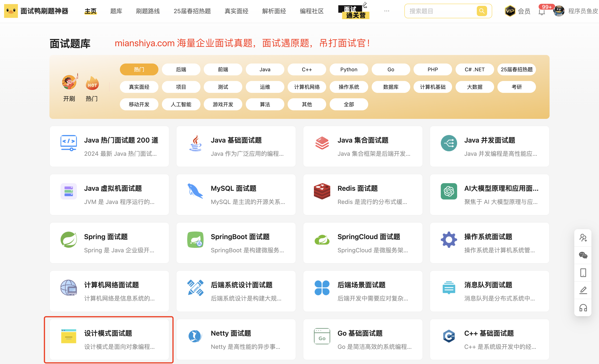

## 什么是工厂方法模式？
**工厂方法模式**（Factory Method Pattern**）**是一种创建型设计模式，旨在定义一个**用于创建对象的接口**，但将具体的实例化工作放到子类中去完成。换句话说，工厂方法模式**通过让子类决定实例化哪个具体类**，从而实现了对象创建的灵活性和可扩展性。

用通俗的话来说就是工厂方法模式就像是一个“定制工厂”，告诉它我们的需求，它根据需求提供合适的产品，而不需要我们关心具体的生产过程。

我们可以把它想象成鱼皮开了一家**剧本杀店**。作为店长，鱼皮会定期采购不同风格的剧本：恐怖的、悬疑的、欢乐的、情感的……但他并不是自己写剧本，而是对接了很多不同类型的**剧本供应商**。

每个供应商只负责某一类剧本，比如：

+ 恐怖剧本供应商：专门供货《雪乡连环杀人》《死者在幻夜中醒来》
+ 情感剧本供应商：提供《海是一场雨》《一座城》
+ 欢乐剧本供应商：出品《离婚吧赶紧的》《来电》

鱼皮只要说一声：“我需要 5 本恐怖剧本”，恐怖供应商就负责提供；“换成 3 本情感剧本”，就找情感剧本供应商。**剧本怎么选、怎么写，不归鱼皮操心，他只通过一个统一的“订剧本”接口发起请求。**


这就是工厂方法模式的本质：**你只关心“要什么类型的产品”，具体“怎么造出来”，交给对应的子类工厂来搞定**。

## 为什么要使用工厂方法模式？
它有下列优点：

1. 解耦代码：客户端无需知道具体的产品类，只需要依赖抽象的工厂接口，降低了代码之间的耦合度。
2. 提高可扩展性：如果以后需要增加新的产品类型，只需新增相应的工厂类，而无需修改现有代码，符合开闭原则。
3. 集中管理：产品的创建逻辑集中在工厂中，便于维护和管理。

为了让大家更好地感受到工厂方法模式的作用，以日志记录系统为例，我们需要支持多种日志记录方式（文件日志、数据库日志、控制台日志等）。让我们来看看使用和不使用工厂方法模式的区别：


通过对比可以看出，不使用工厂方法模式时，我们需要在 `Logger` 类中通过条件判断来处理不同类型的日志记录，这导致了代码耦合度高、违反开闭原则、职责不单一等问题。每当需要添加新的日志类型时，都需要修改现有代码，增加了维护成本。

而使用工厂方法模式后，我们将对象的创建与使用分离，降低了代码耦合度。添加新的日志类型时，只需创建新的工厂类，无需修改现有代码，符合开闭原则。同时，通过工厂接口封装了具体日志记录器的创建细节，使代码结构更加清晰，职责更加单一。

## 工厂方法模式的应用场景
举一些开发中典型的应用场景：

+ 消息通知系统：系统支持短信、邮件、站内信等不同通知方式时，可通过工厂方法屏蔽创建细节，让调用方只负责发消息。
+ 支付系统：用户可能选择支付宝、微信、银行卡等支付方式，工厂方法可以根据用户选择生成对应的支付通道对象，方便扩展新方式。
+ 文件解析模块：上传的文件可能是 Excel、CSV、JSON、XML 等不同格式，工厂方法可以根据文件类型创建对应的解析器实例，统一解析入口。
+ 业务规则引擎：当一个系统支持多个业务规则版本（如不同行业、不同客户），可以通过工厂方法创建对应的规则计算器，灵活支持定制化逻辑。

## 工厂方法模式的基本结构
工厂方法模式具有的角色和职责：

1）抽象产品（Product）：定义产品的公共接口，是所有具体产品的父类。

2）具体产品（ConcreteProduct）：实现了抽象产品接口，表示某种具体的产品。

3）抽象工厂（Factory）：定义了一个返回产品对象的方法（一般是一个抽象方法）。

4）具体工厂（ConcreteFactory）：实现了抽象工厂中的创建产品的方法，生成具体的产品实例。

下面用一张类图帮大家更直观地理解工厂方法模式的结构：


## 工厂方法模式的代码实现
我们以 “消息通知系统” 为例来实现抽象工厂模式，可以快速创建消息对象，整个流程如下： 

1）定义抽象产品接口（比如通知接口）

```java
// 抽象产品接口：通知消息
public interface Message {
    void send(String to, String content);
}
```
这个接口是所有“消息产品”的统一标准，无论是短信、邮件还是站内信，都必须实现 `send` 方法。

2）定义多个具体产品，比如短信、邮件、站内信：

```java
public class SmsMessage implements Message {
    @Override
    public void send(String to, String content) {
        System.out.println("发送短信给 " + to + "，内容：" + content);
    }
}

public class EmailMessage implements Message {
    @Override
    public void send(String to, String content) {
        System.out.println("发送邮件给 " + to + "，内容：" + content);
    }
}

public class InAppMessage implements Message {
    @Override
    public void send(String to, String content) {
        System.out.println("发送站内信给 " + to + "，内容：" + content);
    }
}
```
每个类都实现了 `Message` 接口，表示各自的发送方式。

3）定义抽象工厂接口

```java
// 抽象工厂接口：负责生产消息对象
public interface MessageFactory {
    Message createMessage();
}
```
这是抽象工厂的核心部分，它规定了工厂要提供的“产品生产线”接口。

4）定义多个具体工厂（每种通知方式一个工厂）

```java
public class SmsMessageFactory implements MessageFactory {
    @Override
    public Message createMessage() {
        return new SmsMessage();
    }
}

public class EmailMessageFactory implements MessageFactory {
    @Override
    public Message createMessage() {
        return new EmailMessage();
    }
}

public class InAppMessageFactory implements MessageFactory {
    @Override
    public Message createMessage() {
        return new InAppMessage();
    }
}
```
每个工厂只负责创建一种消息对象，具体怎么创建，它自己说了算。

5）客户端调用（用工厂创建消息，不直接 new）

```java
public class NotificationService {
    private final MessageFactory messageFactory;

    public NotificationService(MessageFactory factory) {
        this.messageFactory = factory;
    }

    public void notifyUser(String to, String content) {
        Message message = messageFactory.createMessage();
        message.send(to, content);
    }
}
```
客户端完全不需要关心到底是邮件、短信还是站内信，只需要注入一个“消息工厂”，然后就可以调用。

6）测试使用

```java
public class Main {
    public static void main(String[] args) {
        MessageFactory factory = new SmsMessageFactory(); // 切换只需换这里
        NotificationService service = new NotificationService(factory);
        service.notifyUser("13812345678", "您的验证码是 123456");
    }
}
```
输出结果：

```plain
发送短信给 13812345678，内容：您的验证码是 123456
```
当我们要切换成邮件通知，只需要把 `SmsMessageFactory` 替换成 `EmailMessageFactory`，完全不需要改 `NotificationService` 的任何代码。

## 工厂方法模式的优缺点
### 优点
+ **解耦了对象创建和使用**：调用方不再关心具体是怎么 new 出来的对象，只负责使用，这样一来，如果后续对象的创建逻辑变了，也不会影响到业务逻辑，代码更稳定、更灵活。
+ **符合开闭原则，易于扩展**：当需要新增一个产品时，只需要新增一个对应的工厂类就行，原来的代码不用动。这对于后期产品种类多、变化快的场景非常友好。
+ **提高了代码的复用性和可维护性**：创建逻辑集中在工厂里，避免了重复造轮子。有什么调整，只需要改一处地方，维护成本低，也更容易统一管理。

### 缺点
+ **类的数量会增多**：每新增一种产品，通常就要新增一个对应的工厂类。产品多了之后，工厂类也多，项目结构可能会显得臃肿。
+ **增加了系统复杂度**：相较于直接 new，一个工厂类、一个产品接口这样组合起来的结构，对于小项目或者逻辑比较简单的场景来说，可能会显得有点过于复杂。
+ **有时候可能出现过度设计**：如果产品结构本身很简单，用工厂方法模式反而会让代码变得啰嗦，不如直接用简单工厂来得高效直接。

## 扩展知识 - 源码分析
### 开源框架中的应用
#### 1、JDK
在 JDK 中，`Calendar.getInstance()` 方法是一个典型的工厂方法模式应用。我们平时获取 `Calendar` 实例时，通常会这样做：

```java
Calendar calendar = Calendar.getInstance();
```
从表面上看，我们只是简单地调用了一个静态方法。实际上，这个方法内部实现了工厂方法的逻辑。它会根据当前系统的默认时区和语言环境，返回不同子类的实例。我们来看一下源码：

```java
    public static Calendar getInstance()
    {
        return createCalendar(TimeZone.getDefault(), Locale.getDefault(Locale.Category.FORMAT));
    }
```
```java
 private static Calendar createCalendar(TimeZone zone,
                                           Locale aLocale)
    {
        CalendarProvider provider =
            LocaleProviderAdapter.getAdapter(CalendarProvider.class, aLocale)
                                 .getCalendarProvider();
        // 省略代码..

        Calendar cal = null;
        // 根据不同的语言环境获取Calendar子类实例
        if (aLocale.hasExtensions()) {
            String caltype = aLocale.getUnicodeLocaleType("ca");
            if (caltype != null) {
                switch (caltype) {
                case "buddhist":
                cal = new BuddhistCalendar(zone, aLocale);
                    break;
                case "japanese":
                    cal = new JapaneseImperialCalendar(zone, aLocale);
                    break;
                case "gregory":
                    cal = new GregorianCalendar(zone, aLocale);
                    break;
                }
            }
        }
        if (cal == null) {
            if (aLocale.getLanguage() == "th" && aLocale.getCountry() == "TH") {
                cal = new BuddhistCalendar(zone, aLocale);
            } else if (aLocale.getVariant() == "JP" && aLocale.getLanguage() == "ja"
                       && aLocale.getCountry() == "JP") {
                cal = new JapaneseImperialCalendar(zone, aLocale);
            } else {
                cal = new GregorianCalendar(zone, aLocale);
            }
        }
        return cal;
    }
```
在这里，`Calendar.getInstance()` 方法调用了 `createCalendar()` 方法，它根据不同的语言环境（`Locale`）和时区（`TimeZone`）来决定返回哪个具体的 `Calendar` 子类（例如，`GregorianCalendar` 或 `JapaneseImperialCalendar`）。这就是工厂方法模式的核心：**将对象的创建过程交给工厂方法，客户端不需要知道具体的实现细节**。

类图如下：

通过这个类图，我们可以看到，`Calendar` 类定义了一个工厂方法 `getInstance()`，它根据具体的语言环境和时区返回不同的 `Calendar` 实现类。这个设计保证了客户端可以简单地通过工厂方法获取到所需要的对象，而不需要关心具体的实现细节。

#### 2、Spring 框架
Spring 框架中的工厂方法模式也非常典型。Spring 的核心接口 `BeanFactory` 提供了一个 `getBean()` 方法，用来获取容器中的 Bean 实例。它的核心功能是根据传入的 Bean 名称（或者类型）来创建或返回一个已经存在的 Bean 实例。

我们来看 `BeanFactory` 接口的定义：

```java
public interface BeanFactory {
    Object getBean(String name) throws BeansException;
}

```
Spring 的 `AbstractBeanFactory` 类实现了 `BeanFactory` 接口，负责管理 Bean 的创建和缓存。看看这个类里的一部分实现：

```java
public abstract class AbstractBeanFactory implements BeanFactory {
    // 根据名称获取 bean
    public Object getBean(String name) throws BeansException {
        return doGetBean(name, null, null, false);
    }

    protected <T> T doGetBean(String name, Class<T> requiredType, Object[] args, boolean typeCheckOnly) {
        // Create bean instance.
         // 省略代码..
        return createBean(beanName, mbd, args);
        // 省略代码..
    }
    // 创建指定名称的 Bean 实例，交由子类实现。
    // 抽象出具体 Bean 创建逻辑，便于子类定义不同的创建策略（如单例、原型、懒加载）；
    protected abstract Object createBean(String beanName, RootBeanDefinition mbd, @Nullable Object[] args)
    throws BeanCreationException;
}

```
在这个例子中，`getBean()` 方法首先会检查是否有已经存在的单例 Bean。如果没有，它会调用 `createBean()` 方法来创建一个新的 Bean。`createBean()` 方法的实现可以根据不同的条件（比如 Bean 的作用域、生命周期等）来决定具体的创建方式。这就是典型的工厂方法模式，它将对象的创建逻辑封装在一个方法里，客户端只需要通过 `getBean()` 来获取对象，而不需要关心 Bean 是如何被实例化的。

类图如下：


从类图可以看出，`BeanFactory` 提供了一个统一的接口 `getBean()`，而 `AbstractBeanFactory` 则是实现具体的创建逻辑，像 `DefaultListableBeanFactory` 就是它的一个具体实现。在这个结构中，`createBean()` 方法就是工厂方法，它负责具体 Bean 的实例化。

### 优势和作用
通过上述的源码分析，我们可以再次总结下工厂方法设计模式的作用。

#### 1、**解耦对象的创建和使用**
工厂方法模式将对象的创建过程与客户端代码解耦。无论是 `Calendar.getInstance()` 还是 `Spring.getBean()`，客户端不需要关心对象是如何被创建的，框架内部会根据上下文自动选择合适的实现类，这使得代码更简洁、更灵活。

#### 2、**增强代码的可扩展性**
在工厂方法模式中，我们只需要修改工厂方法的实现，就可以扩展新的子类或创建新的对象类型。以 `Calendar`为例，如果将来需要支持更多类型的 `Calendar`，我们只需要修改 `createCalendar()` 方法，不需要修改调用者代码。

#### 3、**便于管理复杂的创建逻辑**
特别是在像 Spring 这样的框架中，Bean 的创建涉及到依赖注入、代理、作用域管理等复杂逻辑。如果直接在业务代码中写这些逻辑，代码会变得极其臃肿和难以维护。而使用工厂方法模式，所有的创建逻辑都封装在工厂方法中，客户端代码只关心接口，极大提高了代码的可维护性。

## 相关项目
#### 编程导航的手写 RPC 框架项目
在 [编程导航的手写 RPC 框架项目](https://www.codefather.cn/course/1768543954720022530) 的设计中，使用了工厂模式来创建和管理多个核心组件，包括序列化器、注册中心、服务代理、负载均衡器、重试策略和容错策略等。通过定义对应的工厂类，调用方可以通过统一的方法获取所需组件实例，而无需直接使用 `new` 操作符进行创建。

这种做法有效地隔离了组件的创建过程，降低了调用方与具体实现类之间的耦合度，提升了系统的灵活性和可扩展性。后续若需替换或扩展某一类组件，只需调整工厂类的实现，无需改动业务逻辑代码。


#### 编程导航的 OJ 判题项目
在 [编程导航的 OJ 判题项目](https://www.codefather.cn/course/1790980707917017089) 中，代码沙箱模块采用了工厂模式。根据用户传入的字符串参数（即沙箱类别），系统会动态生成对应的代码沙箱实现类。这里使用的是静态工厂模式，整体实现较为简洁，能够很好地满足当前的需求。通过这种方式，我们可以根据字符串灵活地创建不同类型的沙箱实例，显著提升了模块的通用性和扩展性。后续若需要新增沙箱类型，只需添加对应的实现类和注册逻辑，而无需修改现有代码结构，方便维护和功能扩展。


## 相关面试题
可以在 [程序员面试刷题神器 - 面试鸭](https://www.mianshiya.com/) 上获取到企业常问的设计模式面试题。比如：

1）[工厂模式和抽象工厂模式有什么区别？ ](https://www.mianshiya.com/bank/1801559627969929217/question/1801818998708707329)



