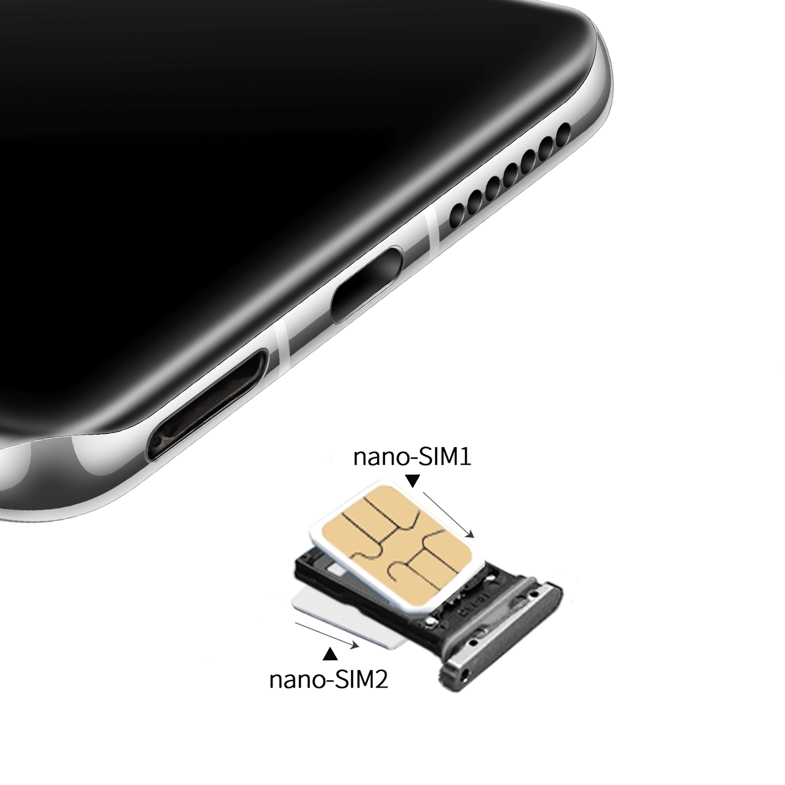
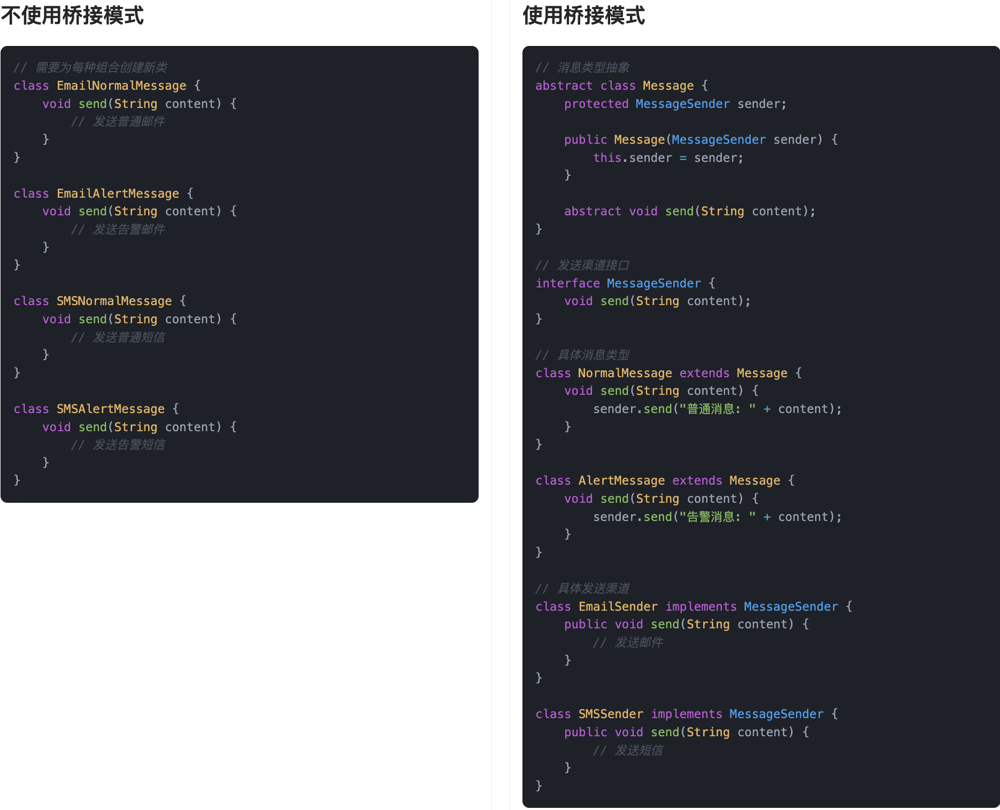
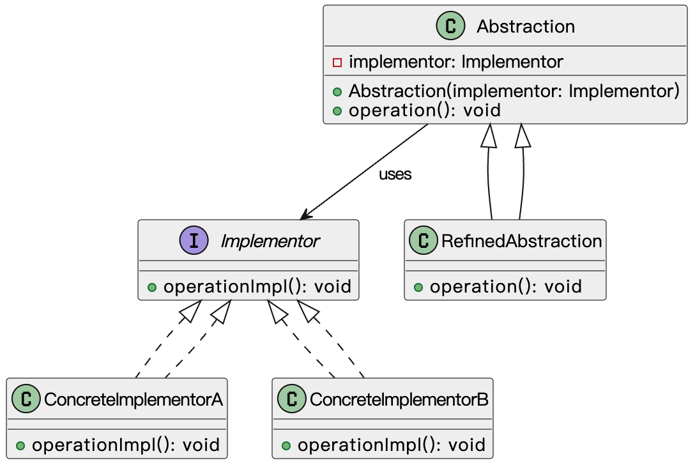
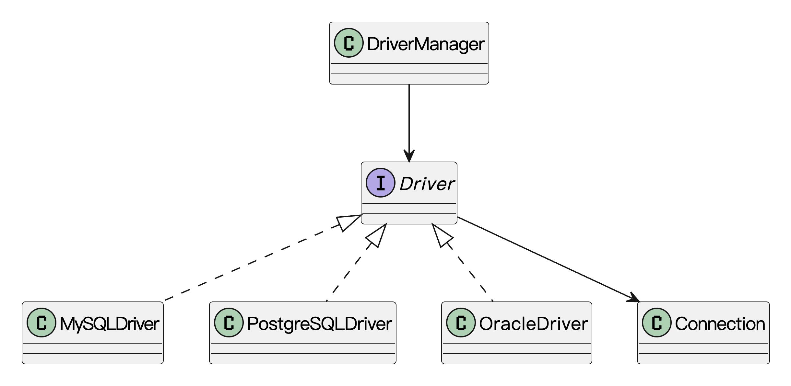
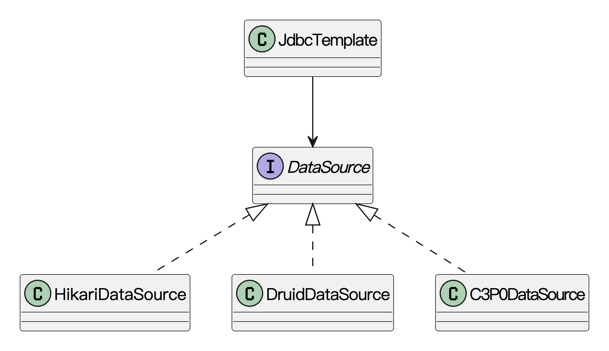

## 什么是桥接模式？
**桥接模式**（Bridge Pattern）是一种结构型设计模式**，**简单来说，就是一种**把抽象和实现分离开来**的方法，让它们可以各自独立变化。

在实际开发中，我们经常会遇到这样的问题：一个功能模块，既要支持多个平台，又要支持多种操作方式。比如做一个消息通知系统，你可能既要支持“邮件通知、短信通知、微信通知”，又要支持“普通用户、VIP 用户、企业用户”的各种业务逻辑。这两个维度一交叉，代码量直接炸裂，继承结构也一眼看不到头。

桥接模式的作用，就是把“消息类型”这条线和“用户类型”这条线拆开，不再死绑在一起，而是通过抽象接口桥接起来。这样我们想加一种新消息、新用户，只管在自己的维度扩展就行了，不用去动对方的代码，灵活又清晰。

我们生活中也有类似的情况，比如买手机。鱼皮上次买了部手机，本身是华为品牌，但可以用移动、联通或者电信的卡。手机和运营商这两个东西，其实是两个互不影响的系统，如果硬要为“华为+移动”“苹果+联通”“小米+电信”各造一款手机，生产线直接起飞。而现实里我们只要做一个SIM卡槽，两边标准化，谁都能插，互相独立又能自由组合，这不就是桥接模式的思路嘛！



通俗讲，桥接模式就是在两个可能独立变化的部分之间搭一座“桥”，让它们能灵活组合，而不是死死绑定。

## 为什么要使用桥接模式？
当一个系统中，抽象和实现之间都可能频繁变化，而且两者都存在多种可能性组合的时候，直接通过继承关系硬连在一起会非常糟糕。继承会导致类数量过多，灵活性极差，任何一方变化都得连锁修改，出错率高。桥接模式通过把抽象和实现解耦，只用组合的方式关联，避免了继承导致的僵硬结构，系统的扩展性、维护性都会大大提高。特别是在面对多维度变化的复杂系统时，桥接模式几乎是必选的解决方案。

为了让大家更好地感受到桥接模式的作用，以消息推送系统为例，我们需要支持不同类型的消息（普通消息、紧急消息）通过不同的渠道（邮件、短信、微信）发送。让我们来看看使用和不使用桥接模式的区别：



通过对比可以看出，不使用桥接模式时，我们需要为每种消息类型和发送渠道的组合创建一个单独的类，这导致了类的数量过多，代码重复度高，难以维护。每当需要添加新的消息类型或发送渠道时，都需要创建大量的新类。

而使用桥接模式后，我们将消息类型和发送渠道分离成两个独立的维度，通过组合的方式实现功能。这种设计使得代码结构更加清晰，扩展性更强。当需要添加新的消息类型或发送渠道时，只需要创建相应的新类，而不需要修改现有代码。

## 桥接模式的应用场景
举一些开发中典型的应用场景：

+ 支付系统：在电商平台中，不同的支付方式（如支付宝、微信支付、银行卡支付）通常具有不同的支付实现逻辑。通过桥接模式，可以将支付接口与支付方式分开，使得支付系统可以在不修改业务逻辑的情况下，灵活地添加新的支付方式，同时也能保持原有支付方式的稳定性。
+ 多渠道广告系统：在一个广告发布平台中，可能需要支持不同的广告投放渠道（如电视、互联网、户外广告等）。桥接模式可以将广告的具体展示与不同广告渠道的实现分开，使得增加或修改广告渠道时，系统的其他部分不受影响，提升系统的扩展性和维护性。
+ 消息推送系统扩展：在一个支持多平台（如邮件、短信、微信等）的消息推送系统中，不同的消息类型（如普通通知、告警通知）和发送渠道可能任意组合。使用桥接模式，我们可以将“消息类型”和“发送渠道”解耦，避免类数量过多，并实现任意组合的灵活扩展。

## 桥接模式的基本结构
桥接模式具有的角色和职责：

1）抽象化（Abstraction）：定义抽象的接口，同时维护一个对实现化对象（Implementor）的引用。

2）扩展抽象化（Refined Abstraction）：在抽象化基础上扩展，调用实现化对象的方法，增加新的功能。

3）实现化（Implementor）：定义实现化角色的接口，它不需要与抽象化接口完全一样，但一般要提供基本操作。

4）具体实现化（Concrete Implementor）：真正去实现实现化接口的类，完成具体的业务逻辑。

下面用一张类图帮大家更直观地理解桥接模式的结构：



## 桥接模式的实现
下面就以 “消息推送系统” 为例，我们用桥接模式实现一个灵活扩展的消息系统。

1）定义发送渠道接口：表示消息发送的底层实现渠道

```java
public interface MessageSender {
    void send(String message);
}
```
这一步是桥接模式中的“实现接口”角色，定义所有发送方式的统一行为规范，比如发送短信、发送邮件等都要实现这个 `send` 方法。

2）实现不同的发送渠道：封装具体发送逻辑

```java
public class EmailSender implements MessageSender {
    public void send(String message) {
        System.out.println("通过【邮件】发送消息：" + message);
    }
}

public class SMSSender implements MessageSender {
    public void send(String message) {
        System.out.println("通过【短信】发送消息：" + message);
    }
}

public class WeChatSender implements MessageSender {
    public void send(String message) {
        System.out.println("通过【微信】发送消息：" + message);
    }
}
```
这些类是桥接模式中的“实现者具体实现”，它们实现了消息的发送细节。我们可以随时添加新渠道而不动原有结构。

3）定义抽象消息类：对外提供发送消息的统一入口

```java
public abstract class Message {
    protected MessageSender sender;

    public Message(MessageSender sender) {
        this.sender = sender;
    }

    public abstract void send(String content);
}
```
这一步是桥接模式中的“抽象类”角色，它持有 `MessageSender` 的引用，实现从抽象到实现的“桥接”，从而可以在运行时自由组合。

4）实现不同的消息类型：定义业务维度的扩展

```java
public class NormalMessage extends Message {
    public NormalMessage(MessageSender sender) {
        super(sender);
    }

    public void send(String content) {
        System.out.println("【普通通知】开始发送...");
        sender.send(content);
    }
}

public class UrgentMessage extends Message {
    public UrgentMessage(MessageSender sender) {
        super(sender);
    }

    public void send(String content) {
        System.out.println("【紧急告警】开始发送...");
        sender.send("【加急】" + content);
    }
}
```
这一步是桥接模式中的“扩展抽象类”，它定义了各种业务逻辑下的消息发送行为，比如普通消息、紧急消息等，而每种都可以桥接任意发送方式。

5）客户端调用示例：组合不同类型和渠道，灵活发送

```java
public class Client {
    public static void main(String[] args) {
        MessageSender emailSender = new EmailSender();
        MessageSender smsSender = new SMSSender();
        MessageSender weChatSender = new WeChatSender();

        Message normalMsgViaEmail = new NormalMessage(emailSender);
        Message urgentMsgViaSMS = new UrgentMessage(smsSender);
        Message urgentMsgViaWeChat = new UrgentMessage(weChatSender);

        normalMsgViaEmail.send("欢迎使用我们的系统！");
        urgentMsgViaSMS.send("服务器 CPU 负载率过高！");
        urgentMsgViaWeChat.send("数据库连接异常！");
    }
}
```
输出结果：

```plain
【普通通知】开始发送...
通过【邮件】发送消息：欢迎使用我们的系统！
【紧急告警】开始发送...
通过【短信】发送消息：【加急】服务器 CPU 负载率过高！
【紧急告警】开始发送...
通过【微信】发送消息：【加急】数据库连接异常！
```
通过桥接模式，我们实现了“消息种类”和“发送方式”的解耦，它们可以自由组合，避免为每种组合都写一个类的灾难。这种设计非常适合多维度扩展的业务场景。

## 桥接模式的优缺点
### 优点
+ **解耦抽象和实现**：桥接模式通过将抽象部分和实现部分分离开来，使得它们可以独立地变化。你可以在不改变抽象类的情况下，改变其实现类，反之亦然。这样减少了修改和扩展时的相互依赖。
+ **提高系统的灵活性**：由于抽象和实现是分离的，你可以根据需要组合不同的抽象和实现，灵活性较高。这对于功能和实现不断变化的系统特别有用。
+ **符合开闭原则**：通过使用桥接模式，系统可以在不修改现有代码的基础上，灵活地增加新的抽象层和实现层，符合开闭原则，便于扩展。

### 缺点
+ **增加了系统复杂度**：桥接模式需要引入多个类，增加了类的数量。这可能会使系统的结构更加复杂，理解和维护起来较为困难，尤其在初期设计阶段。
+ **实现层的独立性问题**：虽然抽象和实现分离了，但有时候，过于独立的实现层可能会导致难以管理的依赖关系。如果设计不当，可能会造成冗余代码或不必要的复杂性。
+ **不适合简单场景**：对于那些抽象和实现之间变化不大的简单场景，使用桥接模式可能会显得过于复杂和冗余。此时，直接将抽象和实现合并在一起可能会更加高效和直观。

## 扩展知识 - 源码分析
### 开源框架中的应用
#### 1、JDK
在 Java 的数据库操作中，`java.sql.DriverManager` 和各个数据库厂商提供的 `Driver` 实现，其实就是桥接模式的典型例子。

我们写 JDBC 代码时，会这么用：

```java
Connection conn = DriverManager.getConnection(
    "jdbc:mysql://localhost:3306/test", "root", "password");
```
这段代码虽然看起来很简单，但其实背后已经完成了数据库驱动的加载、连接的创建、协议的适配等一系列操作。而我们写代码的时候，完全不需要去管底层到底是 MySQL、PostgreSQL 还是 Oracle。

关键就在于 `DriverManager` 提供了一套统一的连接接口，而每个数据库厂商自己实现 `java.sql.Driver` 接口。比如：

```java
public interface Driver {
  Connection connect(String url, java.util.Properties info)
        throws SQLException;
}
```
MySQL 会提供一个自己的实现类：

```java
public class com.mysql.cj.jdbc.Driver implements java.sql.Driver {
    public java.sql.Connection connect(String url, Properties info) throws SQLException {
        // 内部处理 MySQL 的连接逻辑
    }
}
```
而 `DriverManager` 在加载驱动时会调用：

```java
  for(DriverInfo aDriver : registeredDrivers) {
            if(isDriverAllowed(aDriver.driver, callerCL)) {
                try {
                    Connection con = aDriver.driver.connect(url, info);
                    if (con != null) {
                        return (con);
                    }
                } catch (SQLException ex) {
                    if (reason == null) {
                        reason = ex;
                    }
                }

            } else {
                println("    skipping: " + aDriver.getClass().getName());
            }

        }
```
这套机制的本质，其实就是把**数据库连接逻辑**和**连接调用方式**分离开来了，中间通过 `Driver` 接口桥接。这种结构就符合桥接模式的核心思想——**抽象和实现分离**，让它们可以独立演化。

我们可以用下面的类图来看清楚这套结构：



从图中可以看到，DriverManager 不直接依赖任何一个具体的 Driver 实现，而是通过统一接口来调用。

#### 2、Spring 框架
Spring 中也有一个比较典型的桥接模式使用场景，那就是 `JdbcTemplate` 和 `DataSource` 之间的解耦结构。

我们来看下 Spring 的数据库操作流程，比如：

```java
JdbcTemplate jdbcTemplate = new JdbcTemplate(dataSource);
jdbcTemplate.queryForObject("SELECT COUNT(*) FROM user", Integer.class);
```
这个 `JdbcTemplate` 是操作数据库的“工具类”，封装了各种 JDBC 操作流程，比如连接获取、SQL 执行、结果集处理等。而真正连接数据库的，是 `DataSource`，也就是我们熟悉的 HikariCP、Druid、C3P0 等。

Spring 并不关心 `DataSource` 的具体实现，它只关心这个对象有没有提供 `getConnection()` 方法。这就形成了一种桥接关系：

1）JdbcTemplate 是“抽象”层，负责提供统一的数据库操作 API。  
2）DataSource 是“实现”层，负责真正跟数据库打交道。

我们来看 `JdbcTemplate` 部分源码结构：

```java
public class JdbcTemplate extends JdbcAccessor implements JdbcOperations {
    public JdbcTemplate(DataSource dataSource) {
        // 设置数据源（继承自 JdbcAccessor）
        this.setDataSource(dataSource);
        this.afterPropertiesSet();
    }
    // 执行查询语句，返回结果对象
    public <T> T queryForObject(String sql, RowMapper<T> rowMapper) throws DataAccessException {
        List<T> results = this.query(sql, rowMapper);
        return DataAccessUtils.nullableSingleResult(results);
    }
}

```
从源码中看出，`JdbcTemplate` 只依赖 `DataSource` 接口，而不管你用的是哪种连接池。这种结构天然具备良好的扩展性，完全契合桥接模式的解耦思想。我们来看下类图：



这个结构图非常清晰地表达了“抽象”和“实现”的解耦，桥接模式的核心目的就在这里。

### 优势和作用
通过上述的源码分析，我们可以再次总结下桥接模式的作用。

#### 1、实现“抽象”和“实现”的解耦
桥接模式最直接的好处，就是可以把抽象层（比如 JdbcTemplate）和实现层（比如各种 DataSource）完全分开维护。这种设计方式，对于框架来说非常关键，因为框架无法预知业务系统中会接入哪种实现。

#### 2、便于扩展和替换，增强系统灵活性
以 JdbcTemplate 为例，不管我们底层用的是 HikariCP 还是 Druid，业务代码基本不需要改动。这种灵活性，大大降低了系统的耦合度，也方便未来的升级和优化。

#### 3、符合接口隔离与开闭原则
桥接模式鼓励我们面向接口编程，而不是面向具体类。DriverManager 和 JdbcTemplate 都是很好例子，它们通过接口做桥接，让业务代码只关心逻辑而不是实现细节，真正做到了对扩展开放、对修改关闭。

## 相关面试题
可以在 [程序员面试刷题神器 - 面试鸭](https://www.mianshiya.com/) 上获取到企业常问的设计模式面试题。比如：

1）[什么是桥接模式？一般用在什么场景？ ](https://www.mianshiya.com/bank/1801559627969929217/question/1802171736231583745)


