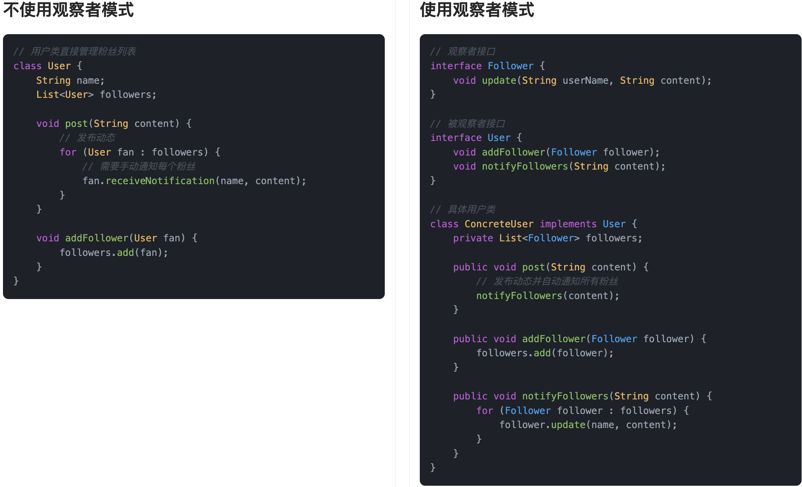

## 什么是观察者模式
**观察者模式**（Observer Pattern）是一种行为型设计模式，它的核心思想就是：**当一个对象状态发生变化时，自动通知所有依赖于它的对象，并自动更新它们**。  
这种模式在很多地方都有应用，尤其是在事件监听、消息推送、UI 刷新这些场景中特别常见。我们一般把这个被监听的对象叫“主题”或“被观察者”，而那些关心它变化的对象，叫“观察者”。一旦主题有任何风吹草动，它就会把消息广播出去，所有关注它的观察者都能第一时间收到通知。

更通俗一点来说，其实它就是在程序里实现了“公众号推送”这种机制。

比如你关注了鱼皮的公众号（程序员鱼皮），每次我发新文章，你就能第一时间收到推送，而不用天天去翻公众号看看有没有更新。对于我这个“主题”来说，无论是 10 个人关注还是 10 万人关注，我只要一发消息，所有人都能收到。这就完美符合了观察者模式的设计思路：**发布-订阅，自动联动，松耦合连接。**


从程序员角度理解，观察者模式特别适合那种“一个改了，其他都得知道”的场景，比如用户设置变了，页面需要重新渲染；或者后台有新通知，前台需要提示……这种一改多动的局面，用观察者模式就能非常优雅地解决。

## 为什么要使用观察者模式？
在很多系统中，对象之间并不是孤立存在的，而是有强烈的联动关系。比如我们更新了某条数据，页面需要刷新；订单状态变化了，客服系统需要同步提醒。如果没有观察者模式，我们要么是让观察者一个个不断去主动查询，浪费资源，要么就是主题要记住所有要通知的对象，耦合度很高，维护起来特别麻烦。观察者模式正好帮我们解了这个难题，它让主题和观察者之间的关系松散且高效，主题只需要负责发布变化，具体谁监听、怎么处理，不需要关心。

为了让大家更好地感受到观察者模式的作用，以社交媒体通知系统为例，我们需要实现用户发布动态后自动通知所有关注者的功能。让我们来看看使用和不使用观察者模式的区别：



通过对比可以看出，不使用观察者模式时，用户类需要直接管理粉丝列表并处理通知逻辑，这导致了用户类和粉丝之间的强耦合。每当需要修改通知方式或添加新的通知类型时，都需要修改用户类的代码，使得系统难以扩展和维护。

而使用观察者模式后，我们通过定义观察者和被观察者接口，将用户和粉丝解耦。用户类只需要维护粉丝列表并调用通知方法，具体的通知逻辑由各个粉丝类自己实现。这种设计不仅提高了代码的灵活性，还使得系统更容易扩展。当需要添加新的通知方式时，只需要创建新的观察者类并实现相应的接口即可，无需修改现有代码。

## 观察者模式的应用场景
举一些开发中典型的应用场景：

+ 社交媒体通知系统：在社交媒体应用中，当用户发布新动态或进行互动（如评论、点赞等）时，其他关注该用户的人需要接收到通知。观察者模式可以让所有关注者（观察者）订阅到某个用户的动态（被观察者），当用户有新动态时，所有订阅者都会收到通知。
+ 帖子订阅系统：在社区交流网站中，用户可以订阅特定类别的帖子。当新的内容发布时，所有订阅了该类别的用户（观察者）会收到推送通知，确保他们及时获取新信息。
+ 电商网站的订单状态变化通知：在电商平台中，用户可以订阅订单状态的变化（如支付成功、发货、送达等）。当订单状态发生变化时，系统会通知所有相关的观察者（如用户、客服、仓库等），确保信息的实时更新和处理。

## 观察者模式的基本结构
观察者模式具有的角色和职责：

1）主题（Subject）：定义了观察者注册、移除和通知的接口，同时维护观察者列表。

2）具体主题（ConcreteSubject）：实现主题接口，并在自己的状态发生变化时，通知所有注册的观察者。

3）观察者（Observer）：定义了响应主题通知的更新接口。

4）具体观察者（ConcreteObserver）：实现观察者接口，接收到通知后，根据需要做出具体处理。

下面用一张类图帮大家更直观地理解观察者模式的结构：


## 观察者模式的实现
下面就以 “社交媒体通知系统” 为例，我们用观察者模式实现一个简单的用户-粉丝关系的通知机制。

1）定义观察者接口：声明接收通知的方法

```java
public interface Follower {
    void update(String userName, String postContent);
}
```
这一步定义了观察者的标准接口。所有“粉丝”类只要实现 `update` 方法，就能接收动态通知，实现订阅功能。

2）定义被观察者接口：声明添加、移除、通知观察者的方法

```java
public interface User {
    void addFollower(Follower follower);
    void removeFollower(Follower follower);
    void notifyFollowers(String postContent);
}
```
这一步定义了“被关注者”的行为，也就是谁发动态、怎么通知所有关注他的人，这样粉丝系统就可以被统一管理。

3）实现具体观察者类：粉丝用户，收到通知就做出响应

```java
public class ConcreteFollower implements Follower {
    private String name;

    public ConcreteFollower(String name) {
        this.name = name;
    }

    @Override
    public void update(String userName, String postContent) {
        System.out.println(name + " 收到通知：@" + userName + " 发了一条新动态：" + postContent);
    }
}
```
这一步定义了真正的“观察者”——每个粉丝都是一个实现类，收到通知就打印提示。你也可以扩展为推送消息、存入消息中心等。

4）实现具体被观察者类：可以发动态的用户，拥有粉丝列表

```java
import java.util.ArrayList;
import java.util.List;

public class ConcreteUser implements User {
    private String userName;
    private List<Follower> followers;

    public ConcreteUser(String userName) {
        this.userName = userName;
        this.followers = new ArrayList<>();
    }

    @Override
    public void addFollower(Follower follower) {
        followers.add(follower);
    }

    @Override
    public void removeFollower(Follower follower) {
        followers.remove(follower);
    }

    @Override
    public void notifyFollowers(String postContent) {
        for (Follower f : followers) {
            f.update(userName, postContent);
        }
    }

    public void post(String content) {
        System.out.println(userName + " 发布动态：" + content);
        notifyFollowers(content);
    }
}
```
这一步实现了一个“发动态的用户”类。他有一个粉丝列表，一旦调用 `post()`，就能自动通知所有粉丝。这个类是观察者模式的“核心控制中心”。

5）客户端调用示例

```java
public class Client {
    public static void main(String[] args) {
        ConcreteUser star = new ConcreteUser("鱼皮");

        Follower f1 = new ConcreteFollower("张三");
        Follower f2 = new ConcreteFollower("李四");
        Follower f3 = new ConcreteFollower("王五");

        star.addFollower(f1);
        star.addFollower(f2);
        star.addFollower(f3);

        star.post("今天阳光真好，适合写代码！");
    }
}
```
输出结果：

```plain
鱼皮 发布动态：今天阳光真好，适合写代码！
张三 收到通知：@鱼皮 发了一条新动态：今天阳光真好，适合写代码！
李四 收到通知：@鱼皮 发了一条新动态：今天阳光真好，适合写代码！
王五 收到通知：@鱼皮 发了一条新动态：今天阳光真好，适合写代码！
```
通过这种方式，我们只需要让粉丝实现 `Follower` 接口，再注册到某个用户，用户一发动态，所有关注者自动收到消息。这就是观察者模式的优势：发布者和订阅者完全解耦，只需定义好接口，通知链条自动生效。

## 观察者模式的优缺点
### 优点
+ **解耦观察者和被观察者**：观察者模式让观察者和被观察者之间的依赖关系变得松散。被观察者（主题）不需要知道观察者的具体实现，只需要通知它们状态变化，这样修改一个观察者或添加新观察者时，不会影响到其他部分。
+ **支持动态改变**：观察者模式允许在运行时动态地添加、删除观察者。当系统需要调整哪些对象感兴趣时，可以随时进行修改，灵活性很强。
+ **多对多关系**：一个主题可以有多个观察者，而每个观察者也可以独立地进行不同的反应。当主题状态发生变化时，所有相关的观察者都能及时得到通知，确保信息的同步更新。

### 缺点
+ **可能会导致通知过多**：如果观察者数量非常多或主题状态更新频繁，每次状态变化都会通知所有观察者，这可能导致性能问题，特别是在观察者数量较大的情况下，通知的开销也会增加。
+ **依赖链复杂**：如果观察者之间存在相互依赖，或者某些观察者依赖多个被观察者，可能会造成较为复杂的依赖链，增加系统的维护难度。
+ **不适用于单向通知**：观察者模式主要用于被观察者向观察者单向传递信息，如果有多个观察者需要互相通信或者需要双向通知，使用观察者模式可能会显得不够合适，反而可能增加复杂度。

## 扩展知识 - 源码分析
### 开源框架中的应用
#### 1、JDK
在 JDK 中，其实很早就提供了对观察者模式的支持，主要是这两个类：

+ `java.util.Observable`：被观察者（Subject）
+ `java.util.Observer`：观察者（Observer）

虽然从 JDK 9 开始，这两个类被标记为“过时”，但它们依然是观察者模式最经典的实现方式，仍然可以学习一下。

我们看下使用场景：

```java
// 被观察者（发布者）
public class PostAgency extends Observable {
    private String post;

    public void setPost(String post) {
        this.post = post;
        setChanged();         // 标记数据发生了变化
        notifyObservers(post); // 通知所有观察者
    }
}

// 观察者（订阅者）
public class PostChannel implements Observer {
    @Override
    public void update(Observable o, Object arg) {
        System.out.println("收到帖子更新: " + arg);
    }
}

```
使用方式也很简单：

```java
PostAgency agency = new PostAgency();
PostChannel channel = new PostChannel();

agency.addObserver(channel); // 注册观察者
agency.setNews("鱼皮发布了帖子"); // 发布通知

```
这个结构非常清晰：

+ 发布者：`Observable`，负责注册/管理观察者、发布通知；
+ 观察者：`Observer`，只需实现 `update()` 方法即可接收通知

#### 2、Spring 框架
Spring 的 **事件发布机制**，本质上就是观察者模式的变体。我们可以通过事件发布器 `ApplicationEventPublisher` 发布一个事件，系统中所有监听该事件的监听器都会收到通知。

先看核心接口和类的关系：

+ `ApplicationEvent`：事件对象（被观察者发布的内容）
+ `ApplicationListener`：监听器（观察者）
+ `ApplicationEventPublisher`：事件发布器（发布通知）

来看下 Spring 的使用代码：

```java
// 自定义事件
public class UserRegisterEvent extends ApplicationEvent {
    private final String username;

    public UserRegisterEvent(Object source, String username) {
        super(source);
        this.username = username;
    }

    public String getUsername() {
        return username;
    }
}

// 发布事件
@Component
public class UserService {
    @Autowired
    private ApplicationEventPublisher publisher;

    public void register(String username) {
        // 注册逻辑...
        publisher.publishEvent(new UserRegisterEvent(this, username));
    }
}

// 监听事件
@Component
public class WelcomeEmailListener implements ApplicationListener<UserRegisterEvent> {
    @Override
    public void onApplicationEvent(UserRegisterEvent event) {
        System.out.println("发送邮件给: " + event.getUsername());
    }
}

```
整个流程就是：注册完成后发布事件，监听器自动接收到这个事件并执行对应的操作。

### 优势和作用
通过上述的源码分析，我们可以再次总结下观察者模式的作用。

#### 1、解耦事件触发和事件响应逻辑
观察者模式最大的好处就是解耦。以 Spring 的事件机制为例，`UserService` 只负责业务本身（注册），根本不用关心通知谁、怎么通知。监听器该做什么，那是它自己的事。

#### 2、便于扩展和维护
如果我们后面想在注册成功之后再加一个“发优惠券”的逻辑，只要再添加一个监听器就可以了，原有代码不动。这种“开闭原则”带来的灵活性是非常重要的。

#### 3、支持异步通知（Spring 中可配置）
Spring 的事件机制还可以通过 `@Async` 实现异步事件监听。也就是说，被观察者通知完了之后可以立刻返回，具体处理交给另一个线程去做，提升了响应速度。

## 相关面试题
可以在 [程序员面试刷题神器 - 面试鸭](https://www.mianshiya.com/) 上获取到企业常问的设计模式面试题。比如：

1）[什么是观察者模式？一般用在什么场景？ ](https://www.mianshiya.com/bank/1801559627969929217/question/1802938904808333313)


