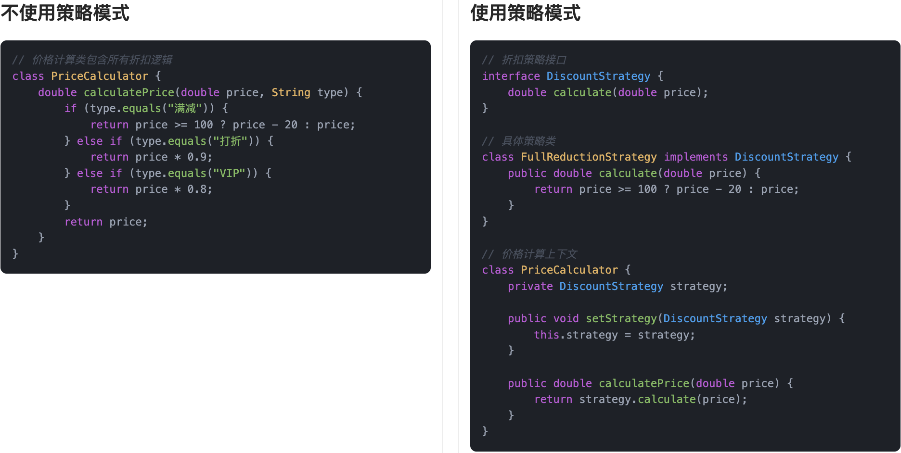
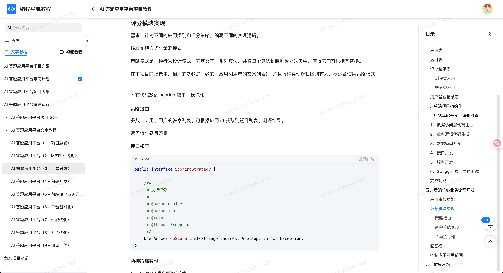

## 什么是策略模式
**策略模式**（Strategy Pattern）是一种行为型设计模式。它的核心思想就是：**定义一系列算法，把它们一个个封装起来，并且让它们可以互相替换**。  
换句话说，我们可以把不同的处理逻辑抽象成不同的策略对象，在程序运行时，根据实际情况动态选择合适的策略进行处理，而不需要在代码里堆砌大量的`if...else`或`switch`判断。

拿生活中的场景来说，这事其实我们每天都在干。比如我们早上出门上班时，会根据天气和路况选择出行方式：天气好就骑车，下雨就打车，堵车就改坐地铁。不同的出行方式就是不同的策略，鱼皮根据实际情况灵活选择，背后逻辑就非常符合策略模式的设计理念。


这种模式在项目里非常好用，尤其是当你发现代码里出现了很多重复的判断逻辑，或者某个行为有多个实现方式的时候，基本可以考虑用策略模式重构一波。它能帮你把变化隔离开来，让程序更灵活、更可维护。

## 为什么要使用策略模式？
在实际开发中，当我们遇到需要根据不同条件选择不同行为的场景时，最直接的做法通常是堆一堆`if-else`或者`switch-case`判断。随着条件的增多，代码就会变得又长又乱，维护起来非常困难。更重要的是，这种做法严重违背了面向对象设计的开闭原则（对扩展开放，对修改关闭）。  
而使用策略模式，我们可以把每一种策略独立封装成单独的类，后续如果要新增、修改策略，只需要扩展新的策略类就行，原有代码不需要改动，系统的扩展性和可维护性就能大大提升。

为了让大家更好地感受到策略模式的作用，以电商折扣计算为例，我们需要实现一个灵活的促销系统，支持多种折扣方式。让我们来看看使用和不使用策略模式的区别：



通过对比可以看出，不使用策略模式时，所有的折扣计算逻辑都集中在`PriceCalculator`类中，使用 if 语句进行判断。这种方式导致代码耦合度高且维护困难，每当需要添加新的折扣方式时，都需要修改`PriceCalculator`类的代码，违反了开闭原则。

而使用策略模式后，我们将每种折扣方式封装成独立的策略类，通过接口统一管理。`PriceCalculator`类不再关心具体的折扣计算逻辑，只需要调用策略对象的calculate方法即可。这种设计使得系统更加灵活，添加新的折扣方式只需要创建新的策略类，无需修改现有代码。同时，策略模式也使得代码结构更加清晰，每个策略类都专注于自己的职责，提高了代码的可维护性。

## 策略模式的应用场景
举一些开发中典型的应用场景：

+ 支付系统中的支付方式选择：在电商平台中，支付系统通常支持多种支付方式（如支付宝、微信支付、信用卡等）。通过策略模式，可以将每种支付方式抽象为不同的策略类，用户根据选择的支付方式动态切换对应的策略，简化支付流程的实现和扩展。
+ 折扣计算策略：在电商平台或购物网站中，商品的折扣计算可能根据不同的促销策略（如满减、打折、会员折扣等）有所不同。策略模式允许根据不同的促销活动或用户等级选择相应的折扣策略，并在需要时轻松切换或扩展折扣规则。
+ 路线规划算法：在导航系统或地图应用中，用户可以选择不同的路线规划算法（如最短路径、最快路径、避免拥堵等）。策略模式可以将这些不同的路线规划策略封装为不同的算法策略，用户选择时可以动态切换算法，无需修改系统的核心逻辑。
+ 日志记录方式选择：在应用中，日志的记录方式可能根据不同的环境或需求而变化。例如，在开发环境中可以记录详细日志，而在生产环境中可能只记录关键日志。通过策略模式，可以在程序运行时选择不同的日志记录策略（如控制台输出、文件写入、远程日志服务等）。

## 策略模式的基本结构
策略模式具有的角色和职责：

1）策略接口（Strategy）：定义所有支持的算法（策略）必须实现的方法。

2）具体策略（ConcreteStrategy）：实现策略接口，封装具体的算法实现。

3）上下文（Context）：持有一个策略接口的引用，负责在客户端选择并执行具体的策略。

下面用一张类图帮大家更直观地理解策略模式的结构：


## 策略模式的实现
下面就以 “电商折扣计算” 为例，我们用策略模式实现一个灵活的促销系统。

1）定义折扣策略接口：声明统一的折扣计算方法

```java
public interface DiscountStrategy {
    double calculate(double originalPrice);
}
```
这一步是策略模式的核心接口，抽象了“折扣”行为。所有促销方式只要实现这个接口，就能被系统自由替换调用。

2）实现具体策略类：满减、打折、会员折扣等

```java
public class FullReductionStrategy implements DiscountStrategy {
    @Override
    public double calculate(double originalPrice) {
        if (originalPrice >= 100) {
            return originalPrice - 20; // 满减
        }
        return originalPrice;
    }
}
```
```java
public class PercentageDiscountStrategy implements DiscountStrategy {
    @Override
    public double calculate(double originalPrice) {
        return originalPrice * 0.9; // 打九折
    }
}
```
```java
public class VipDiscountStrategy implements DiscountStrategy {
    @Override
    public double calculate(double originalPrice) {
        return originalPrice * 0.8; // VIP 打八折
    }
}
```
这些类就是“策略族”的具体实现，分别封装了不同的折扣规则。每种规则彼此独立，互不影响。

3）创建上下文类：接收策略并执行计算的业务入口

```java
public class PriceCalculator {
    private DiscountStrategy strategy;

    public void setStrategy(DiscountStrategy strategy) {
        this.strategy = strategy;
    }

    public double calculatePrice(double originalPrice) {
        if (strategy == null) {
            throw new IllegalStateException("未设置折扣策略");
        }
        return strategy.calculate(originalPrice);
    }
}
```
上下文类 `PriceCalculator` 用于管理和执行折扣策略的调用逻辑。通过 `setStrategy()` 注入不同的策略对象，达到行为灵活切换的效果。

4）客户端调用示例

```java
public class Client {
    public static void main(String[] args) {
        PriceCalculator calculator = new PriceCalculator();
        double originalPrice = 120.0;

        // 使用满减策略
        calculator.setStrategy(new FullReductionStrategy());
        System.out.println("【满减策略】最终价格：" + calculator.calculatePrice(originalPrice));

        // 使用打折策略
        calculator.setStrategy(new PercentageDiscountStrategy());
        System.out.println("【打折策略】最终价格：" + calculator.calculatePrice(originalPrice));

        // 使用 VIP 策略
        calculator.setStrategy(new VipDiscountStrategy());
        System.out.println("【VIP策略】最终价格：" + calculator.calculatePrice(originalPrice));
    }
}
```
输出结果：

```plain
【满减策略】最终价格：100.0
【打折策略】最终价格：108.0
【VIP策略】最终价格：96.0
```
通过策略模式，`PriceCalculator` 并不关心折扣如何计算，只关心“调用策略”。这让我们在新增“新人专属满200减50”这类促销时，只需要实现一个新策略类，而无需改动旧逻辑。

## 策略模式的优缺点
### 优点
+ **算法封装**：策略模式将不同的算法封装成独立的策略类，每个策略类都实现一个统一的接口。这样，当我们需要切换算法时，只需要改变策略对象，而不需要修改客户端代码，增强了代码的灵活性和可维护性。
+ **符合开闭原则**：当需要新增不同的策略时，我们只需增加新的策略类，并实现相应的算法，不需要修改原有的代码。这样，系统在需求变化时具有更好的扩展性。
+ **避免了多重条件判断**：策略模式通过将复杂的条件判断逻辑分散到各个策略类中，避免了在主程序中出现大量的 if-else 或 switch-case 语句，使得代码更加清晰简洁，便于维护。

### 缺点
+ **策略类过多**：每增加一种策略，都需要创建一个新的策略类，随着策略数目的增加，系统中的类会变得比较多，可能导致代码冗长和难以管理。
+ **客户端必须了解策略**：虽然策略模式让算法封装得很好，但客户端仍然需要了解不同策略之间的区别，并选择合适的策略。这可能会导致客户端变得有些复杂。
+ **增加了对象之间的协作**：策略模式引入了一个上下文类来管理策略的切换和使用，这意味着客户端不仅需要选择策略，还需要与上下文进行协作，可能会引入额外的复杂度。

## 扩展知识 - 源码分析
### 开源框架中的应用
#### 1、Spring 框架
Spring 里对策略模式的应用非常广泛，尤其是在处理一些“多种行为可选”的场景时，几乎都可以看到策略模式的场景。我们来看几个例子：

##### org.springframework.beans.factory.support.InstantiationStrategy：
这个接口定义了 Bean 的实例化策略，不同策略实现了不同的实例化方式。

```java
public interface InstantiationStrategy {
    // 实例化指定的 Bean
   	Object instantiate(RootBeanDefinition bd, @Nullable String beanName, BeanFactory owner)
			throws BeansException;
}

```
Spring 默认提供了两种实现：

+ `CglibSubclassingInstantiationStrategy`：使用 CGLIB 动态生成子类进行实例化
+ `SimpleInstantiationStrategy`：使用默认构造函数或反射直接实例化

具体调用是在 `AbstractAutowireCapableBeanFactory` 中进行的：

```java
Object bean = getInstantiationStrategy().instantiate(bd, null, this);
```
我们可以根据配置或者条件，动态切换不同的实例化策略。

##### org.springframework.core.annotation.MergedAnnotations.SearchStrategy：
这个枚举类定义了查找注解时的不同策略，比如：

+ `DIRECT`：只查找当前元素上的注解
+ `INHERITED_ANNOTATIONS`：包括继承的注解
+ `SUPERCLASS`：在父类中继续查找
+ `TYPE_HIERARCHY`：在整个类型体系中查找

这些枚举值就代表了不同的“搜索策略”，最终在 MergedAnnotations 的查找逻辑中，会根据这个策略来决定怎么找注解。

##### org.springframework.boot.autoconfigure.condition.SearchStrategy：
在 Spring Boot 的条件装配机制中，也定义了一套策略枚举，用于控制 Bean 的搜索范围，比如：

+ `ALL`：在全局范围查找
+ `CURRENT`：只在当前上下文中查找

这些也是典型的策略枚举，允许我们根据场景动态控制 Bean 的获取逻辑。

### 优势和作用
通过上述的源码分析，我们可以再次总结下策略模式的作用。

#### 1、让行为扩展更加灵活
策略模式把行为封装到独立的策略类中，我们只需要新增一个策略实现类，就可以扩展出新的行为，不需要修改已有的逻辑。这种“扩展开放、修改关闭”的设计原则非常有利于维护大型系统。

#### 2、避免复杂的 if/else 或 switch 逻辑
在实际开发中，我们经常会看到一堆基于类型、状态的 if/else 分支判断。使用策略模式后，这些判断可以转化为策略选择，结构更清晰，职责更单一，逻辑更容易管理。

#### 3、提高代码复用率和可测试性
每个策略类职责单一，独立实现，可以单独测试，代码复用度也更高。在 Spring 中，我们可以将不同策略注册为不同的 Bean，根据注入条件灵活切换，配合注解或配置使用非常方便。

## 相关项目
#### 编程导航的 AI 答题平台项目
在 [编程导航的 AI 答题平台项目](https://www.codefather.cn/course/1790274408835506178) 的判题评分模块中，使用了策略模式来封装不同的评分算法。由于业务场景中需要支持多种评分方式，不同的评分算法对应不同的处理策略，因此通过统一接口进行抽象，提升了系统的可扩展性和可维护性。

具体实现上，定义了 `ScoringStrategy` 接口，用于规范评分方法的入参和出参。每个评分算法实现该接口，并使用自定义注解 `ScoringStrategyConfig` 标识其对应的应用类型和评分类型。评分驱动类 `ScoringStrategyExecutor` 通过 Spring 注入所有实现类，执行时遍历评分策略列表，并结合注解中的元信息筛选出匹配的算法并调用其实现，从而实现评分逻辑的灵活调度。



#### 编程导航的 OJ 判题项目
在 [编程导航的 OJ 判题项目 ](https://www.codefather.cn/course/1790980707917017089)的判题模块中，为了解决不同编程语言对应的判题逻辑差异问题，使用了策略模式。由于各语言的判题规则存在差异（例如 Java 语言可能需要更高的时间和内存限制），如果直接在业务层通过大量 `if-else` 语句进行区分，会导致代码的圈复杂度上升，不利于维护。

为此，系统定义了 `JudgeStrategy` 接口，统一约定了 `doJudge` 方法，不同语言的判题逻辑通过实现该接口的策略类进行封装，例如 `JavaLanguageJudgeStrategy`。当需要调整某种语言的判题逻辑时，只需修改对应的策略类即可，增强了系统的可扩展性和可维护性。同时引入了 `JudgeContext` 类，用于封装策略执行过程中所需的上下文信息，并通过 `JudgeManager` 类根据具体编程语言选择对应策略并执行，从而实现了判题逻辑的模块化管理，简化了 service 层的代码结构。


## 相关面试题
可以在 [程序员面试刷题神器 - 面试鸭](https://www.mianshiya.com/) 上获取到企业常问的设计模式面试题。比如：

1）[什么是策略模式？一般用在什么场景？ ](https://www.mianshiya.com/bank/1801559627969929217/question/1803305303140720641)


