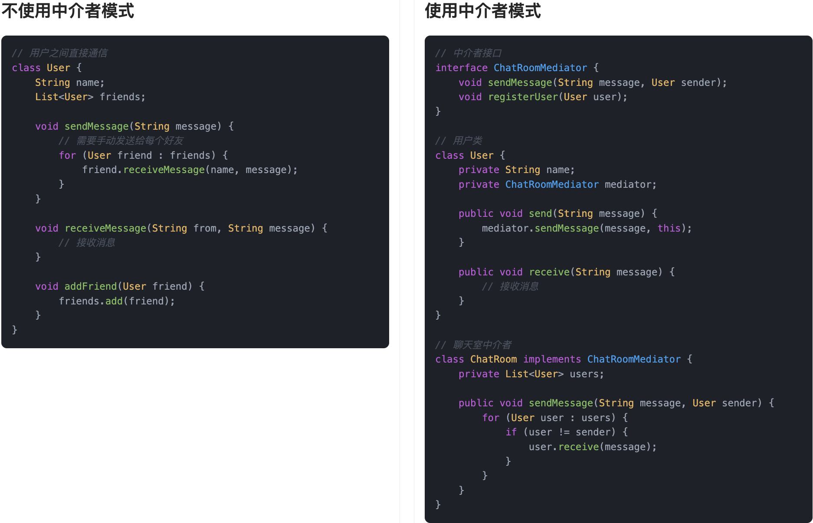
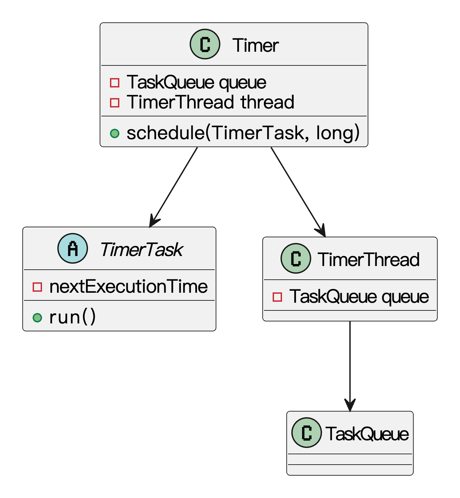

## 什么是中介者模式？
**中介者模式**（Mediator Pattern）是一种行为型设计模式。它的核心思想是：**通过引入一个中介对象，来封装对象之间复杂的交互关系**。各个对象之间不再直接引用或依赖彼此，而是统一通过中介者来进行通信和协作。

说得直白一点，就是大家不再私底下互相打电话沟通，而是都去找一个中间人，由他来负责统一安排和转达。这样做的好处是，每个对象只需要关注自己的行为和中介者的交互，不需要关心其他对象的存在，大大降低了系统的复杂度。

拿生活中的例子来说，鱼皮我前段时间租房子时就遇到了这种情况。早些年我还试过在各种贴吧和微信群里一个个联系房东，问房源、约看房、谈价格，最后人都快崩溃了。现在可不一样，直接找个靠谱的中介，把自己的需求告诉他：“我想在市中心附近租套两居室，预算多少，最好带阳台”，然后坐等中介那边安排房源、联系房东、协调时间，一站式搞定。这时候，中介公司就是那个“中介者对象”，租客和房东之间互不认识、互不打扰，所有沟通都通过中介来完成，省心又高效。


放到程序中也类似。中介者模式的好处是让各个对象之间不再直接依赖彼此，只关注和中介的互动。这不仅降低了耦合度，还让系统更容易扩展和维护。比如以后鱼皮住的不满意想换个房子，不需要联系房东，只要中介那边再帮忙找符合条件的就行了。

## 为什么要使用中介者模式？
当我们开发系统时，随着业务逻辑越来越复杂，对象之间的依赖关系可能呈指数级增长。每个对象直接持有其他对象的引用，一旦有个别对象变化，就可能牵一发而动全身，导致系统变得难以维护。  
通过引入中介者模式，我们让各个对象只依赖中介者，所有的交互逻辑集中在中介者里进行统一管理。这样不仅简化了对象之间的关系，也方便我们集中管理交互逻辑，后续要修改通信流程时，只需要改中介者的实现，大大降低了系统的维护成本和复杂度。

为了让大家更好地感受到中介者模式的作用，以多人聊天室为例，我们需要实现一个消息转发系统，让用户之间能够互相通信。让我们来看看使用和不使用中介者模式的区别：



通过对比可以看出，不使用中介者模式时，每个用户都需要直接管理其他用户的引用，用户之间形成了复杂的网状依赖关系。这种方式导致代码耦合度高，每当需要添加新的用户或修改通信逻辑时，都需要修改多个用户类的代码。

而使用中介者模式后，我们通过`ChatRoomMediator`接口将用户之间的通信集中管理。用户不再需要知道其他用户的存在，只需要与中介者交互。这种设计使得系统更加灵活，添加新的用户只需要创建新的用户类并注册到中介者即可，无需修改现有代码。同时，中介者模式也使得代码结构更加清晰，每个用户类都专注于自己的职责，提高了代码的可维护性。

## 中介者模式的应用场景
举一些开发中典型的应用场景：

+ 聊天室系统中的消息转发：在多人聊天室中，用户之间不能直接通信，而是通过聊天室服务器（中介者）转发消息。每个用户只与中介者打交道，发送消息给中介者，由中介者决定如何分发，避免用户之间耦合。
+ 在线会议或协作工具：在多人在线会议或协作系统中，每个参与者的语音、视频、共享屏幕等行为都由会议服务端（中介者）协调管理，确保信息同步和权限控制清晰，避免点对点通信带来的混乱。
+ 电商平台订单流程协调：在订单系统中，下单后涉及库存、支付、物流、通知等多个子系统。通过中介者模式，一个中控调度中心可以统一协调各子系统的行为，避免它们之间互相调用导致系统高度耦合，便于流程扩展和异常处理。

## 中介者模式的基本结构
中介者模式具有的角色和职责：

1）抽象中介者（Mediator）：定义对象交互的接口，声明发送消息的方法。

2）具体中介者（ConcreteMediator）：实现中介者接口，协调各个具体同事对象之间的通信。

3）抽象同事类（Colleague）：每个同事对象都持有中介者对象的引用，并通过它与其他同事通信。

4）具体同事类（ConcreteColleague）：实现具体的同事逻辑，需要与其他对象通信时，通过中介者转发。

下面用一张类图帮大家更直观地理解中介者模式的结构：


## 中介者模式的实现
下面就以 “多人聊天室消息转发” 为例，我们用中介者模式实现一个简单的聊天室系统。

1）定义中介者接口：声明聊天室中介者的基本职责

```java
public interface ChatRoomMediator {
    void sendMessage(String message, User sender);
    void registerUser(User user);
}
```
中介者接口定义了最核心的两个功能：**消息转发** 和 **聊天室用户注册**。

2）定义抽象用户类：用户通过中介发送和接收消息

```java
public abstract class User {
    protected String name;
    protected ChatRoomMediator mediator;

    public User(String name, ChatRoomMediator mediator) {
        this.name = name;
        this.mediator = mediator;
    }

    public abstract void receive(String message);
    public abstract void send(String message);
}
```
每个用户都依赖中介者接口来通信，而不关心其他用户的存在。

3）实现具体用户类：发送消息和接收消息的具体行为

```java
public class ChatUser extends User {

    public ChatUser(String name, ChatRoomMediator mediator) {
        super(name, mediator);
    }

    @Override
    public void send(String message) {
        System.out.println(this.name + " 发送消息：" + message);
        mediator.sendMessage(message, this);
    }

    @Override
    public void receive(String message) {
        System.out.println(this.name + " 收到消息：" + message);
    }
}
```
这个类具体实现了用户的消息发送和接收逻辑，发送是通过中介者完成的。

4）实现具体中介者类：转发消息给除发送者外的所有用户

```java
import java.util.ArrayList;
import java.util.List;

public class ChatRoom implements ChatRoomMediator {
    private List<User> users = new ArrayList<>();

    @Override
    public void sendMessage(String message, User sender) {
        for (User user : users) {
            if (user != sender) {
                user.receive(sender.name + "：" + message);
            }
        }
    }

    @Override
    public void registerUser(User user) {
        users.add(user);
    }
}
```
这个类集中管理所有用户并负责消息广播，是整个系统的“中枢神经”。

5）客户端调用示例

```java
public class ChatClient {
    public static void main(String[] args) {
        ChatRoom chatRoom = new ChatRoom();

        User1 yupi = new ChatUser("鱼皮", chatRoom);
        User1 yes = new ChatUser("Yes哥", chatRoom);
        User1 y = new ChatUser("小y", chatRoom);

        chatRoom.registerUser(yupi);
        chatRoom.registerUser(yes);
        chatRoom.registerUser(y);

        yupi.send("大家好！");
        yes.send("Hi 鱼皮！");
    }
}
```
输出结果：

```plain
鱼皮 发送消息：大家好！
Yes哥 收到消息：鱼皮：大家好！
小y 收到消息：鱼皮：大家好！
Yes哥 发送消息：Hi 鱼皮！
鱼皮 收到消息：Yes哥：Hi 鱼皮！
小y 收到消息：Yes哥：Hi 鱼皮！
```
在这个例子可以体现出中介者模式的特点：每个用户彼此完全不认识，只与聊天室交互，聊天室负责管理一切通信和逻辑。

## 中介者模式的优缺点
### 优点
+ **减少类之间的耦合**：中介者模式通过将对象之间的交互集中在一个中介者对象中，避免了对象直接引用和依赖其他对象，从而减少了类之间的耦合度，提升了系统的可维护性。
+ **集中控制**：所有的交互都通过中介者来协调，便于对系统进行集中管理和调试。系统中的各个组件通过中介者进行通信，使得修改某个组件的行为时，不会影响到其他组件。
+ **易于扩展和修改**：通过增加新的中介者或修改现有的中介者逻辑，可以很方便地添加新的行为或者改变对象的交互方式，而不需要修改对象本身，符合开闭原则。

### 缺点
+ **中介者复杂度高**：随着系统功能的增加，中介者本身可能变得非常复杂，管理和维护中介者中的逻辑可能变得越来越困难，甚至可能成为系统的瓶颈。
+ **增加了系统的集中性风险**：如果所有的交互都通过中介者处理，当中介者出现问题时，可能导致整个系统的瘫痪。因此，需要确保中介者能够高效、稳定地处理交互。
+ **不适用于简单场景**：如果系统的交互关系简单，使用中介者模式可能会显得过度设计。此时，直接通过对象间的简单交互可能更为高效和清晰。

## 扩展知识 - 源码分析
### 开源框架中的应用
#### 1、JDK
在 JDK 的 `java.util.Timer` 定时任务调度机制中，其实背后就是用中介者模式协调多个任务的执行。

我们可以简单拆解一下这个结构：

+ `TimerTask` 代表各个“参与者”，每个任务都知道自己什么时候执行，但并不直接调度自己。
+ `Timer` 就是中介者，它统一管理所有任务的调度逻辑。

我们来看一下部分关键源码：

```java
public abstract class TimerTask implements Runnable {
    long nextExecutionTime;

    public abstract void run(); // 子类实现定时逻辑
}

public class Timer {
    private final TaskQueue queue = new TaskQueue();
    private final TimerThread thread = new TimerThread(queue);

    public void schedule(TimerTask task, long delay) {
        if (delay < 0)
            throw new IllegalArgumentException("Negative delay.");
        sched(task, System.currentTimeMillis()+delay, 0);
    }

}

```
在这个结构里，`TimerTask` 负责定义任务逻辑，而 `Timer` 统一调度这些任务执行时间和顺序，这就很符合中介者模式的核心思想：让参与者之间不直接交互，而是通过一个中介协调处理。

我们通过类图来理解下基本结构:



### 优势和作用
通过上述的源码分析，我们可以再次总结下中介者模式的作用。

#### 1、降低对象之间的耦合度
在 `java.util.Timer` 的结构中，所有调度逻辑都集中在 `Timer` 里，各个 `TimerTask` 只负责自己的执行逻辑，不需要知道其他任务的存在。通过 `Timer` 这个中介者，任务之间不再直接交互，模块职责更清晰，代码依赖也更简单。

#### 2、提升可扩展性与维护性
任务调度统一由 `Timer` 控制，我们只需修改 `Timer` 的逻辑，就能调整所有任务的调度策略。这样的集中管理方式，更适合处理复杂变化，也便于后期扩展和维护。

## 相关面试题
可以在 [程序员面试刷题神器 - 面试鸭](https://www.mianshiya.com/) 上获取到企业常问的设计模式面试题。比如：

1）[什么是中介者模式？一般用在什么场景？ ](https://www.mianshiya.com/bank/1801559627969929217/question/1803305756926664705)


