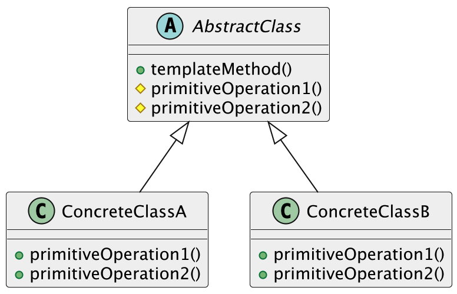
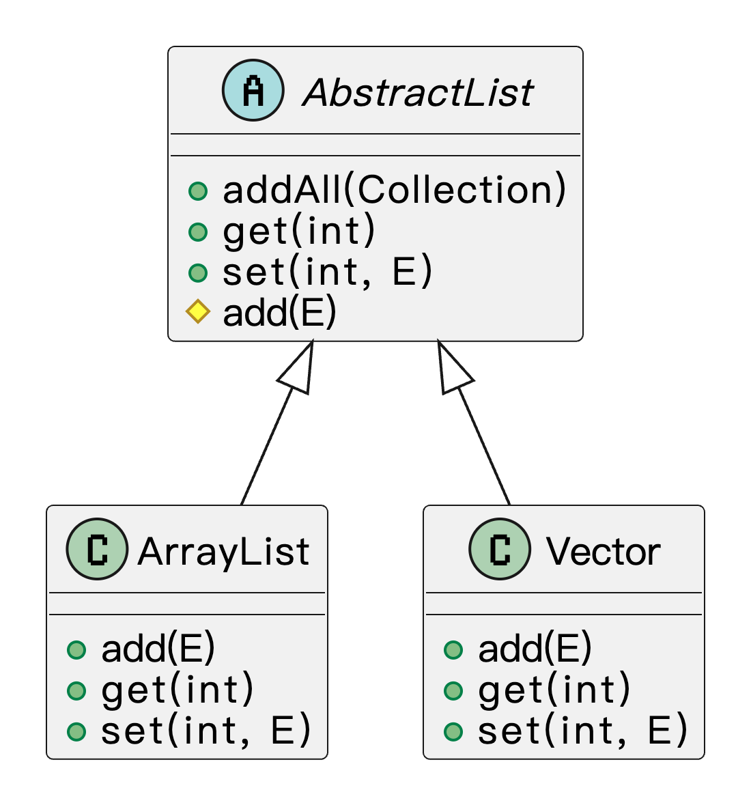

## 什么是模板方法模式？
**模板方法模式**（Template Method Pattern）是一种行为型设计模式，它的核心思想是：**在一个方法中定义好算法的整体流程结构，把一些具体的步骤延迟到子类中去实现**。也就是说，父类负责规定流程框架，具体的细节由子类根据需要自己去填充。

简单讲，就是我们在父类里搭好框架，规定好执行流程，哪些步骤必须有，哪些步骤需要变化，但是具体怎么做，由子类去填充细节。这样做有一个很重要的好处：能够复用通用流程的代码，又能灵活地定制细节。父类定义流程骨架，子类实现具体内容，两边互不干扰。

鱼皮在写代码前都有泡茶或者泡咖啡的习惯，这两个其实流程都差不多：先烧水、再冲泡、然后倒进杯子，最后加点糖或者柠檬。烧水、倒水这些是固定套路，但“泡茶”还是“冲咖啡”，就要看具体饮品来决定了。换句话说，这个泡饮品的流程，其实就是父类写的“模板方法”，不同饮品自己来决定怎么实现具体步骤。

### 
## 为什么要使用模板方法模式？
在开发中，很多业务场景虽然看起来不同，但其实流程结构是类似的。如果我们在每个具体实现里都重复写相同的流程控制代码，不仅代码量大，而且维护困难。  
使用模板方法模式以后，我们能把公共的流程逻辑抽取到父类里，保证结构统一，又能让不同子类根据实际情况去扩展自己的特殊步骤。  
这样一来，代码复用率高了，扩展也变得更方便了。特别是在流程标准化又希望有一定灵活性的时候，模板方法模式可以说非常合适。

为了让大家更好地感受到模板方法模式的作用，以订单处理流程为例，我们需要实现一个支持不同类型订单处理的系统。让我们来看看使用和不使用模板方法模式的区别：

通过对比可以看出，不使用模板方法模式时，每个订单处理类都需要重复实现相同的流程步骤，导致代码重复，且难以维护。当需要修改公共流程时，需要修改所有相关的类，增加了出错的风险。

而使用模板方法模式后，我们将公共的流程步骤定义在抽象类中，具体的实现细节由子类完成。这种设计使得代码结构更加清晰，减少了重复代码，提高了代码的可维护性。同时，模板方法模式也使得系统更容易扩展，添加新的订单类型只需要创建新的子类并实现特定的方法即可。

## 模板方法模式的应用场景
举一些开发中典型的应用场景：

+ 爬虫系统中的通用抓取流程：在开发爬虫时，不同网站的页面结构不同，但抓取流程往往类似（如：建立连接 → 下载页面 → 解析内容 → 保存数据）。可以使用模板方法模式定义抽象的抓取流程，将每一步封装成钩子方法，让子类实现特定网站的解析逻辑。
+ 活动营销系统中的通用促销流程：在电商的促销活动中，执行流程类似（校验资格 → 计算优惠 → 发送通知），但每种活动的优惠逻辑不同。可以通过模板方法封装统一的执行框架，不同的促销活动继承实现自己的优惠计算方式。
+ 订单处理流程标准化：在大型电商或供应链系统中，不同类型订单（实物商品、虚拟商品、预售商品等）的处理流程高度相似（如校验 → 支付 → 发货 → 通知），但发货逻辑或通知方式有所差异。可用模板方法抽象出通用流程结构，允许各子类扩展具体细节逻辑。

## 模板方法模式的基本结构
模板方法模式具有的角色和职责：

1）抽象类（AbstractClass）：定义模板方法和基本流程骨架，声明一些抽象操作让子类实现。

2）具体子类（ConcreteClass）：实现父类定义的抽象步骤，完成特定子类自己的逻辑。

下面用一张类图帮大家更直观地理解模板方法模式的结构：



## 模板方法模式的实现
下面就以 “订单处理流程” 为例，我们用模板方法模式实现一个简单的订单处理流程。

1）定义抽象类：提供模板方法和公共流程

```java
abstract class OrderProcessTemplate {
    // 模板方法，定义了订单处理的固定步骤
    public final void processOrder() {
        checkStock();
        pay();
        deliver();
        notifyCustomer();
    }

    // 校验库存的步骤，所有订单都需要
    protected void checkStock() {
        System.out.println("检查库存");
    }

    // 支付步骤，交由具体子类实现
    protected abstract void pay();

    // 发货步骤，交由具体子类实现
    protected abstract void deliver();

    // 通知客户的步骤，所有订单都需要
    protected void notifyCustomer() {
        System.out.println("通知客户订单处理完成");
    }
}
```
在这段代码中，我们定义了一个 `OrderProcessTemplate` 类，其中的 `processOrder` 方法是模板方法，包含了订单处理的公共步骤。`checkStock` 和 `notifyCustomer` 是所有订单都必须进行的步骤，所以它们在父类中实现了。而 `pay` 和 `deliver` 这些具体的步骤则被声明为抽象方法，由具体的子类实现。

2）实现具体子类：实现具体步骤

```java
class PhysicalProductOrder extends OrderProcessTemplate {
    @Override
    protected void pay() {
        System.out.println("支付实物商品的订单");
    }

    @Override
    protected void deliver() {
        System.out.println("发货实物商品");
    }
}
```
具体子类 `PhysicalProductOrder` 实现了支付和发货的具体逻辑，对于实物商品的订单，支付方式和发货方式可能与虚拟商品不同。

```java
class VirtualProductOrder extends OrderProcessTemplate {
    @Override
    protected void pay() {
        System.out.println("支付虚拟商品的订单");
    }

    @Override
    protected void deliver() {
        System.out.println("通过邮件发送虚拟商品");
    }
}
```
`VirtualProductOrder` 继承了模板类，并实现了虚拟商品的支付和发货逻辑。对于虚拟商品，支付和发货的流程与实物商品不同。

3）客户端调用示例

```java
public class Client {
    public static void main(String[] args) {
        System.out.println("处理实物商品订单：");
        OrderProcessTemplate physicalOrder = new PhysicalProductOrder();
        physicalOrder.processOrder(); // 调用模板方法

        System.out.println("\n处理虚拟商品订单：");
        OrderProcessTemplate virtualOrder = new VirtualProductOrder();
        virtualOrder.processOrder(); // 调用模板方法
    }
}
```
输出结果：

```plain
处理实物商品订单：
检查库存
支付实物商品的订单
发货实物商品
通知客户订单处理完成

处理虚拟商品订单：
检查库存
支付虚拟商品的订单
通过邮件发送虚拟商品
通知客户订单处理完成
```
在这个下单的例子中，使用模板方法模式可以帮助我们抽象出公共的处理流程（如检查库存和通知客户），并允许具体的子类去定制化支付和发货的实现细节。这样一来，系统能够处理不同类型的订单，但流程依然保持一致，同时又能根据具体的订单类型（如实物商品和虚拟商品）来定制具体步骤。

## 模板方法模式的优缺点
### 优点
+ **代码复用性高**：模板方法模式的最大优势就是能够在父类中提供一个统一的流程框架，子类只需要实现特定的步骤，避免了重复的代码，实现了高效的代码复用。
+ **控制流程**：父类定义了一个整体的算法流程，并且控制了步骤的执行顺序，确保了算法的一致性。子类只能修改某些特定步骤，保证了流程的稳定性。
+ **提高扩展性**：模板方法模式将通用的逻辑放在父类中，子类只需关心自己特有的部分。这样，新增子类时，基本不需要修改现有代码，扩展非常方便。

### 缺点
+ **父类过于庞大**：如果模板方法里有很多步骤，而每个步骤都涉及到大量的逻辑，父类可能会变得非常臃肿，难以维护。
+ **不够灵活**：模板方法模式限制了子类的行为，子类只能修改父类中的某些步骤，无法对整体流程进行更多的定制，这在某些情况下可能导致灵活性不足。
+ **过多的继承关系**：使用模板方法模式时，可能会引入过多的继承层次，增加了类之间的耦合性，不利于系统的可维护性。

## 扩展知识 - 源码分析
### 开源框架中的应用
#### 1、JDK
在 JDK 的集合框架里，其实模板方法模式的用法特别常见。我们可以看到 `AbstractList`、`AbstractSet`、`AbstractMap` 这些抽象类里，都提前定义好了集合的整体操作逻辑，而把具体行为留给子类去实现。我们拿 `AbstractList` 这个类来举个例子。

比如 `addAll(Collection<? extends E> c)` 这个方法，它的整体流程是已经写死的：先做参数检查、然后遍历集合调用 `add()` 方法、再根据添加结果返回布尔值。但是这个 `add()` 方法本身是抽象的，交给子类来实现。

```java
public abstract class AbstractList<E> extends AbstractCollection<E> implements List<E> {

    // 模板方法，添加所有元素
    public boolean addAll(int index, Collection<? extends E> c) {
        rangeCheckForAdd(index);
        boolean modified = false;
        for (E e : c) {
            // 调用子类的 add 方法，模板方法的核心体现
            add(index++, e);
            modified = true;
        }
        return modified;
    }

    abstract E get(int index);

    abstract E set(int index, E element);
}
```
在这个过程中，`addAll()` 是一个**模板方法**，规定好了执行流程，而把核心操作 `add()` 抽象出来。这样不同的集合子类可以自定义 `add()` 的实现，但整个流程逻辑是不变的。

我们可以通过类图来表示下结构：



#### 2、Spring 框架
在 Spring 中，`JdbcTemplate` 是一个非常典型的模板方法模式的应用。我们在平时写数据库代码的时候，只需要传入 SQL 和参数，甚至只实现一个回调接口，就能完成复杂的操作，比如查询、更新、事务控制等等。

它的核心思路是：先定义好数据库操作的整体流程，包括：

1）获取连接 

2）执行 SQL 

3）处理结果集 

4）关闭连接

这里我们只关心传入SQL语句，以及怎么把查询结果的数据映射成对象，其他像连接的获取、语句的执行、结果的处理、资源的释放，全部由 `JdbcTemplate` 处理好。我们来看下源码：

```java
public class JdbcTemplate extends JdbcAccessor implements JdbcOperations {

    public <T> T query(String sql, ResultSetExtractor<T> rse) throws DataAccessException {
        // 省略其他代码...
        return execute(new QueryStatementCallback(sql, rse));
    }

    private <T> T execute(StatementCallback<T> action, boolean closeResources) throws DataAccessException {
        Assert.notNull(action, "Callback object must not be null");
        // 从数据源中获取一个数据库连接
        Connection con = DataSourceUtils.getConnection(obtainDataSource());
        Statement stmt = null;
        try {
            // 创建一个 Statement 对象用于执行 SQL
            stmt = con.createStatement();
            // 应用配置，比如设置超时时间、fetch size 等
            applyStatementSettings(stmt);
            // 执行回调中的数据库逻辑，回调交给使用者处理
            T result = action.doInStatement(stmt);
            handleWarnings(stmt);
            return result;
        }
        catch (SQLException ex) {
            // 省略其他代码...
        }
        finally {
            if (closeResources) {
                JdbcUtils.closeStatement(stmt);
                DataSourceUtils.releaseConnection(con, getDataSource());
            }
        }
    }
}
```
这个 `execute` 方法就像模板一样，定义了整体数据库访问的步骤，而具体逻辑由回调类 `QueryStatementCallback`去实现。

### 优势和作用
通过上述的源码分析，我们可以再次总结下模板方法模式的作用。

#### 1、统一流程、提升复用
模板方法把一套通用流程写在父类里，只把个别步骤留给子类实现。比如 JDK 中的 `AbstractList`、`AbstractSet`、`AbstractMap`，都统一了集合的核心逻辑，具体添加、删除交由子类完成；Spring 的 `JdbcTemplate`也是，把连接、执行、关闭这些流程封装好了，我们只管写 SQL 和处理结果。

#### 2、提升扩展能力
如果我们想加点新逻辑，只需要继承父类或传入回调就行，不需要动原来的模板。像 `JdbcTemplate` 支持自定义 `RowMapper`，集合框架也允许我们扩展自定义的 List、Set，非常方便。

#### 3、减少出错概率
一些操作必须按照固定顺序执行，比如数据库的连接、释放。如果交给开发者手写，很容易出错。模板方法把这些顺序定死了，流程稳定、出错少。

#### 4、适合框架封装
框架里常有固定流程 + 可扩展的场景，模板方法很适合这种结构。Spring、Servlet、JDBC 里都大量用到了它。

## 相关项目
#### 编程导航的智能云图库项目
在 [编程导航的智能云图库项目](https://www.codefather.cn/course/1864210260732116994) 的图片上传模块中，使用了模板方法模式。通用的上传流程（如校验、生成临时文件、上传到对象存储、解析图片信息、删除临时文件）被统一定义在抽象类 `PictureUploadTemplate` 中。对于“本地文件上传”和“URL 上传”这两种不同的场景，分别通过子类 `FilePictureUpload` 和 `UrlPictureUpload` 实现，在“校验图片”、“获取文件名”、“下载或处理文件”等与输入源相关的步骤中提供差异化逻辑，其余流程则复用模板父类的实现。


#### 编程导航的代码生成器平台项目
在 [编程导航的代码生成器平台项目](https://www.codefather.cn/course/1790980795074654209) 的生成器模块中使用了模板方法模式。由于生成流程较多且逻辑复杂，将整体流程抽象成模板基类，统一定义执行步骤的标准流程。具体的生成环节（如生成 JAR 包、生成脚本等）由不同的子类实现，从而在不改动主流程结构的前提下，根据实际需求定制各步骤逻辑。例如，如果需要在生成 JAR 包的环节中增加输出信息，只需新增一个子类并重写对应方法即可，有助于提升代码的可维护性和扩展性。


#### 编程导航的 OJ 判题项目
在 [编程导航的 OJ 判题项目 ](https://www.codefather.cn/course/1790980707917017089)的代码沙箱模块中，使用了模板方法模式来统一管理 Java 原生沙箱和 Docker 沙箱的执行流程。由于两者的核心业务流程基本一致，包括保存文件、编译代码、执行程序、收集结果、清理文件和错误处理等操作，且部分步骤可通用，因此通过抽象出统一模板以减少重复实现。

具体做法是，定义了一个抽象的沙箱模板类，其中用一个模板方法固定了执行流程的整体结构，并将每个处理环节抽象成独立方法，允许子类根据需要进行重写。Java 原生沙箱和 Docker 沙箱分别继承该模板类，共享通用的处理逻辑，同时对差异化环节（如执行逻辑）进行自定义实现。通过这种方式，既避免了重复代码，也提高了流程的清晰度和系统的扩展性。


## 相关面试题
可以在 [程序员面试刷题神器 - 面试鸭](https://www.mianshiya.com/) 上获取到企业常问的设计模式面试题。比如：

1）[什么是模板方法模式？一般用在什么场景？ ](https://www.mianshiya.com/bank/1801559627969929217/question/1802939152477790209)


