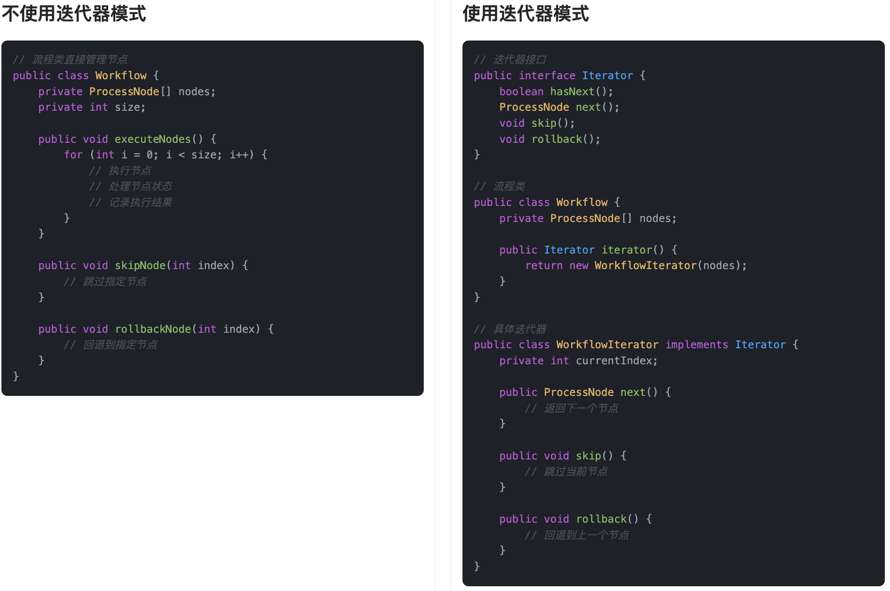

## 什么是迭代器模式?
**迭代器模式**（Iterator Pattern）是一种行为型设计模式，它的主要作用是**提供一种方法，顺序访问一个集合对象内部的元素，而又不暴露集合的内部结构。**

简单说就是，我们不需要知道集合内部是怎么存储数据的（比如是数组、链表还是其他什么复杂结构），只需要通过统一的接口一步步访问元素，像走楼梯一样一级一级地拿到数据。这种模式，把遍历操作从集合对象里抽取了出来，专门交给迭代器对象去处理。集合本身负责存放数据，迭代器负责按顺序去访问数据，两边各司其职，互不干扰。

就拿编程导航网站来说，我们会在里面刷帖，首页有各种热门技术帖、面试经验总结、代码分享等等。你点下一页，或者下拉加载，它就自动给你继续展示新的帖子。这个网站背后其实管理着成百上千条帖子，可能分门别类地存放在数据库里，但对于我们用户来说，根本不关心底层是怎么存的，我们只关心——“我下拉之后能不能顺利接着看下一条”。


这就是迭代器模式的典型应用。前端页面就像是调用了一个“帖子迭代器”，每调用一次下一页，就能拿到下一页的数据。而迭代器背后已经封装好了怎么去找数据、怎么去分页、甚至怎么缓存。

所以说，迭代器模式的好处就在于，它把“访问方式”从“存储结构”里解耦了出来。数据该怎么展示是前端的事，数据怎么存是后端的事，两个互不干扰，代码也更清晰、扩展性更好。

## 为什么要使用迭代器模式？
在开发中，集合对象内部的数据结构往往不一样，有的可能是数组，有的是链表，甚至还有更复杂的树结构。如果我们每次都直接操作内部结构，不仅耦合度高，而且维护起来非常麻烦。  
使用迭代器模式以后，集合内部怎么存储，遍历逻辑怎么实现，都被封装到专门的迭代器对象中，集合只需要提供一个统一的接口给外部使用。这样做可以有效地降低集合和使用者之间的耦合，同时让遍历操作更加灵活、安全，也更符合面向对象编程的设计原则。

为了让大家更好地感受到迭代器模式的作用，以流程节点遍历为例，我们需要实现一个支持遍历流程节点的系统。让我们来看看使用和不使用迭代器模式的区别：



通过对比可以看出，不使用迭代器模式时，流程类直接暴露了内部数组，客户端需要了解数组的实现细节才能进行遍历。这种方式导致代码耦合度高，且难以扩展，比如当需要改变内部存储结构时，所有使用该类的代码都需要修改。

而使用迭代器模式后，我们将遍历逻辑封装在迭代器类中，客户端只需要通过统一的接口进行遍历，不需要关心内部实现细节。这种设计使得代码结构更加清晰，降低了耦合度，提高了代码的可维护性。

## 迭代器模式的应用场景
举一些开发中典型的应用场景：

+ 自定义分页组件的数据遍历：在实现自定义分页功能时，后台可能需要遍历分页数据源（如数据库游标、远程接口返回的数据流）。通过迭代器模式封装遍历逻辑，使分页组件与数据源解耦，统一访问方式。
+ 流程引擎中的节点遍历：在审批流程或业务流程引擎中，每个流程由多个节点组成，系统需要按顺序遍历这些节点来执行相应操作。使用迭代器模式可以统一节点遍历逻辑，支持顺序执行、跳过、回退等操作。

## 迭代器模式的基本结构
迭代器模式具有的角色和职责：

1）迭代器接口（Iterator）：定义访问和遍历元素的方法。

2）具体迭代器（ConcreteIterator）：实现迭代器接口，负责具体遍历逻辑。

3）聚合接口（Aggregate）：定义创建迭代器对象的方法。

4）具体聚合（ConcreteAggregate）：实现聚合接口，创建对应的迭代器实例。

下面用一张类图帮大家更直观地理解迭代器模式的结构：


## 迭代器模式的实现
下面就以 “流程引擎中的节点遍历” 为例，我们用迭代器模式实现一个简单的流程节点遍历系统。

1）定义节点类：表示流程中的一个节点

```java
class ProcessNode {
    private String name;

    public ProcessNode(String name) {
        this.name = name;
    }

    public String getName() {
        return name;
    }

    @Override
    public String toString() {
        return "ProcessNode{name='" + name + "'}";
    }
}
```
在这段代码中，我们定义了一个 `ProcessNode` 类，表示流程中的一个节点。每个节点有一个名称，表示这个节点的类型（如“审批节点”，“通知节点”等）。我们实现了 `toString` 方法，方便在遍历时输出节点信息。

2）定义迭代器接口：提供统一的遍历方法

```java
interface Iterator {
    boolean hasNext();  // 判断是否还有下一个元素
    Object next();      // 获取下一个元素
}
```
在这里，我们定义了一个 `Iterator` 接口，它包含 `hasNext()` 和 `next()` 方法。`hasNext()` 判断是否还有下一个节点，`next()` 返回下一个节点。

3）定义具体的流程类：实现节点集合并返回迭代器

```java
class Workflow {
    private ProcessNode[] nodes;
    private int size;

    public Workflow(int capacity) {
        nodes = new ProcessNode[capacity];
        size = 0;
    }

    // 添加节点到流程中
    public void addNode(ProcessNode node) {
        if (size < nodes.length) {
            nodes[size++] = node;
        }
    }

    // 返回流程的迭代器
    public Iterator iterator() {
        return new WorkflowIterator();
    }

    // 具体的迭代器实现类
    private class WorkflowIterator implements Iterator {
        private int index;

        public WorkflowIterator() {
            index = 0;
        }

        @Override
        public boolean hasNext() {
            return index < size;
        }

        @Override
        public Object next() {
            if (hasNext()) {
                return nodes[index++];
            }
            return null;
        }
    }
}
```
在这里，我们定义了一个 `Workflow` 类，表示流程。`Workflow` 内部保存了一个节点数组，并提供了 `addNode()` 方法来添加节点。`iterator()` 方法返回一个 `Iterator` 对象，用于遍历流程中的节点。我们实现了一个 `WorkflowIterator` 内部类，它实现了 `Iterator` 接口，提供了节点的遍历逻辑。

4）客户端调用示例

```java
public class Client {
    public static void main(String[] args) {
        Workflow workflow = new Workflow(5);
        workflow.addNode(new ProcessNode("开始"));
        workflow.addNode(new ProcessNode("审批"));
        workflow.addNode(new ProcessNode("通知"));
        workflow.addNode(new ProcessNode("结束"));

        // 获取迭代器进行遍历
        Iterator iterator = workflow.iterator();
        while (iterator.hasNext()) {
            ProcessNode node = (ProcessNode) iterator.next();
            System.out.println("Executing node: " + node);
        }
    }
}
```
输出结果：

```plain
Executing node: ProcessNode{name='开始'}
Executing node: ProcessNode{name='审批'}
Executing node: ProcessNode{name='通知'}
Executing node: ProcessNode{name='结束'}
```
在客户端测试代码中，我们首先创建了一个 `Workflow` 对象并添加了几个节点。然后，通过 `iterator()` 方法获取迭代器，使用 `hasNext()` 和 `next()` 方法遍历流程中的节点并执行相关操作。每次调用 `next()` 都返回一个节点对象，并打印节点的执行信息。

## 迭代器模式的优缺点
### 优点
+ **简化遍历操作**：迭代器模式将集合的遍历过程抽象出来，提供了统一的接口来访问集合中的元素。这样，客户端不需要关心集合的具体实现，遍历操作变得更加简单和一致。
+ **支持多种遍历方式**：通过迭代器，集合的遍历方式可以灵活调整，比如可以用不同的顺序遍历集合，甚至在一些情况下，可以实现反向遍历等功能，增强了系统的灵活性。
+ **避免暴露集合的内部结构**：迭代器模式通过引入迭代器对象来控制集合元素的访问，客户端无需知道集合内部是如何存储的，从而保护了集合的封装性，符合信息隐藏原则。

### 缺点
+ **增加了复杂性**：虽然迭代器模式提供了统一的接口，但为了支持迭代器，可能需要引入额外的类和接口，这会导致系统的类数增加，增加了实现的复杂度。
+ **不适合小型集合**：在一些简单的小型集合中，使用迭代器模式可能显得有些过于复杂。对于一些简单的列表，直接使用传统的遍历方式可能会更加简单和高效。
+ **只能一次遍历**：标准的迭代器模式通常只支持单一方向的遍历，并且在遍历过程中无法回溯。如果需要多次遍历或在遍历过程中进行复杂的状态修改，可能需要额外的管理或更复杂的设计。

## 扩展知识 - 源码分析
### 开源框架中的应用
#### 1、JDK
Java 集合框架对迭代器模式的应用特别典型。我们可以随便打开一个集合类，比如 `ArrayList`，会发现它实现了 `Iterable` 接口，里面有个`iterator()`方法，我们来看下实现的源码：

```java
public class ArrayList<E> extends AbstractList<E>
        implements List<E>, RandomAccess, Cloneable, java.io.Serializable
      public Iterator<E> iterator() {
        return new Itr();
    }

      private class Itr implements Iterator<E> {
        int cursor;       // index of next element to return
        int lastRet = -1; // index of last element returned; -1 if no such
        int expectedModCount = modCount;

        Itr() {}

        // 负责遍历逻辑
        public boolean hasNext() {
            // 判断是否还有元素
        }

        public E next() {
            // 返回当前元素，并指向下一个
        }

        public void remove() {
            // 可选操作，移除当前元素
        }
    }
}

```
这里的`iterator()`方法返回了一个Itr内部类的实例，它实现了`Iterator`接口。通过`hasNext()`和`next()`我们就可以一步步安全地遍历ArrayList。

也就是说，我们不需要知道 `ArrayList` 是基于数组还是链表，它都提供了统一的遍历方式。`HashSet`、`LinkedList` 也是一样的处理逻辑。

### 优势和作用
通过上述的源码分析，我们可以再次总结下迭代器模式的作用。

#### 1、统一访问方式
`ArrayList` 实现了 `Iterable` 接口，不管内部是数组还是其他结构，我们都可以用 `Iterator` 或增强 for 循环来遍历，代码更统一。

#### 2、隐藏实现细节
具体的遍历逻辑封装在内部类 `Itr` 中，使用时只需要关心 `hasNext()` 和 `next()`，不用了解底层怎么实现。

#### 3、增强可扩展性
只要实现了 `Iterable` 接口，任何自定义集合都能接入现有遍历逻辑，无需修改调用方代码，方便扩展。

## 相关面试题
可以在 [程序员面试刷题神器 - 面试鸭](https://www.mianshiya.com/) 上获取到企业常问的设计模式面试题。比如：

1）[什么是迭代器模式？一般用在什么场景](https://www.mianshiya.com/bank/1801559627969929217/question/1802939021862969346)  


