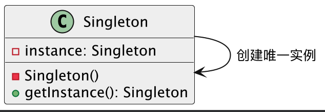
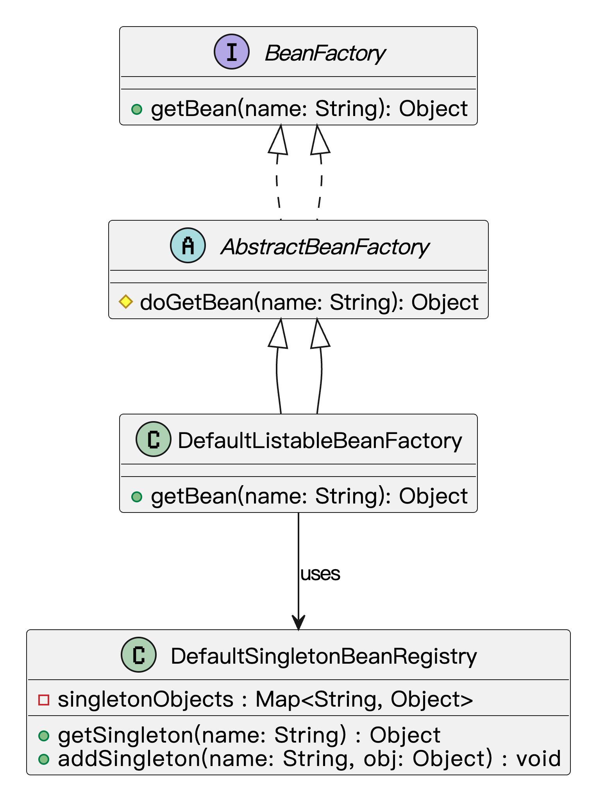
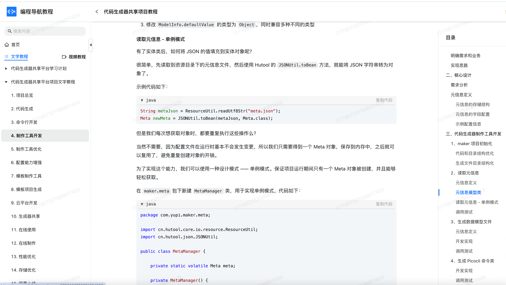
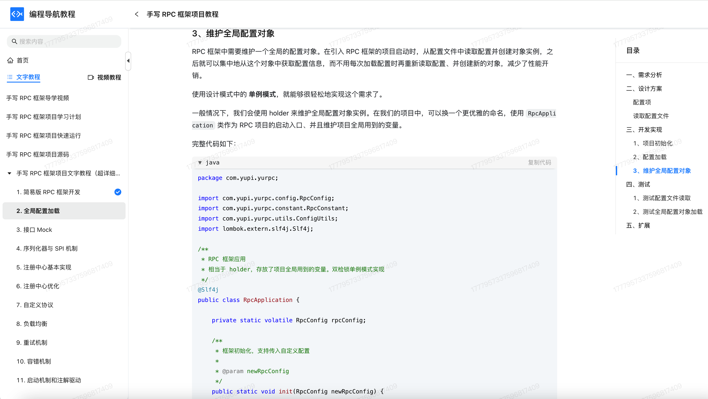

## 什么是单例模式？
**单例模式**（Singleton Pattern）是一种创建型设计模式，它就是说：一个类在整个应用运行期间，**只能有一个实例**，而且这个实例对外提供一个全局访问点。换句话说，无论是在哪儿调用这个类，拿到的永远都是同一个对象。

举个例子，鱼皮是鱼鸢网络公司的老板。老板这个角色，整个公司只能有一个，对吧？你不能今天开会有一个老板，明天写代码又冒出来另一个老板。员工要联系老板，肯定不是“自己 new 一个”，而是通过公司内部的某个统一入口，比如“老板办公室”或者“老板微信”，直接找到现有的老板。


程序里也是一样。像数据库连接池、线程池、缓存管理器这些东西，如果每次用都重新 new，一个项目跑不了几天内存就炸了。所以我们通常只让它们有一个唯一实例，整个系统共享，这样不仅节省资源，还方便统一管理。

单例模式解决的正是这个问题：**全局只能有一个对象，而且这个对象谁都能随时找到**。

## 为什么要使用单例模式？
它有下列优点：

1. 节省资源：控制实例数量，避免在高频访问场景中反复创建销毁。
2. 统一管理：全局只有一个入口，方便统一初始化和清理，比如统一配置、日志级别控制 。
3. 线程安全：好的单例实现可以天然保证多线程环境下只有一次创建，避免竞态条件。
4. 与其他模式结合：单例常常作为工厂、抽象工厂等模式的基础组件，为更复杂的结构型、行为型模式提供支持。

为了让大家更好地感受到单例模式的作用，以数据库连接管理器为例，我们需要确保整个应用程序中只有一个数据库连接实例，以避免资源浪费和连接冲突。让我们来看看使用和不使用单例模式的区别：


通过对比可以看出，不使用单例模式时，每次创建 `DBConnectionManager` 实例都会建立新的数据库连接，这导致了资源浪费、连接对象数过多、管理困难等问题。多个连接实例的存在还可能引发数据一致性问题，增加了系统维护的复杂度。

而使用单例模式后，我们确保了整个应用程序中只有一个数据库连接实例，有效避免了资源浪费。通过私有构造函数和静态获取方法，我们实现了对实例创建的严格控制，保证了连接的唯一性。这种实现方式不仅节省了系统资源，还简化了连接管理，提高了系统的可维护性。

## 单例模式的基本结构
下面用一张类图帮大家更直观地理解单例模式的结构：



在这个类图中：

`Singleton()` 是私有构造方法，防止外部实例化

`instance`是私有的静态实例变量

`getInstance()` 是对外暴露的获取实例的静态方法

## 单例设计模式的基本要求
单例方法模式的基本特点：

1）私有化构造器：禁止外部直接 `new`，这样才能确保外部拿不到新对象。

2）持有唯一实例的静态变量：通常写成 `private static Singleton instance;`，程序启动或首次访问时再创建。。

3）全局访问点：提供一个 `public static getInstance()` 方法，外部就通过这个方法拿到唯一实例。

4）线程安全：在多线程场景下，还得保证并发时也只有一份，常见做法有加锁、双检锁、静态内部类、或者直接用枚举。

## 单例模式的应用场景
举一些开发中典型的应用场景：

+ 全局唯一ID生成器：在电商、内容平台等高并发系统中，需要全局唯一的订单号、用户ID、消息ID等，通常会实现一个雪花算法（Snowflake）或时间戳+随机数生成器，作为单例使用，保证线程安全和唯一性。
+ 系统配置管理类：很多应用在启动时会加载一份配置（如系统参数、限流配置、第三方服务地址等），通过单例模式保证在内存中只加载一次，全局共享，避免重复读取和资源浪费。
+ 应用级缓存组件：例如一些基础数据（地区列表、标签分类、活动配置等）缓存到内存中，需要多个模块共享，通常封装成单例类，提供统一的读写接口，保证数据一致性。

## 单例模式的几种实现
1）饿汉式（Eager Initialization）

饿汉式是在类加载阶段就完成实例化，保证从第一次访问该类到程序结束，全局只有这一个实例。它依赖 JVM 的类加载机制来确保线程安全。

```java
public class Singleton {
    private static final Singleton INSTANCE = new Singleton();
    private Singleton() { }
    public static Singleton getInstance() {
        return INSTANCE;
    }
}

```
2）懒汉式（Synchronized Lazy）

懒汉式在第一次调用 `getInstance()` 时才创建实例，通过对该方法加锁来保证线程安全，适合对启动性能有要求且实例不一定马上需要的场景。

```java
public class Singleton {
    private static Singleton instance;
    private Singleton() { }
    public static synchronized Singleton getInstance() {
        if (instance == null) {
            instance = new Singleton();
        }
        return instance;
    }
}

```
3）双重检查锁定（Double-Checked Locking）

双重检查锁定结合了懒汉式的延迟加载和饿汉式的高性能，首次创建时加锁，后续访问则跳过同步块，从而减少锁开销。

```java
public class Singleton {
    private static volatile Singleton instance;
    private Singleton() { }
    public static Singleton getInstance() {
        if (instance == null) {
            synchronized (Singleton.class) {
                if (instance == null) {
                    instance = new Singleton();
                }
            }
        }
        return instance;
    }
}

```
4）静态内部类（Initialization-on-demand Holder）

利用 JVM 在加载外部类时并不立即加载内部类的特性，将实例的创建延迟到真正访问内部类时。既能延迟加载，又能借助类加载的线程安全特性。

```java
public class Singleton {
    private Singleton() { }
    private static class Holder {
        private static final Singleton INSTANCE = new Singleton();
    }
    public static Singleton getInstance() {
        return Holder.INSTANCE;
    }
}

```
5）枚举式（Enum Singleton）

利用 Java 枚举类型的特性，枚举值在类加载时就创建，JVM 保证枚举实例的线程安全和唯一性。同时，枚举对序列化和反射攻击具有天然防护能力。

```java
public enum Singleton {
    INSTANCE;
}

```
## 单例模式的优缺点
### 优点
+ **全局唯一，资源可控**：单例模式可以保证某个类在系统中始终只有一个实例，这对一些需要全局共享资源的场景，比如配置管理器、线程池、缓存等，非常实用，既节省资源又避免冲突。
+ **提供统一访问点**：通过统一的 getInstance() 方法获取实例，不用每次都去 new，代码更简洁，管理也更集中，有时候还能结合懒加载，提升性能。
+ **便于扩展为多线程安全版本**：只要设计得当，比如加锁、使用双重检查或静态内部类方式，都能很好地保证线程安全，让单例在多线程环境下也能稳定运行。

### 缺点
+ **不利于测试和扩展**：单例一旦写死了，很难在单元测试时替换成 mock 对象，也不容易在运行时切换成别的实现，不利于灵活扩展和测试隔离。
+ **可能引发隐藏的状态问题**：由于单例在多个地方被共享使用，容易导致不小心在一个地方修改了它的状态，影响到其他地方的行为，尤其在多线程环境下更容易出问题。
+ **生命周期不可控**：单例通常在 JVM 生命周期内都存在，不容易销毁，容易导致资源无法及时释放。如果单例中持有了重资源，比如数据库连接或者文件句柄，可能造成内存泄漏风险。

## 扩展知识 - 源码分析
### 开源框架中的应用
#### 1、JDK
java.lang.Runtime 类就是一个标准的单例，它通过 getRuntime() 方法返回唯一实例。

平时我们要执行一些本地命令，比如启动外部程序或者获取系统环境信息，都会用到 `Runtime.getRuntime()`：

```java
Runtime runtime = Runtime.getRuntime();
runtime.exec("ls");
```
从外部来看，这个类就是通过一个 `getRuntime()` 方法来获取实例，那内部是怎么保证只返回一个实例的呢？我们来看看源码：

```java
public class Runtime {
    private static final Runtime currentRuntime = new Runtime();

    public static Runtime getRuntime() {
        return currentRuntime;
    }

    private Runtime() {}  // 构造方法私有化
}

```
这个写法其实就是我们最常说的 **饿汉式单例模式**，线程安全，而且写法简单。

#### 2、Spring 框架
在 Spring 框架里，单例模式简直是无处不在。默认情况下，我们自己写的 Bean，如果没有额外指定 scope，都是单例的。

举个例子，我们有这样一个配置类：

```java
@Configuration
public class AppConfig {
    @Bean
    public UserService userService() {
        return new UserService();
    }
}

```
只要这个配置类被 Spring 扫描到，Spring 就会在容器初始化时创建一个 `UserService` 实例，放进它的 Bean 容器里。之后我们每次调用 `getBean(UserService.class)`，拿到的都是同一个对象。

我们来看下底层 Spring 是怎么实现这个单例逻辑的。

Spring 的 Bean 创建流程大致是：

```java
getBean(name) →
    doGetBean(name) →
        getSingleton(name) →
            singletonObjects.get(name)
```
其中 `singletonObjects` 是一个 `ConcurrentHashMap`，保存着所有单例 Bean。

```java
// org.springframework.beans.factory.support.DefaultSingletonBeanRegistry
public class DefaultSingletonBeanRegistry {
   	private final Map<String, Object> singletonObjects = new ConcurrentHashMap<>(256);

    // 从单例对象集合里获取bean
    protected Object getSingleton(String beanName) {
        Object singletonObject = this.singletonObjects.get(beanName);
        // 其他逻辑
        return singletonObject;
    }

    protected void addSingleton(String beanName, Object singletonObject) {
       synchronized (this.singletonObjects) {
			this.singletonObjects.put(beanName, singletonObject);
			// 其他逻辑 
		}
    }
}

```
也就是说，Spring 把所有单例 Bean 放在一个 Map 中，初始化时创建一次，之后每次从这个 Map 里直接拿。

我们可以用一张类图，来梳理下 Spring 单例实现相关的几个核心类：



从类图上我们可以看出：

+ `DefaultSingletonBeanRegistry` 是负责缓存和管理单例的核心类；
+ `DefaultListableBeanFactory` 通过继承 `AbstractBeanFactory` 来实现 Bean 获取逻辑；
+ 所有获取单例的操作，最终都会走到 `getSingleton()` 方法。

### 优势和作用
通过上述的源码分析，我们可以再次总结下单例模式的作用。

#### 1、**资源管理统一**
像 `Runtime` 这样的系统工具类，如果每次都 new 一份会造成资源浪费。Java 把它做成了单例，确保整个 JVM 里只有一个实例，全局统一调度。Spring 中默认的 `singleton` 作用域也是一样，所有请求都会拿到同一个 Bean，实现了资源的集中管理。

2、**减少内存消耗**  
如果每次请求都 new 一个对象，尤其在并发场景下，系统负担会非常大。用单例模式，只初始化一次，后续复用，能显著降低内存占用和对象创建的开销。

3、**保证全局状态一致**  
像配置中心、日志管理器这种组件，必须保证状态统一。如果每次都有新对象，配置就可能不一致。单例可以确保整个系统中使用的是同一个状态副本，不容易出错。

## 相关项目
#### 编程导航的代码生成器平台项目
在[编程导航代码生成器平台项目](https://www.codefather.cn/course/1790980795074654209)的元信息管理模块中，使用了双检锁单例模式实现 `MetaManager` 类。项目在启动时需要读取一次 JSON 配置文件并将其转化为 Java 对象，后续直接使用内存中的对象即可。由于这个初始化过程只需执行一次，采用双检锁方式确保 `MetaManager` 在首次使用时延迟加载，同时保证多线程环境下的线程安全，并避免每次访问都进入同步块，从而提升读取性能。



#### 编程导航的手写 RPC 框架项目
在[编程导航的手写 RPC 框架项目](https://www.codefather.cn/course/1768543954720022530)里，实例加载和 RPC 配置初始化用到了双检锁单例模式来控制实例的创建。通过对实例对象进行两次非空判断，并在中间通过对对应 `Class` 对象加锁（`synchronized`）的方式，确保在多线程环境下只会创建一个实例。

该模式实现了懒加载机制，即仅在实际需要时才初始化对象，避免了程序启动时就占用资源。同时，也保证了线程安全性，防止出现并发初始化导致的问题，从而提升了系统的性能和资源利用效率。



## 相关面试题
可以在 [程序员面试刷题神器 - 面试鸭](https://www.mianshiya.com/) 上获取到企业常问的设计模式面试题。比如：

1）[请解释什么是单例模式，并给出一个使用场景 ](https://www.mianshiya.com/bank/1801559627969929217/question/1801818689919852545)

2）[单例模式有哪几种实现？如何保证线程安全？ ](https://www.mianshiya.com/bank/1801559627969929217/question/1801818854546284546)


