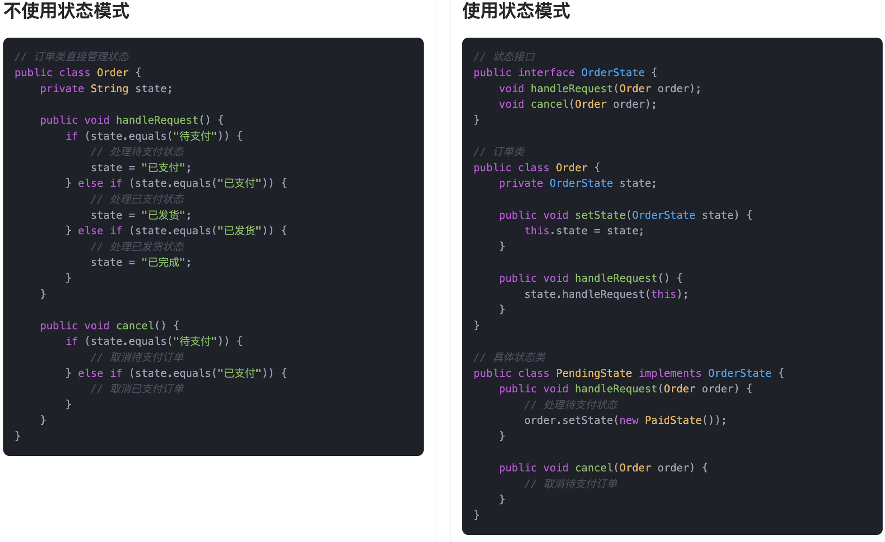
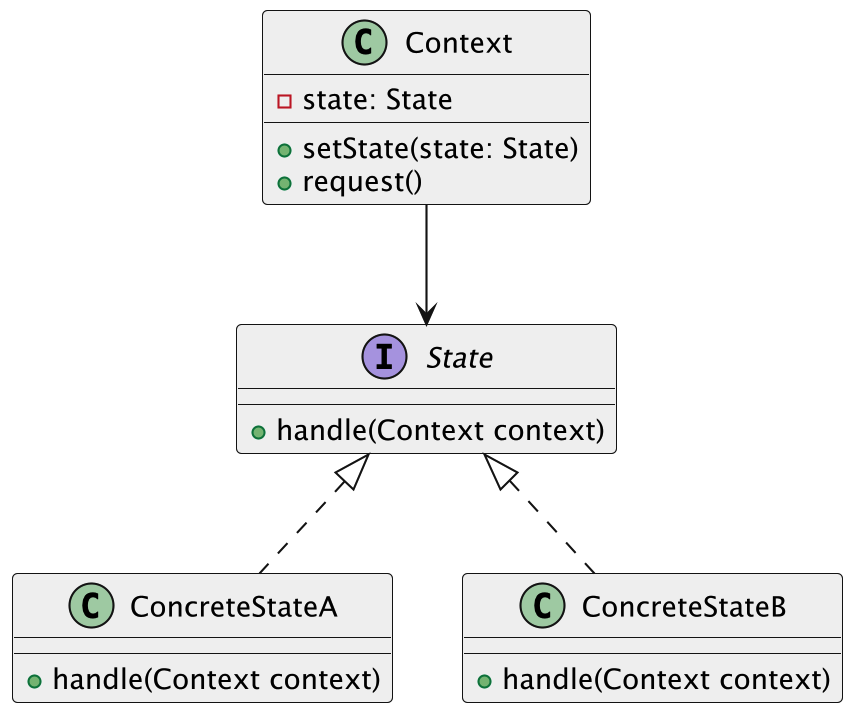

## 什么是状态模式？
**状态模式**（State Pattern）是一种行为型设计模式，它的核心思想是：**允许对象在内部状态变化时，改变它的行为，看起来就像是对象本身发生了变化一样**。

换句话说，在不同的状态下，同一个对象的表现是不一样的。我们把状态相关的行为抽取成独立的状态类，然后让原来的对象根据当前的状态，把具体的工作交给对应的状态类来处理。

这种设计的好处是，把原本一大堆 if-else 的状态切换逻辑拆分成小而清晰的模块。每个状态自己负责自己那一套行为，代码职责更明确，也更容易维护和扩展。

如果打个比方，状态模式就像鱼皮的日常的多重身份切换：到公司我是“老板”，管理着公司日常运营，直播时我是“技术博主”，认真和大家分享干货；下班后切换成“健身小白”，练练拳击出出汗；晚上回家后变回“游戏玩家”，打开电脑快乐上分。一个人，不同状态，不同行为，但我还是我。


类似的场景还有很多，比如地铁闸机。当我们还没刷卡时，它是“锁定”状态，挡着我们进不去；刷卡成功，它切换成“解锁”状态，就放行让我们通过；人一走完，它又自动切回“锁定”状态，准备迎接下一个人。整个过程，闸机自己在内部悄悄变换状态，不同状态做不同的事。

所以，状态模式就是把“对象在不同状态下的不同表现”，用一个个独立的状态类来管理，然后根据需要动态切换当前状态，让对象在不知不觉中表现出完全不同的行为。

## 为什么要使用状态模式？
在实际开发中，有些对象的行为是依赖于内部状态变化的，比如订单状态、工作流引擎、网络连接等等。如果我们直接在对象内部用一堆`if-else`或者`switch-case`去处理这些状态和行为，很快代码就会变得又长又难懂，维护起来非常麻烦。而且每次新增或修改一个状态，都要动到整个对象的逻辑，容易出错。  
使用状态模式以后，每个状态对应一个独立的类，不同的行为分别管理，状态切换也变得有序清晰。既符合单一职责原则，又大大提高了代码的可读性、可维护性和扩展性。

为了让大家更好地感受到状态模式的作用，以订单状态流转管理为例，我们需要实现一个支持订单状态转换的系统。让我们来看看使用和不使用状态模式的区别：



通过对比可以看出，不使用状态模式时，订单类中包含了所有状态的处理逻辑，使用大量的条件判断来处理不同状态下的行为。这种方式导致代码结构复杂，难以维护，且添加新的状态需要修改现有代码，违反了开闭原则。

而使用状态模式后，我们将每个状态封装成独立的类，状态之间的转换逻辑也变得更加清晰。这种设计使得代码结构更加清晰，降低了耦合度，提高了代码的可维护性。同时，状态模式也使得系统更容易扩展，添加新的状态只需要创建新的状态类，而不需要修改现有代码。

## 状态模式的应用场景
举一些开发中典型的应用场景：

+ 订单状态流转管理：在电商系统中，订单从“待支付”到“已支付”“待发货”“已发货”“已完成”等状态流转，每种状态下允许的操作不同。使用状态模式可以将每种状态封装成一个独立类，清晰管理订单行为和状态变更逻辑。
+ 流程审批系统中的节点控制：在流程引擎中，表单或任务在“待审批”“审批中”“已通过”“已驳回”等状态之间转换，不同状态下的权限与处理方式各不相同。状态模式可以将审批行为和状态解耦，便于流程扩展和维护。
+ 用户账号的权限控制：在会员系统中，用户账号可能处于“正常”“冻结”“注销”等状态，不同状态下的可操作内容不同。状态模式可将这些状态和对应行为封装，简化权限校验逻辑。

## 状态模式基本结构
状态模式具有的角色和职责：

1）环境类（Context）：持有当前状态对象，负责状态的切换，同时对外暴露统一的行为接口。

2）抽象状态类（State）：定义所有具体状态需要实现的接口或者抽象类。

3）具体状态类（ConcreteState）：实现抽象状态定义的行为，每个具体状态类封装了对应的操作逻辑，并且可以决定是否切换到其他状态。

下面用一张类图帮大家更直观地理解状态模式的结构：



## 状态模式的实现
下面就以 “订单状态流转管理” 为例，我们用状态模式实现一个简单的订单管理系统。

1）定义订单状态接口：声明订单的所有状态操作

```java
interface OrderState {
    void handleRequest(Order order); // 处理订单请求，根据不同状态执行不同操作
}
```
在这段代码中，我们定义了一个 `OrderState` 接口，表示订单的不同状态。该接口有一个 `handleRequest()` 方法，负责处理订单的不同操作，不同的状态类会提供不同的实现。

2）实现具体的订单状态类：每个状态都作为一个类来实现

```java
class PendingState implements OrderState {
    @Override
    public void handleRequest(Order order) {
        System.out.println("订单处于待支付状态，请支付。");
        order.setState(new PaidState()); // 支付完成后，改变订单状态为已支付
    }
}

class PaidState implements OrderState {
    @Override
    public void handleRequest(Order order) {
        System.out.println("订单已支付，请发货。");
        order.setState(new ShippedState()); // 发货后，改变订单状态为已发货
    }
}

class ShippedState implements OrderState {
    @Override
    public void handleRequest(Order order) {
        System.out.println("订单已发货，请等待接收。");
        order.setState(new CompletedState()); // 完成后，改变订单状态为已完成
    }
}

class CompletedState implements OrderState {
    @Override
    public void handleRequest(Order order) {
        System.out.println("订单已完成。");
    }
}
```
在这里，我们为每种订单状态实现了一个具体的状态类。每个状态类都实现了 `OrderState` 接口的 `handleRequest()` 方法，具体的操作会根据当前状态执行相应的逻辑。

3）定义订单类：管理当前订单状态并切换状态

```java
class Order {
    private OrderState state;

    public Order() {
        this.state = new PendingState(); // 初始状态为“待支付”
    }

    public void setState(OrderState state) {
        this.state = state;
    }

    public void request() {
        state.handleRequest(this); // 调用当前状态的处理方法
    }
}
```
在这段代码中，我们定义了一个 `Order` 类，它包含了一个 `OrderState` 类型的成员变量 `state`，表示当前订单的状态。`setState()` 方法用于改变订单状态，`request()` 方法用于调用当前状态的处理方法。

4）客户端调用示例

```java
public class Client {
    public static void main(String[] args) {
        Order order = new Order();  // 创建一个订单

        // 客户端操作：订单请求
        order.request();  // 初始状态是“待支付”

        // 模拟状态流转
        order.request();  // 订单支付后，进入“已支付”状态
        order.request();  // 订单发货后，进入“已发货”状态
        order.request();  // 订单完成后，进入“已完成”状态
    }
}
```
输出结果：

```plain
订单处于待支付状态，请支付。
订单已支付，请发货。
订单已发货，请等待接收。
订单已完成。
```
在客户端测试代码中，我们首先创建了一个 `Order` 对象，该对象初始状态为“待支付”。然后通过调用 `request()` 方法，模拟订单状态的流转。每次调用 `request()` 方法时，都会根据当前的状态执行相应的操作，并转到下一个状态。

## 状态模式的优缺点
### 优点
+ **简化复杂条件语句**：状态模式通过将不同的状态转移和行为封装在独立的状态类中，避免了大量的 if-else 或 switch-case 语句，使得代码更加清晰和易于维护。
+ **易于扩展**：每增加一种状态时，我们只需要创建一个新的状态类，并实现相应的处理逻辑，不需要修改已有的代码，符合开闭原则，增加新的状态非常方便。
+ **行为的局部化**：不同的状态有不同的行为，每个状态只关心自己应该如何处理，不会影响其他状态的处理。这样避免了不同状态下行为的重复代码，增强了系统的内聚性。

### 缺点
+ **类的数量增加**：每个状态都需要一个对应的类，随着状态数目的增加，类的数量也会迅速增加，可能导致系统的复杂度增加，管理和维护成本上升。
+ **状态之间的转换复杂**：如果状态之间的转换规则比较复杂，可能会导致状态类之间的耦合度较高，增加系统的复杂性和难度。
+ **容易过度设计**：在一些较简单的场景下，使用状态模式可能会显得有些过度设计，反而增加了不必要的抽象和代码量。在简单的状态转换中，直接使用条件语句可能会更简洁有效。

## 扩展知识 - 源码分析
### 开源框架中的应用
#### 1、Spring 框架
Spring 里比较典型的状态模式应用是 **Spring State Machine（SSM）**。这个组件专门为状态驱动型的业务设计，比如订单从“待支付”到“已支付”，再到“已发货”、“已收货”，中间可能还有“退款”、“关闭”等状态，每种状态之间的切换都会触发不同的行为。

在 Spring State Machine 中，主要的核心接口是 `StateMachine<S, E>`，`S` 表示状态类型，`E` 表示事件类型。整个框架围绕“状态 + 事件 + 转换”三大块展开。

我们来看一下源码的核心类：

```java
/**
 * 状态机接口，定义了状态机的基本操作。
 * 
 */
public interface StateMachine<S, E> {

    /**
     * 获取当前状态机所处的状态。
     */
    State<S, E> getState();

    /**
     * 向状态机发送一个事件，用于触发状态转换。
     * 
     */
    void sendEvent(E event);

    /**
     * 启动状态机，进入初始状态。
     */
    void start();

    /**
     * 停止状态机，通常用于清理资源或退出状态控制流程。
     */
    void stop();
}

```
每个状态的行为通过实现 `State<S, E>` 接口来定义，比如进入状态、退出状态时要做什么事情：

```java
/**
 * 表示状态机中的一个具体状态。
 *
 */
public interface State<S, E> {

    /**
     * 获取当前状态的唯一标识。
     */
    S getId();

    /**
     * 进入该状态时执行的逻辑，通常用于初始化、打印日志或发出通知等操作。
     */
    void onEntry();

    /**
     * 退出该状态时执行的逻辑，通常用于清理资源或记录状态变化等操作。
     */
    void onExit();
}

```
而状态之间的切换是由 `Transition<S, E>` 管理的：

```java
/**
 * 表示状态机中的一次状态迁移（Transition），
 * 包含源状态、目标状态和触发此次迁移的事件。
 */
public interface Transition<S, E> {

    /**
     * 获取迁移的起始状态（源状态）。
     */
    State<S, E> getSource();

    /**
     * 获取迁移的目标状态。
     */
    State<S, E> getTarget();

    /**
     * 获取触发此次状态迁移的事件。
     */
    E getTriggerEvent();
}

```
我们可以通过一张类图来看下这个结构：


可以看到，Spring State Machine 的设计非常符合状态模式的核心思想：将状态封装成对象，每个状态之间的转换由 Transition 管理，每种状态的行为独立开来，互不干扰。

### 优势和作用
通过上述的源码分析，我们可以再次总结下状态模式的作用。

#### 1、提高代码可维护性
状态模式的最大优点就是把状态和行为解耦。就拿 Spring State Machine 来说，每个状态和对应的转换逻辑都封装成对象后，我们就不用再写一堆 if-else 或 switch-case 来判断当前处于哪个状态，也不用担心某个地方多写了状态判断而导致逻辑重复。

#### 2、方便扩展新状态或新行为
如果以后新增一个订单状态，比如“等待签收”，我们只需要新增一个状态对象，并注册相应的转换逻辑即可，不用改动现有的代码。这种开放封闭原则的体现，正是状态模式的强项。

#### 3、复杂流程管理更清晰
在像订单流转、审批流这种有明确流程的系统中，状态模式能很好地把状态流转管理清楚。尤其在多个状态共享某些公共行为或触发不同的事件时，状态模式能有效地把逻辑整理清楚，避免混乱。

## 相关面试题
可以在 [程序员面试刷题神器 - 面试鸭](https://www.mianshiya.com/) 上获取到企业常问的设计模式面试题。比如：

1）[什么是状态模式？一般用在什么场景？](https://www.mianshiya.com/bank/1801559627969929217/question/1802939360414605313)


