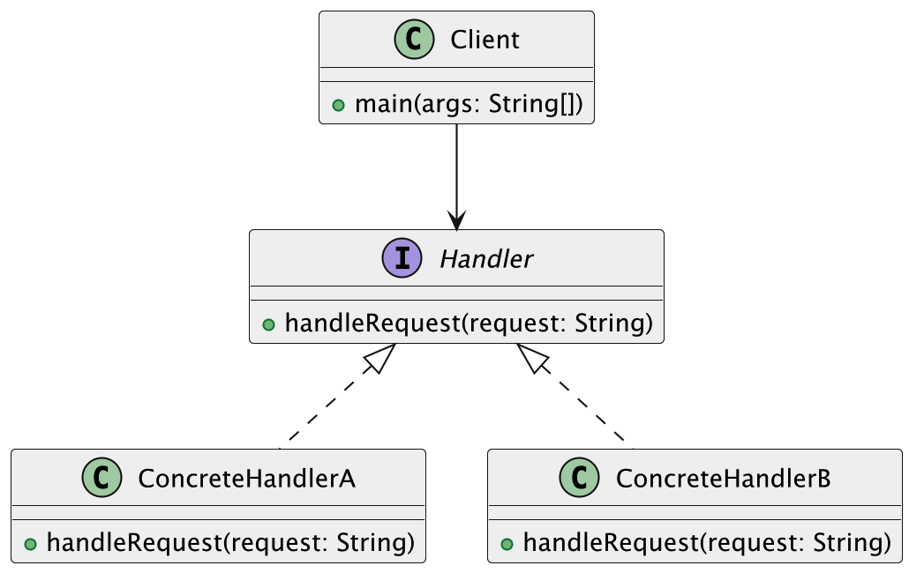
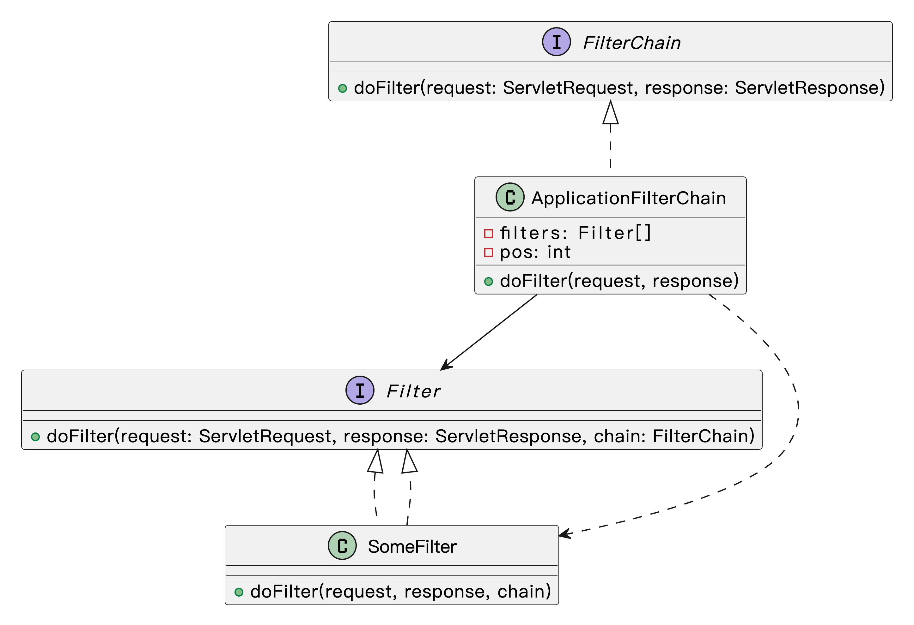
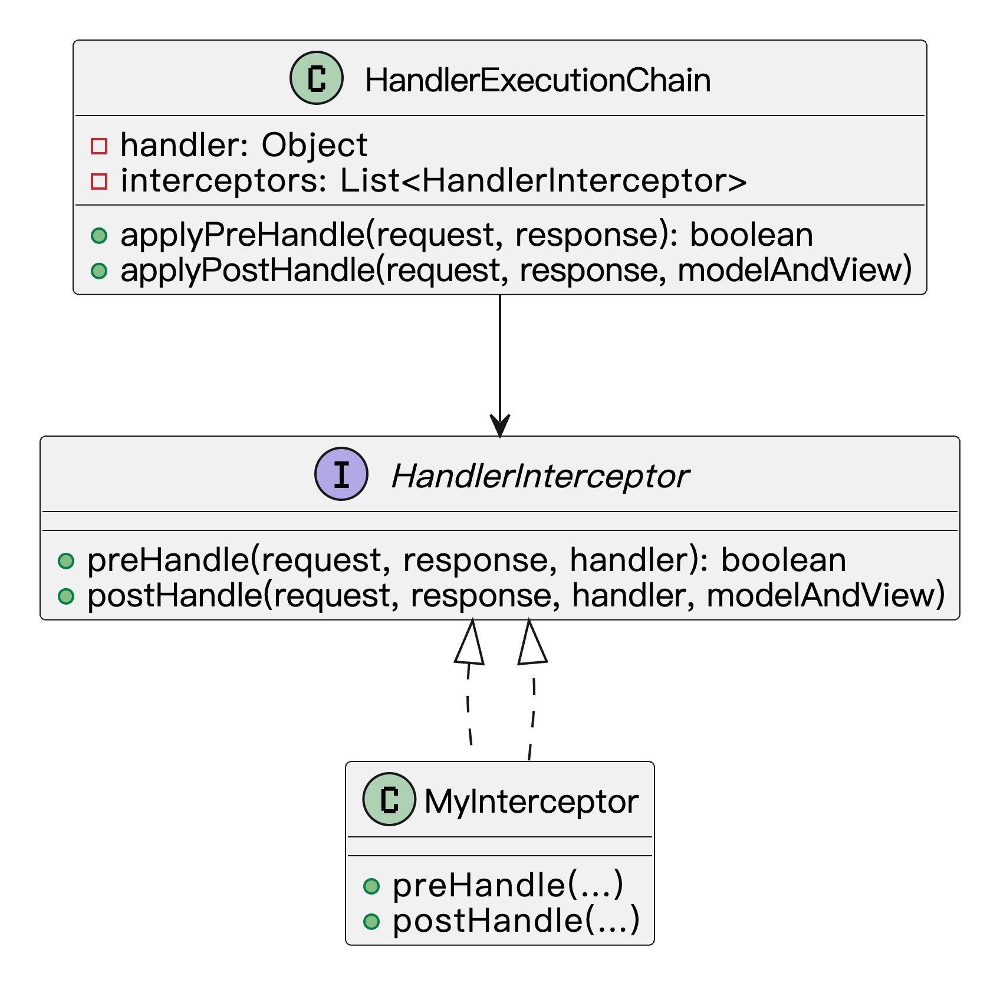

## 什么是责任链模式？
**责任链模式**（Chain of Responsibility Pattern）是一种行为型设计模式，它的核心思想就是：**将多个处理请求的对象连接成一条链，每个对象在链上依次处理请求，直到有对象处理完请求为止**。换句话说，当一个请求到来时，它会沿着链上的对象逐个传递，每个对象有机会去处理这个请求。如果当前对象无法处理，它就将请求传递给链上的下一个对象。

就像我们平时遇到问题时，可能会先找一个人问，然后如果他不懂，就转交给下一个人，直到问题得到解决。每个人都承担自己可以处理的部分，任务逐级分配，直到问题得到处理。

我举个例子哈。我们在公司请假时，流程其实挺像责任链的：请个两天假，组长就批了；请五天假，组长批不了，得往上递给部门经理；如果我想请个长假出去玩一个月，那就得让总监出面了。这种逐级审批的流程，本质上就是一条责任链。我只要发起请假申请，不管谁批的，反正最后有人能拍板就行。 


我们写代码时也会遇到类似的情况。比如做一个请求拦截器链条，先做权限校验，再做参数校验，最后可能还有个日志记录。每个环节负责自己那一块，不用知道前后是谁，只管干自己的事，整体逻辑就非常清晰、灵活，后续扩展也方便。

## 为什么要使用责任链模式？
在实际开发中，我们经常会遇到某个请求需要经过多个处理环节。例如，一个订单系统可能需要经过库存检查、支付验证、配送安排等多个步骤。如果这些步骤放在一个类里处理，逻辑会非常混乱，并且修改起来也非常麻烦。而责任链模式通过将这些处理环节分成多个对象，每个对象只处理自己负责的部分，并将处理结果传递给下一个环节，清晰明了，方便扩展和维护。这样，我们不仅可以避免一个类内堆砌过多的业务逻辑，还能动态地调整责任链的顺序和处理方式。

为了让大家更好地感受到责任链模式的作用，以订单优惠处理为例，我们需要实现一个支持多种优惠策略的系统。让我们来看看使用和不使用责任链模式的区别：


通过对比可以看出，不使用责任链模式时，订单类中包含了所有优惠处理的逻辑，使用大量的条件判断来处理不同的优惠策略。这种方式导致代码结构复杂，难以维护，且添加新的优惠策略需要修改现有代码，违反了开闭原则。

而使用责任链模式后，我们将每个优惠策略封装成独立的处理器类，通过责任链的方式将它们连接起来。这种设计使得代码结构更加清晰，降低了耦合度，提高了代码的可维护性。同时，责任链模式也使得系统更容易扩展，添加新的优惠策略只需要创建新的处理器类即可。

## 责任链模式的应用场景
举一些开发中典型的应用场景：

+ 用户请求的权限校验流程：在企业权限系统中，一个请求可能需要经过多个层级的权限校验，如登录校验、角色校验、操作权限校验等。使用责任链模式可以将每个校验步骤封装成独立处理器，按顺序处理请求，便于扩展与维护。
+ 电商系统的订单优惠处理：下单时可能存在多种优惠（满减、折扣、优惠券、会员折扣等），这些优惠可能需要按顺序叠加或互斥。通过责任链模式，将每种优惠逻辑封装成一个处理节点，逐个执行判断和计算。
+ 内容审核系统中的多级规则过滤：在社区、短视频、评论系统中，内容发布前可能需经过“敏感词过滤 → 图片检测 → 风险用户识别 → 自定义规则”等多个审核步骤。每个过滤器作为链中的一环，统一处理内容审核流程。

## 责任链模式基本结构
责任链模式具有的角色和职责：

1）抽象处理者（Handler）：声明一个处理请求的接口，通常包括一个方法`handleRequest()`，并且持有对下一个处理者的引用。

2）具体处理者（ConcreteHandler）：实现抽象处理者的处理方法，如果当前对象能够处理请求，就处理它；否则，将请求转发给链上的下一个对象。

3）客户端（Client）：客户端负责构造责任链并发送请求，它不需要关心请求如何被处理，只需要向责任链传递请求即可。

下面用一张类图帮大家更直观地理解责任链模式的结构：



## 责任链模式的实现
下面就以 “订单优惠处理” 为例，我们用责任链模式实现一个简单的订单优惠系统。

1）定义优惠处理接口：声明各类优惠的处理方法

```java
interface DiscountHandler {
    void setNextHandler(DiscountHandler handler);  // 设置下一个处理器
    void applyDiscount(Order order); // 应用优惠策略
}
```
在这段代码中，我们定义了一个 `DiscountHandler` 接口，表示优惠处理的抽象类。每个优惠处理器需要实现 `applyDiscount()` 方法来处理订单优惠，同时通过 `setNextHandler()` 方法设置责任链中的下一个处理节点。

2）实现具体的优惠处理类：每个优惠作为一个处理器

```java
class FullReductionDiscountHandler implements DiscountHandler {
    private DiscountHandler nextHandler;  // 下一个处理器

    @Override
    public void setNextHandler(DiscountHandler handler) {
        this.nextHandler = handler;
    }

    @Override
    public void applyDiscount(Order order) {
        if (order.getAmount() > 200) {
            System.out.println("满减折扣: -50");
            order.setAmount(order.getAmount() - 50);
        }
        if (nextHandler != null) {
            nextHandler.applyDiscount(order);  // 继续传递给下一个处理器
        }
    }
}

class CouponDiscountHandler implements DiscountHandler {
    private DiscountHandler nextHandler;

    @Override
    public void setNextHandler(DiscountHandler handler) {
        this.nextHandler = handler;
    }

    @Override
    public void applyDiscount(Order order) {
        if (order.hasCoupon()) {
            System.out.println("优惠券折扣: -30");
            order.setAmount(order.getAmount() - 30);
        }
        if (nextHandler != null) {
            nextHandler.applyDiscount(order);
        }
    }
}

class MemberDiscountHandler implements DiscountHandler {
    private DiscountHandler nextHandler;

    @Override
    public void setNextHandler(DiscountHandler handler) {
        this.nextHandler = handler;
    }

    @Override
    public void applyDiscount(Order order) {
        if (order.isMember()) {
            System.out.println("会员折扣: -20");
            order.setAmount(order.getAmount() - 20);
        }
        if (nextHandler != null) {
            nextHandler.applyDiscount(order);
        }
    }
}
```
在这段代码中，我们实现了三个具体的优惠处理类：`FullReductionDiscountHandler`（满减优惠）、`CouponDiscountHandler`（优惠券优惠）和 `MemberDiscountHandler`（会员优惠）。每个类都有 `applyDiscount()` 方法来执行相应的优惠逻辑，并通过责任链将处理过程传递下去。

3）定义订单类：包含订单金额和优惠逻辑

```java
class Order {
    private double amount;  // 订单金额
    private boolean hasCoupon;  // 是否使用了优惠券
    private boolean isMember;  // 是否为会员

    public Order(double amount, boolean hasCoupon, boolean isMember) {
        this.amount = amount;
        this.hasCoupon = hasCoupon;
        this.isMember = isMember;
    }

    public double getAmount() {
        return amount;
    }

    public void setAmount(double amount) {
        this.amount = amount;
    }

    public boolean hasCoupon() {
        return hasCoupon;
    }

    public boolean isMember() {
        return isMember;
    }
}
```
在这段代码中，我们定义了一个 `Order` 类，包含订单的金额、是否使用了优惠券以及是否是会员的标志。通过这些字段，优惠处理类可以判断是否应用相应的优惠。

4）客户端调用示例

```java
public class Client {
    public static void main(String[] args) {
        Order order = new Order(250, true, true);  // 创建订单

        // 创建各个优惠处理器
        DiscountHandler fullReductionHandler = new FullReductionDiscountHandler();
        DiscountHandler couponHandler = new CouponDiscountHandler();
        DiscountHandler memberHandler = new MemberDiscountHandler();

        // 设置责任链：优惠处理器依次连接
        fullReductionHandler.setNextHandler(couponHandler);
        couponHandler.setNextHandler(memberHandler);

        // 开始应用优惠
        fullReductionHandler.applyDiscount(order);  // 从满减开始处理
        System.out.println("最终订单金额: " + order.getAmount());
    }
}
```
输出结果：

```plain
满减折扣: -50
优惠券折扣: -30
会员折扣: -20
最终订单金额: 150.0
```
在客户端测试中，首先创建一个订单对象，并依次创建了满减、优惠券、会员优惠处理器。通过 `setNextHandler()` 方法将它们链接成一个责任链。最后，通过调用 `applyDiscount()` 方法开始依次处理订单的各项优惠，最终得到处理后的订单金额。

## 责任链模式的优缺点
### 优点
+ **减少了耦合性**：责任链模式通过将请求的处理分配给多个对象，每个对象只负责自己能处理的部分，避免了请求者和处理者之间的直接耦合。请求者无需知道请求最终由哪个对象处理。
+ **灵活的请求处理方式**：责任链中的处理者可以根据需求动态调整，灵活地控制请求的流转路径。每个处理者决定是否处理请求，或者将请求传递给下一个处理者，确保了请求的灵活处理。
+ **可扩展性强**：通过增加新的处理者，可以轻松地扩展责任链。当新增的处理逻辑不影响其他部分时，系统能够非常平滑地扩展，符合开闭原则。

### 缺点
+ **不容易调试**：由于请求在链中的多个对象之间传递，可能会导致调试时不容易追踪请求的处理路径。如果链条比较长或者复杂，调试过程可能变得比较麻烦。
+ **可能造成性能问题**：如果责任链中的处理者较多且每个处理者都需要做一些复杂的操作，可能会导致请求的处理变慢，影响系统性能。
+ **责任链的管理复杂性**：虽然责任链模式能够使系统的扩展变得简单，但当责任链较长时，管理和维护责任链中的各个处理者可能会变得复杂。如果链条太长或处理者数量过多，整个责任链的维护成本也会增加。

## 扩展知识 - 源码分析
### 开源框架中的应用
#### 1、JDK
在 JDK 中，Servlet 规范里的 **Filter 链**（FilterChain）就是责任链模式的一个经典实现场景。

我们可以简单回顾一下 Servlet 中请求是怎么被处理的：请求到达服务器之后，首先会经过我们配置的一系列过滤器，每个过滤器都可以决定是否继续往下传递请求，或者中断整个链条。这就是责任链的核心思想 —— 一条链条上挂着多个处理节点，每个节点都有“放行”或“拦截”的能力。

我们看下源码：

```java
/**
 * ApplicationFilterChain 是 Servlet 规范中的过滤器链实现类。
 * 它负责按顺序调用多个 Filter，然后最终调用目标 Servlet。
 */
public final class ApplicationFilterChain implements FilterChain {

    // 存储过滤器配置的数组，每个元素对应一个 Filter
    private ApplicationFilterConfig[] filters = new ApplicationFilterConfig[0];

    // 当前正在执行的过滤器索引（指针）
    private int pos = 0;

    // 实际过滤器数量
    private int n = 0;

    /**
     * 过滤器链的核心执行方法。
     * 会依次调用链中的每个 Filter 的 doFilter 方法，
     * 最后调用目标 Servlet 的 service 方法。
     */
    @Override
    public void doFilter(ServletRequest request, ServletResponse response)
        throws IOException, ServletException {

        // 如果启用了 Java 安全管理器（SecurityManager），则以特权操作执行过滤器链
        if (Globals.IS_SECURITY_ENABLED) {
            final ServletRequest req = request;
            final ServletResponse res = response;
            try {
                // 使用 AccessController 执行受限操作
                java.security.AccessController.doPrivileged(
                    (java.security.PrivilegedExceptionAction<Void>) () -> {
                        // 实际执行过滤器链逻辑
                        internalDoFilter(req, res);
                        return null;
                    }
                );
            } catch (PrivilegedActionException pe) {
              // 省略代码...
            }
        } else {
            // 没有启用安全机制时，直接执行过滤器链
            internalDoFilter(request, response);
        }
    }

    // 省略 internalDoFilter 方法（通常用于实际按顺序调用过滤器和 Servlet）
}

```
每个过滤器内部的 `doFilter` 方法都有一个 `FilterChain` 参数，这个参数的作用就是让过滤器有能力“放行”到下一个过滤器。

也就是说，责任链模式在这里的实现是通过递归或者迭代的方式，把请求逐步传递给下一个责任节点（过滤器），每个节点各司其职。

我们可以用一张类图来简化这个结构：



#### 2、Spring 框架
在 Spring 中，**HandlerInterceptor** 的链式执行也是责任链模式的体现。

Interceptor 拦截器其实跟 Filter 有点像，它们都可以在请求前后做一些操作。但是 Interceptor 是更靠近 Spring MVC 的，它作用于控制器的调用过程。

我们可以看下 `HandlerExecutionChain` 是怎么实现责任链的：

```java
/**
 * 表示一个处理器执行链，包含实际的处理器对象（如 Controller 方法）和一组拦截器。
 * 每个请求会对应一个 HandlerExecutionChain。
 */
public class HandlerExecutionChain {

    // 实际执行的处理器对象，比如某个 Controller 方法
    private final Object handler;

    // 拦截器列表，用于在 handler 执行前后进行拦截处理
    private final List<HandlerInterceptor> interceptors = new ArrayList<>();

    // 记录已成功执行 preHandle 的拦截器索引，用于 afterCompletion 回调时回退调用
    private int interceptorIndex = -1;

    /**
     * 执行所有拦截器的 preHandle 方法（按顺序）。
     * 如果有一个返回 false，表示请求被拦截，中断后续流程。
     * 
     * @return true 表示继续处理请求；false 表示中断处理流程
     */
    boolean applyPreHandle(HttpServletRequest request, HttpServletResponse response) throws Exception {
        for (int i = 0; i < this.interceptors.size(); i++) {
            HandlerInterceptor interceptor = this.interceptors.get(i);
            // 如果拦截器返回 false，触发 afterCompletion 回调，并中止处理
            if (!interceptor.preHandle(request, response, this.handler)) {
                triggerAfterCompletion(request, response, null);
                return false;
            }
            // 记录已成功执行的拦截器索引
            this.interceptorIndex = i;
        }
        return true;
    }

    /**
     * 在 handler 执行完之后，调用所有拦截器的 postHandle 方法（按倒序）。
     */
    void applyPostHandle(HttpServletRequest request, HttpServletResponse response, @Nullable ModelAndView mv)
            throws Exception {
        for (int i = this.interceptors.size() - 1; i >= 0; i--) {
            HandlerInterceptor interceptor = this.interceptors.get(i);
            interceptor.postHandle(request, response, this.handler, mv);
        }
    }

    // 假设还有一个 triggerAfterCompletion 方法，负责触发所有拦截器的 afterCompletion 回调（按倒序）
}

```
每个 Interceptor 可以在控制器执行前进行预处理（`preHandle`），也可以在控制器执行后进行后置处理（`postHandle`）。如果有一个 Interceptor 决定不放行，整个链条就会被中断。

我们通过类图来简单看下结构：



### 优势和作用
通过上述的源码分析，我们可以再次总结下责任链模式的作用。

#### 1、提高代码的可维护性
我们在 Filter 或 Interceptor 链上添加新的处理逻辑时，不需要去改已有的类逻辑，只需要新增一个过滤器或拦截器，再加到链条里就可以了。这种方式让每个节点的职责都非常清晰，修改起来也很安全，维护成本低。

#### 2、增强系统的扩展能力
比如我们有一个订单系统，假设需要在请求处理前先进行权限校验、再记录日志、再做数据脱敏。用责任链模式之后，我们只需要依次添加几个拦截器（或者过滤器），每个模块都独立，互不影响。新增或替换其中某个处理流程都很容易，不会牵一发而动全身。

#### 3、提升代码结构的清晰度
通过链式结构，整个请求处理流程是线性的、可预测的。每一层都只关注自己的职责，这种“单一职责 + 链式组合”的方式，极大地提高了代码的清晰度。

## 相关面试题
可以在 [程序员面试刷题神器 - 面试鸭](https://www.mianshiya.com/) 上获取到企业常问的设计模式面试题。比如：

1）[什么是责任链模式？一般用在什么场景？ ](https://www.mianshiya.com/bank/1801559627969929217/question/1803305518413373442)


