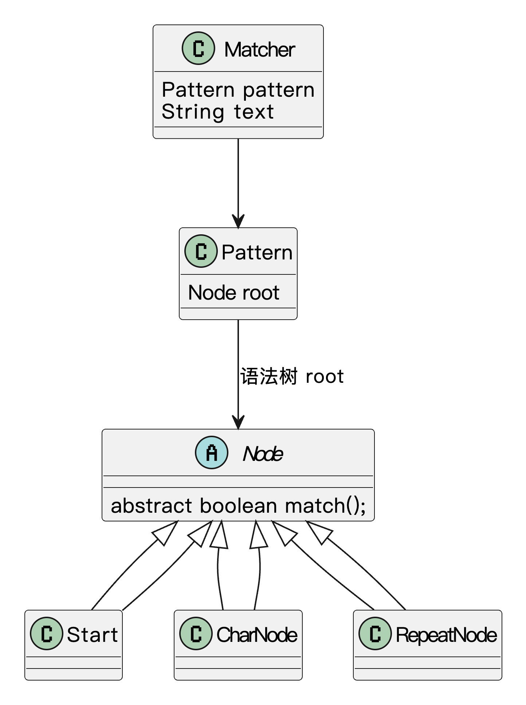

## 什么是解释器模式？
**解释器模式**（Interpreter Pattern）是一种行为型设计模式，它的主要作用是**为特定类型的语言提供解释执行的方法**。在这个模式中，我们定义了一个语言的语法规则，并通过这些规则来解释输入的表达式或语句，最终得出我们想要的结果。

简单来说，解释器模式就像是**“给机器提供一个规则，让它能够理解我们输入的内容并根据规则来执行”**。它通常用于处理某些固定语法规则的语言或表达式，比如数学表达式、正则表达式、查询语言等。

比如说鱼皮家里的遥控器，按一下“音量+”就是发出一个简单的命令，这时候电视机要能理解“音量+”是要加音量而不是换台，就得有一套规则去解释这个指令。再比如你看到“✅”就知道是“同意”，“❌”就是“不同意”，人脑能理解，但如果让程序处理这些表格符号，就得教它这套规则，也就是写一个解释器。

 

## 为什么要使用解释器模式？
在开发过程中，有时候我们的系统需要处理一些用户自定义的、结构清晰的表达式或者指令。如果用硬编码的方式去处理各种情况，不仅代码臃肿，而且非常难维护。每增加一种新的语法，就要修改一堆if-else，非常不利于扩展。  
而解释器模式把语法规则和执行逻辑封装到各个解释器对象中，既符合开闭原则，也让系统更容易维护和扩展。如果将来有新规则，我们只需要增加新的解释器就可以了，不需要大改原有逻辑。

为了让大家更好地感受到解释器模式的作用，以规则引擎为例，我们需要实现一个能够解析和执行自定义规则的系统。让我们来看看使用和不使用解释器模式的区别：


通过对比可以看出，不使用解释器模式时，规则引擎类中包含了所有规则解析和执行的逻辑，使用大量的条件判断来处理不同的规则表达式。这种方式导致代码结构复杂，难以维护，且添加新的规则类型需要修改现有代码，违反了开闭原则。

而使用解释器模式后，我们将每个规则表达式封装成独立的类，通过组合的方式构建复杂的规则。这种设计使得代码结构更加清晰，降低了耦合度，提高了代码的可维护性。同时，解释器模式也使得系统更容易扩展，添加新的规则类型只需要创建新的表达式类，而不需要修改现有代码。

## 解释器模式的应用场景
举一些开发中典型的应用场景：

+ 自定义规则引擎：在风控、营销、权限等系统中，业务规则经常需要用类似 `"age > 18 && score < 600"` 这样的表达式进行配置。使用解释器模式可以将这些规则表达式解析成语法树，动态执行并得出结果，避免频繁修改代码。
+ DSL（领域特定语言）解析：一些项目中需要用户定义自己的业务流程、命令、查询语法（如自定义查询语言、自动化脚本语言）。解释器模式适合将这些语法结构翻译为可执行的命令或操作。
+ 表达式解析：在实现计算器、权限表达式（如 `hasRole('admin') && isAuthenticated()`）、公式引擎等场景中，经常需要解析并计算一类语法表达式。解释器模式通过构建抽象语法树（AST），递归地解释每个节点，从而支持灵活的表达式解析与扩展，便于后续添加新运算符或函数，保持系统的可维护性与可扩展性。

## 解释器模式基本结构
解释器模式具有的角色和职责：

1）抽象表达式（AbstractExpression）：定义所有解释器的通用接口，通常包含一个`interpret()`方法，负责解释和计算表达式。

2）终结符表达式（TerminalExpression）：实现`interpret()`方法的具体类，表示具体的语法元素。这些元素是无法再分解的最小单位。

3）非终结符表达式（NonTerminalExpression）：与终结符表达式不同，它们用于表示语言中的组合元素，可以包含其他表达式作为其子表达式。

4）上下文（Context）：包含了解释过程中所需要的数据，例如变量的值或当前的环境。

5）客户端（Client）：客户端负责构建并初始化解释器中的表达式，给定输入后，启动解释过程。

下面用一张类图帮大家更直观地理解解释器模式的结构：


## 解释器模式的实现
下面就以 “自定义规则引擎” 为例，我们用解释器模式实现一个简单的规则引擎，能够动态解析并执行类似 `age > 18 && score < 500` 这样的规则表达式。

1）定义表达式接口：声明规则表达式的执行方法

```java
interface Expression {
    boolean interpret(Context context);  // 解释表达式，返回布尔值
}
```
先定义一个 `Expression` 接口，其中的 `interpret()` 方法用来解释规则表达式并返回布尔值结果。`interpret()` 接受 `Context` 作为参数，`Context` 中保存了规则的上下文信息（如 `age` 和 `score`）。

2）定义上下文类：存储规则所需要的参数

```java
class Context {
    private int age;
    private int score;

    public Context(int age, int score) {
        this.age = age;
        this.score = score;
    }

    public int getAge() {
        return age;
    }

    public int getScore() {
        return score;
    }
}
```
`Context` 类用于保存规则所需的上下文信息，像 `age` 和 `score` 这样的变量可以动态传递给规则引擎。

3）实现具体的表达式类：分别解析具体的规则

```java
class GreaterThanExpression implements Expression {
    private String field;
    private int value;

    public GreaterThanExpression(String field, int value) {
        this.field = field;
        this.value = value;
    }

    @Override
    public boolean interpret(Context context) {
        if ("age".equals(field)) {
            return context.getAge() > value;
        } else if ("score".equals(field)) {
            return context.getScore() > value;
        }
        return false;
    }
}

class LessThanExpression implements Expression {
    private String field;
    private int value;

    public LessThanExpression(String field, int value) {
        this.field = field;
        this.value = value;
    }

    @Override
    public boolean interpret(Context context) {
        if ("age".equals(field)) {
            return context.getAge() < value;
        } else if ("score".equals(field)) {
            return context.getScore() < value;
        }
        return false;
    }
}

class AndExpression implements Expression {
    private Expression expr1;
    private Expression expr2;

    public AndExpression(Expression expr1, Expression expr2) {
        this.expr1 = expr1;
        this.expr2 = expr2;
    }

    @Override
    public boolean interpret(Context context) {
        return expr1.interpret(context) && expr2.interpret(context);
    }
}
```
+ `GreaterThanExpression` 和 `LessThanExpression` 类是具体的规则表达式，分别判断某个字段（如 `age` 或 `score`）是否大于或小于某个值。
+ `AndExpression` 用来组合两个表达式，表示逻辑“与”操作。

4）解析动态输入的规则表达式：实现灵活的规则解析

```java
class RuleParser {
    public static Expression parse(String rule) {
        String[] tokens = rule.split("&&");  // 按“&&”分割表达式
        Expression left = null;
        Expression right = null;

        for (String token : tokens) {
            token = token.trim();
            if (token.contains(">")) {
                String[] parts = token.split(">");
                String field = parts[0].trim();
                int value = Integer.parseInt(parts[1].trim());
                left = new GreaterThanExpression(field, value);
            } else if (token.contains("<")) {
                String[] parts = token.split("<");
                String field = parts[0].trim();
                int value = Integer.parseInt(parts[1].trim());
                right = new LessThanExpression(field, value);
            }
        }
        return new AndExpression(left, right);  // 合并左右表达式
    }
}
```
`RuleParser` 类实现了规则字符串的解析。它能够灵活地解析动态输入的规则表达式（例如 `"age > 18 && score < 600"`），通过拆分符号来确定每个表达式的类型（如大于、小于等）。

5）客户端调用示例：解析并执行动态规则表达式

```java
public class Client {
    public static void main(String[] args) {
        // 用户输入的动态规则
        String rule = "age > 18 && score < 500";

        // 创建上下文对象
        Context context = new Context(20, 450);  // 假设 age = 20, score = 450

        // 解析规则表达式
        Expression expression = RuleParser.parse(rule);

        // 判断规则是否成立
        boolean result = expression.interpret(context);
        System.out.println("表达式结果: " + result);  // 输出结果
    }
}
```
输出结果：

```plain
表达式结果: true
```
使用解释器模式，我们可以动态解析并执行业务规则表达式。用户输入的规则（如 `age > 18 && score < 500`）会被解析为一棵语法树，规则引擎会逐个判断每个表达式，最终得出一个布尔结果。

## 解释器模式的优缺点
### 优点
+ **容易扩展**：解释器模式通过使用递归结构，能够方便地扩展新的语法规则。只要有新的语法需求，就可以在原有基础上添加新的解释器类，保持系统的扩展性。
+ **清晰的结构**：这种模式将不同的语法规则和解释逻辑分开，使得整个解析过程非常清晰易懂。每种规则有对应的解释器，职责明确，便于维护和修改。
+ **灵活性高**：解释器模式使得对于复杂表达式的处理变得更加灵活，可以根据需要添加不同的解析规则来适应不同的场景。

### 缺点
+ **类的数量过多**：如果语法规则非常复杂，需要为每个规则编写一个对应的解释器类，这可能导致系统中的类数量大幅增加，增加了代码的复杂度。
+ **性能问题**：解释器模式通过递归调用进行解析，对于大量的数据或复杂的表达式，可能会引发性能问题。尤其是在处理大规模输入时，递归调用的栈深度可能影响系统的执行效率。
+ **不适合简单场景**：如果语法规则非常简单，使用解释器模式可能就显得有些过于复杂，反而增加了不必要的开销。在这种情况下，采用其他模式可能会更简单和高效。

## 扩展知识 - 源码分析
### 开源框架中的应用
#### 1、JDK
解释器模式在 JDK 中最经典的应用就是**正则表达式**，也就是 `java.util.regex` 包。

我们平时写的正则表达式，其实背后就是在定义一套“语法规则”，然后通过某些类来“解释”这个规则，并应用到具体的字符串上。整个流程就和解释器模式的结构非常吻合：  
我们先定义一个文法（比如 `[a-z]{3}\d+`），再用一个解释器来解析它、执行它。

JDK 中主要有两个类：

+ `Pattern`：表示正则表达式，是对文法规则的封装；
+ `Matcher`：负责将表达式应用到某个目标字符串上，判断是否匹配、提取子串等。

我们来看段例子：

```java
 // 编译阶段：将表达式转成内部表示结构
Pattern pattern = Pattern.compile("[a-z]{3}\\d+");
 // 解释阶段：应用规则进行匹配
Matcher matcher = pattern.matcher("abc123");      

if (matcher.matches()) {
    System.out.println("匹配成功");
}
```
这里 `Pattern.compile()` 其实是在“解释”正则字符串，构建对应的表达式结构。而 `matcher.matches()` 则是在用这个结构对输入字符串进行解释、匹配。

再来看下 `Pattern` 的部分源码：

```java
/**
 * Java 中正则表达式的核心类，表示一个编译后的正则表达式模式。
 */
public final class Pattern implements java.io.Serializable {

    // 正则表达式编译后形成的状态机结构的起始节点
    // Node 是内部使用的抽象语法树结构，用于表示正则表达式的执行逻辑
    transient Node root;

    // 其他字段（如 pattern、flags、matchRoot、capturingGroupCount、localCount 等）省略...

    /**
     * 编译给定的正则表达式为 Pattern 对象。
     */
    public static Pattern compile(String regex) {
        return new Pattern(regex, 0);
    }

    /**
     * 构造函数，执行正则表达式的编译过程。
     */
    private Pattern(String p, int f) {
        pattern = p;
        flags = f;
        // 省略部分代码...
        if (pattern.length() > 0) {
            try {
                // 正则编译的核心逻辑，会构建 Node 状态机
                compile();
            } catch (StackOverflowError soe) {
                throw error("Stack overflow during pattern compilation");
            }
        } else {
            // 空字符串时，构造一个直接可接受的起始节点
            root = new Start(lastAccept);
            matchRoot = lastAccept;
        }
    }
}

```
内部用 `Node` 节点构建出一颗表达式语法树，每个节点代表一种语法规则，比如字符匹配、数量重复、分组等等。我们来看下类图结构：



#### 2、Spring 框架
Spring 框架中用得比较明显的是 **SpEL（Spring Expression Language）**，也就是 Spring 自己的一套表达式语言系统。这个东西哪里有用到呢？比如 `@Value` 注解里动态注入值，或者是 Spring Security 的访问权限判断逻辑，都可以通过 SpEL 表达式来动态控制。

我们写个例子看下：

```java
ExpressionParser parser = new SpelExpressionParser();
Expression expression = parser.parseExpression("1 + 2 * 3");
Integer result = expression.getValue(Integer.class); // 输出：7

```
这里的 `SpelExpressionParser` 就相当于解释器，它把字符串 `"1 + 2 * 3"` 解析成一棵内部的语法树，然后 `getValue` 方法就是解释并执行这棵树。

我们来看下源码：

```java
/**
* 表达式解析器接口，负责将原始的表达式字符串解析为可执行的 Expression 对象
*/
public interface ExpressionParser {

    /**
	 * 解析表达式字符串，返回一个可用于计算的 Expression 对象。
	 */
    Expression parseExpression(String expressionString) throws ParseException;

    /**
	 * 解析表达式字符串，允许指定解析上下文（ParserContext）。
	 */
    Expression parseExpression(String expressionString, ParserContext context) throws ParseException;

}

```
```java
/**
 * 表达式接口，表示一个已经解析好的、可以被执行的表达式。
 * 
 * 通常由 ExpressionParser 解析得到，调用 getValue 方法可以计算表达式的结果。
 */
public interface Expression {

    /**
    * 在指定的上下文中执行表达式，并将结果转换为指定类型
    */
    <T> T getValue(EvaluationContext context, @Nullable Class<T> desiredResultType) throws EvaluationException;
}

```
SpEL 的解释流程，大概可以分为三步：

1）解析表达式（语法分析）  
2）生成表达式树（语义分析）  
3）解释表达式（求值）

我们来看下主要的结构类图：


其中：

+ `SpelExpressionParser` 就是我们平时用来构造表达式的；
+ `SpelExpression` 是表达式对象，封装了抽象语法树（AST）；
+ `SpelNodeImpl` 是具体的 AST 节点，负责解释每一个子表达式。

整个结构就非常符合解释器模式的典型架构：一个表达式对象 + 一棵语法树 + 一个解释执行的过程。

### 优势和作用
通过上述的源码分析，我们可以再次总结下解释器模式的作用。

#### 1、灵活处理动态规则
我们遇到一些不确定的业务规则，比如用户可以自己配置表达式、运行时动态计算逻辑时，解释器模式就特别合适。像 SpEL 就允许我们在运行时写字符串表达式，而不是把所有逻辑都写死在代码里。

#### 2、结构清晰、可扩展性好
解释器模式把“规则定义”和“执行逻辑”彻底解耦了。比如我们想扩展支持更多的运算符，只需要扩展 AST 节点的解析和执行类，而不是去改整体逻辑。这种设计在表达式引擎、规则系统里非常常见。

#### 3、框架可配置性更强
通过字符串表达式控制程序行为，配置灵活、可维护。Spring 用 SpEL 实现了动态 Bean 加载、条件注入、权限控制等能力，可以在运行时动态控制程序逻辑。

