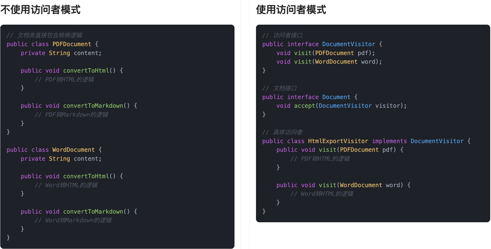

## 什么是访问者模式？
**访问者模式**（Visitor Pattern）是一种行为型设计模式，它的核心思想是：**将数据结构和作用于数据结构上的操作分离开来，让新的操作可以在不改变数据结构的前提下添加进来**。  
说白了，就是原来的类我不想动它，但我又想多做点事，这时候就请一个“外部角色”来干活。这个角色我们叫它“访问者”，它会主动去拜访每个对象，挨个执行自己的操作。

比如我们鱼鸢网络公司有一个“员工信息系统”，里面记录了所有员工的信息。人事部想算绩效奖金，财务想算税，IT想统计电脑配置。按正常思路，如果都把这些逻辑写在员工类里，那类就炸了，职责全堆一起了。用访问者模式，我们就把这些操作分给不同的“访问者”对象，让它们自己来处理员工信息。

每个员工类只需要提供一个 `accept(Visitor v)` 方法，访问者自己带着“我要干的事”过来，跟员工说：“我来算你这个月的工资”，员工高兴地点个头：“可以啊”，就完了。


这个模式的最大好处就是：扩展性强，不破坏原结构，逻辑清晰，职责明确。如果后续新增一个“安全部门”来查岗，那只需要新增一个访问者类，不用动员工类半行代码。

## 为什么要使用访问者模式？
在实际开发中，有时候我们面对的数据结构是相对稳定的，但是需要不断地增加新的功能或者操作。如果我们直接在数据结构的类里加方法，类会不断膨胀，变得难以维护，而且违背了单一职责原则和开闭原则。  
通过访问者模式，我们可以很优雅地把新增的功能封装成访问者类，数据结构本身不动，只需要开放一个接受访问者的方法（accept方法），就可以实现新功能的扩展，大大提高了系统的灵活性和可维护性。

为了让大家更好地感受到访问者模式的作用，以文档格式转换为例，我们需要实现一个能够将不同格式文档转换为HTML的系统。让我们来看看使用和不使用访问者模式的区别：



通过对比可以看出，不使用访问者模式时，每个文档类都需要实现自己的转换逻辑，导致代码重复且难以维护。当需要添加新的转换方式（如转换为Markdown）时，需要修改所有文档类，违反了开闭原则。

而使用访问者模式后，我们将转换逻辑从文档类中分离出来，封装在访问者类中。这种设计使得代码结构更加清晰，降低了耦合度，提高了代码的可维护性。同时，访问者模式也使得系统更容易扩展，添加新的转换方式只需要创建新的访问者类，而不需要修改现有文档类。

## 访问者模式的应用场景
举一些开发中典型的应用场景：

+ 文档处理系统中的格式转换：对于一个文档处理系统，可能需要处理各种格式的文档（如PDF、Word、Excel等），而每种文档格式的解析与转换逻辑不同。访问者模式可以用来定义一个通用的操作接口，允许对不同类型的文档进行格式转换处理，扩展时无需修改文档类的代码，只需增加新的转换访问者。
+ 编译器设计：在编译器中，源代码通常会被解析为抽象语法树（AST）。不同类型的节点（如类、函数、表达式）会有不同的处理逻辑。使用访问者模式，编译器可以在不修改节点类的情况下，针对不同节点执行特定的操作，如语法检查、代码优化等。

## 访问者模式基本结构
访问者模式具有的角色和职责：

1）抽象元素（Element）：这是所有元素的基类或者接口，声明了接受访问者的`accept()`方法。每个元素类都会实现该方法，用来将访问者传递给自己。

2）具体元素（ConcreteElement）：每个具体元素类都实现了抽象元素的`accept()`方法，通常这个方法会将自己传递给访问者，让访问者执行特定的操作。

3）抽象访问者（Visitor）：定义了针对每个具体元素类的操作。每个具体访问者都实现这个接口，并且为每个元素类提供不同的操作。

4）具体访问者（ConcreteVisitor）：实现了抽象访问者接口，并为每个具体元素提供特定的操作。

5）对象结构（ObjectStructure）：包含一组元素对象，提供一个`accept()`方法，允许访问者访问结构中的每个元素。

下面用一张类图帮大家更直观地理解访问者模式的结构：


## 访问者模式的实现
下面就以 “文档格式转换” 为例，我们使用访问者模式实现一个简单的文档处理系统。

1）定义访问者接口：声明针对不同文档类型的转换方法

```java
public interface DocumentVisitor {
    void visit(PDFDocument pdf);
    void visit(WordDocument word);
    void visit(ExcelDocument excel);
}
```
这一步定义了访问者的统一接口，每种文档类型（PDF、Word、Excel）对应一个访问方法，用于封装“对文档进行格式转换”的逻辑入口。

2）定义文档元素接口：提供接受访问者的方法

```java
public interface Document {
    void accept(DocumentVisitor visitor);
}
```
每个文档类型实现这个接口，就可以“接受”访问者，调用相应的转换方法。通过双分派机制，把访问逻辑交给访问者处理，文档本身无需关心。

3）实现具体文档类：如 PDF、Word、Excel

```java
public class PDFDocument implements Document {
    private String content;

    public PDFDocument(String content) {
        this.content = content;
    }

    public String getContent() {
        return content;
    }

    @Override
    public void accept(DocumentVisitor visitor) {
        visitor.visit(this);
    }
}

public class WordDocument implements Document {
    private String content;

    public WordDocument(String content) {
        this.content = content;
    }

    public String getContent() {
        return content;
    }

    @Override
    public void accept(DocumentVisitor visitor) {
        visitor.visit(this);
    }
}

public class ExcelDocument implements Document {
    private String[][] table;

    public ExcelDocument(String[][] table) {
        this.table = table;
    }

    public String[][] getTable() {
        return table;
    }

    @Override
    public void accept(DocumentVisitor visitor) {
        visitor.visit(this);
    }
}
```
每个文档类都实现 `accept` 方法，并在其中调用访问者的对应方法，把自身 `this` 传过去。这样访问者就可以获取到文档数据并处理，而文档类不需要知道“怎么处理”。

4）实现具体访问者类：将文档转换为 HTML 格式

```java
public class HtmlExportVisitor implements DocumentVisitor {

    @Override
    public void visit(PDFDocument pdf) {
        System.out.println("<html><body><h1>PDF 内容</h1><p>" + pdf.getContent() + "</p></body></html>");
    }

    @Override
    public void visit(WordDocument word) {
        System.out.println("<html><body><h1>Word 内容</h1><p>" + word.getContent() + "</p></body></html>");
    }

    @Override
    public void visit(ExcelDocument excel) {
        System.out.println("<html><body><h1>Excel 内容</h1><table border='1'>");
        for (String[] row : excel.getTable()) {
            System.out.print("<tr>");
            for (String cell : row) {
                System.out.print("<td>" + cell + "</td>");
            }
            System.out.println("</tr>");
        }
        System.out.println("</table></body></html>");
    }
}
```
这个访问者类实现了将文档转换为 HTML 的具体逻辑。每种文档的转换方式不同，但它们共用一个访问者接口，使得扩展变得灵活又统一。

5）客户端调用示例

```java
public class Client {
    public static void main(String[] args) {
        Document pdf = new PDFDocument("这是 PDF 文件的内容");
        Document word = new WordDocument("这是 Word 文档的内容");
        Document excel = new ExcelDocument(new String[][] {
            {"姓名", "成绩"},
            {"鱼皮", "90"},
            {"Yes哥", "95"}
        });

        DocumentVisitor htmlExporter = new HtmlExportVisitor();

        pdf.accept(htmlExporter);
        word.accept(htmlExporter);
        excel.accept(htmlExporter);
    }
}
```
输出结果：

```plain
<html><body><h1>PDF 内容</h1><p>这是 PDF 文件的内容</p></body></html>
<html><body><h1>Word 内容</h1><p>这是 Word 文档的内容</p></body></html>
<html><body><h1>Excel 内容</h1><table border='1'><tr><td>姓名</td><td>成绩</td></tr><tr><td>鱼皮</td><td>90</td></tr><tr><td>Yes哥</td><td>95</td></tr></table></body></html>

```
客户端通过访问者 `HtmlExportVisitor` 完成了对多个文档类型的统一格式转换。访问者模式让新增新的转换方式（比如导出为 Markdown 或 HTML）变得非常容易，而无需修改原有文档类的任何代码。

## 访问者模式的优缺点
### 优点
+ **扩展性强**：访问者模式可以让我们在不改变元素类（被访问者类）的情况下，增加新的操作。这样一来，功能扩展变得非常简单，只需要在访问者中添加新功能即可，符合开闭原则。
+ **集中操作**：将操作集中在访问者类中，避免了在各个元素类中重复实现相同的操作，使得系统的修改和维护更加集中和清晰。
+ **灵活性高**：访问者模式让你可以针对不同类型的元素执行不同的操作，灵活性也非常高，特别适用于需要对对象结构中的不同元素做不同操作的情况。

### 缺点
+ **增加了类的数量**：访问者模式需要为每个不同的操作创建一个访问者类，这会导致系统中类的数量增加，进而使得系统变得复杂。
+ **修改元素类困难**：虽然增加新操作很方便，但一旦要修改元素类的结构，就会影响到所有的访问者，需要同步更新访问者中的相关代码，导致维护成本增加。
+ **不适合频繁变化的对象结构**：访问者模式适合结构比较稳定的场景，如果对象结构经常变化，添加新的元素时，就必须修改所有的访问者类，这样就违背了它的初衷，增加了维护难度。

## 扩展知识 - 源码分析
### 开源框架中的应用
#### 1、JDK
在 JDK 中，**javax.lang.model.element.ElementVisitor** 是访问者模式的标准实现，它的作用是在编译期间**遍历Java程序中的各种元素**（如类、方法、字段）并执行对应逻辑。

这个接口是在 Java 注解处理器（APT）机制中用得最多的，很多框架比如 Lombok、Dagger 都会用它来分析代码结构。

我们来看下关键源码：

```java
/**
 * 元素访问器接口，用于访问 Java 程序中的各种元素（类、方法、字段、包等）。
 * 
 * 这是 Java 编译器 API（javax.lang.model）中的关键接口之一，
 * 用于在注解处理器或源码分析工具中访问和处理抽象语法树（AST）元素。
 */
public interface ElementVisitor<R, P> {

    /**
     * 访问任意 Element 的通用方法。
     */
    R visit(Element e, P p);

    /**
     * 访问任意 Element 的简便方法，相当于 visit(e, null)。
     */
    R visit(Element e);

    /**
     * 访问包（PackageElement）元素。
     */
    R visitPackage(PackageElement e, P p);

    /**
     * 访问类、接口、枚举等类型元素（TypeElement）。
     */
    R visitType(TypeElement e, P p);

    /**
     * 访问字段、局部变量、参数等变量元素（VariableElement）。
     */
    R visitVariable(VariableElement e, P p);

 /**
     * 访问方法或构造函数等可执行元素（ExecutableElement）。
     */
    R visitExecutable(ExecutableElement e, P p);

    /**
     * 访问泛型类型参数元素（TypeParameterElement）。
     */
    R visitTypeParameter(TypeParameterElement e, P p);

    /**
     * 访问未知类型的元素（将来语言版本可能引入新元素）。
     */
    R visitUnknown(Element e, P p);

```
每种程序元素对应一个 `visitXxx` 方法，而 `Element` 接口中定义了 `accept()` 方法：

```java
/**
 * 表示程序中出现的语言元素（如包、类、字段、方法、参数等）的通用接口。
 */
public interface Element {

    /**
     * 接收一个访问器访问当前元素，实现访问者模式（Visitor Pattern）。
     */
    <R, P> R accept(ElementVisitor<R, P> v, P p);
}

```
调用者会传入一个访问者，`accept()` 会根据元素类型调用对应的 `visitXxx()` 方法。

我们通过类图来看下简单的结构：


类图中我们可以很清晰地看到：数据结构（Element）和操作逻辑（ElementVisitor）被彻底分离，扩展非常方便。

#### 2、Spring 框架
Spring 中有一个类叫 **BeanDefinitionVisitor**，它就是一个典型的访问者，用来遍历 Bean 的元数据结构，并对属性值做批量处理或修改。

这个类一般出现在 Spring 内部配置处理的过程中，比如替换某些占位符、动态修改属性值等场景。

我们来看下源码：

```java
public class BeanDefinitionVisitor {

    /**
     * 访问整个 BeanDefinition 的入口方法，
     * 子类通常会在这里递归访问各个属性值。
     */
    public void visitBeanDefinition(BeanDefinition beanDefinition) {
        visitParentName(beanDefinition);
		visitBeanClassName(beanDefinition);
		visitFactoryBeanName(beanDefinition);
		visitFactoryMethodName(beanDefinition);
		visitScope(beanDefinition);
		if (beanDefinition.hasPropertyValues()) {
			visitPropertyValues(beanDefinition.getPropertyValues());
		}
		if (beanDefinition.hasConstructorArgumentValues()) {
			ConstructorArgumentValues cas = beanDefinition.getConstructorArgumentValues();
			visitIndexedArgumentValues(cas.getIndexedArgumentValues());
			visitGenericArgumentValues(cas.getGenericArgumentValues());
		}
    }

    /**
     * 访问 BeanDefinition 的 parentName 属性（父 Bean 名称）。
     */
    protected void visitParentName(BeanDefinition beanDefinition) {
        // 省略实现代码...
    }

    /**
     * 访问 BeanDefinition 的 beanClassName 属性（Bean 的类名）。
     */
    protected void visitBeanClassName(BeanDefinition beanDefinition) {
        // 省略实现代码...
    }

    /**
     * 访问 BeanDefinition 的 factoryBeanName 属性（工厂 Bean 名称）。
     */
    protected void visitFactoryBeanName(BeanDefinition beanDefinition) {
        // 省略实现代码...
    }

    /**
     * 访问 BeanDefinition 的 factoryMethodName 属性（工厂方法名）。
     */
    protected void visitFactoryMethodName(BeanDefinition beanDefinition) {
        // 省略实现代码...
    }

    /**
     * 访问 BeanDefinition 的 scope 属性（作用域，例如 singleton、prototype）。
     */
    protected void visitScope(BeanDefinition beanDefinition) {
        // 省略实现代码...
    }

    /**
     * 访问 BeanDefinition 中的属性值集合（<property> 标签对应的内容）。
     */
    protected void visitPropertyValues(MutablePropertyValues pvs) {
        // 省略实现代码...
    }

    /**
     * 访问构造函数中按索引注入的参数（constructor-arg index="0"）。
     */
    protected void visitIndexedArgumentValues(Map<Integer, ConstructorArgumentValues.ValueHolder> ias) {
        // 省略实现代码...
    }

    /**
     * 访问构造函数中按顺序注入的参数（无 index，按顺序匹配）。
     */
    protected void visitGenericArgumentValues(List<ConstructorArgumentValues.ValueHolder> gas) {
        // 省略实现代码...
    }

    /**
     * 处理各种类型的值，支持嵌套 BeanDefinition、引用、集合、字符串等，
     * 是整个访问过程的核心调度方法。
     */
    @Nullable
    protected Object resolveValue(@Nullable Object value) {
         // 省略实现代码...
    }

    /**
     * 访问数组类型的值，逐一解析其中的元素。
     */
    protected void visitArray(Object[] arrayVal) {
        // 省略实现代码...
    }

    /**
     * 访问 List 类型的值，逐一解析其中的元素。
     */
    protected void visitList(List listVal) {
        // 省略实现代码...
    }

    /**
     * 访问 Set 类型的值，逐一解析其中的元素。
     */
    protected void visitSet(Set setVal) {
        // 省略实现代码...
    }

    /**
     * 访问 Map 类型的值，递归解析 key 和 value。
     */
    protected void visitMap(Map<?, ?> mapVal) {
        // 省略实现代码...
    }
}

```
这个访问者会“走遍”整个 Bean 的定义结构，处理每个属性值，完成类似占位符替换、动态注入等任务。它和 `BeanDefinition` 本身是解耦的，两者各司其职。

### 优势和作用
通过上述的源码分析，我们可以再次总结下访问者模式的作用。

#### 1、结构稳定，操作可扩展
在 JDK 和 Spring 这类框架中，结构往往是比较稳定的，比如 `Element`、`BeanDefinition` 这些类的结构不轻易改动。而访问者模式允许我们在不修改这些类的前提下，自由地添加各种操作。新加一个行为只需要实现一个新的访问者，不需要动原有结构，非常利于扩展和维护。

#### 2、逻辑集中，职责清晰
访问者把不同的操作集中到一个类中，比如 `ElementVisitor` 或 `BeanDefinitionVisitor`，这样每种操作的代码都聚集在一块，逻辑更清晰，也方便后期维护和测试。而且不同访问者之间互不干扰，不容易引发耦合问题。

#### 3、支持多态调度
通过 `accept()` 方法的双重分发机制（也叫“双分派”），访问者模式能够根据访问者和被访问者的具体类型，自动调用对应的访问逻辑。这种机制对处理复杂层级结构（比如编译器的 AST、Spring 的配置树）特别有用。

## 相关面试题
可以在 [程序员面试刷题神器 - 面试鸭](https://www.mianshiya.com/) 上获取到企业常问的设计模式面试题。比如：

1）[什么是访问者模式？一般用在什么场景？ ](https://www.mianshiya.com/bank/1801559627969929217/question/1803306004491264002)


