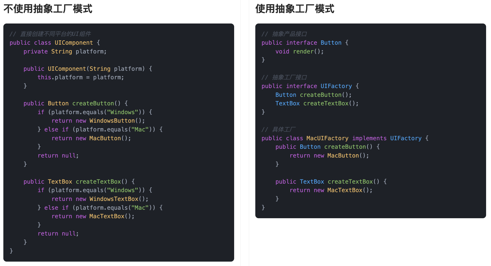

## 什么是抽象工厂模式？
**抽象工厂模式**（Abstract Factory Pattern）是一种创建型设计模式，说白了，它就是提供一个“超级工厂”的接口，专门用来创建一整组互相关联的产品对象，而且不用我们关心这些产品具体是怎么实现的。

我们平常在购买手机时，店家提供了多种型号的手机，每种型号的手机提供了不同的配件和服务套餐。这些产品（手机、配件、套餐）可以是不同厂商的不同系列，但是它们在功能和设计上是相互协调的。例如，一个厂商可能提供“手机+耳机+手表”组合，另一个厂商提供“手机+无线充电器+定制化服务”组合。这就是一种“工厂”，它不仅生产手机，还生产与之匹配的其他产品。抽象工厂模式就是帮助我们创建这种相互依赖的产品组合。


换句话说，它让我们通过一个接口，就能搞定多个相关对象的创建，而且这些对象之间还能保持一致性。更妙的是，我们完全不用关心具体的类名或构造逻辑，这些都交给具体的工厂实现去处理。

## 为什么要使用抽象工厂模式？
抽象工厂模式的主要目的是为了解决对象创建的复杂性和耦合性问题。当我们有多个系列的产品，每个系列包含多个相互关联的对象时，如果直接在客户端代码中创建这些对象，会导致代码变得难以维护和扩展。抽象工厂模式通过将对象的创建过程抽象化，让客户端无需关心具体的产品实现，只需要通过工厂接口来获取相应的产品对象。这样，客户端代码和产品的具体实现解耦，便于产品的扩展和修改，同时也方便在不改变客户端代码的前提下，轻松切换不同系列的产品，从而提高了系统的灵活性和可维护性。

为了让大家更好地感受到抽象工厂模式的作用，以跨平台UI组件库为例，我们需要支持不同操作系统（Windows、Mac）下的按钮、文本框等UI组件。让我们来看看使用和不使用抽象工厂模式的区别：



通过对比可以看出，不使用抽象工厂模式时，我们需要在 `UIComponent` 类中通过条件判断来创建不同平台的UI组件，这导致了代码耦合度高、违反开闭原则、难以扩展等问题。每当需要添加新的平台或组件类型时，都需要修改现有代码，增加了维护成本。

而使用抽象工厂模式后，我们将产品族的创建与使用分离，降低了代码耦合度。通过抽象工厂接口和具体工厂类，我们可以轻松添加新的平台支持，无需修改现有代码。同时，这种实现方式确保了同一平台下的组件风格一致性，提高了代码的可维护性和可扩展性。

## 抽象工厂模式的应用场景
举一些开发中典型的应用场景：

+ 多平台 UI 渲染引擎：在开发一个支持 Web、Android、小程序等多端渲染的内容管理系统时，可以用抽象工厂为不同平台提供一整套组件（按钮、表单、图片组件等），工厂屏蔽平台差异，保持调用方式一致。
+ 多数据库适配场景（逻辑与物理结构差异大）：当一个系统需要支持 MySQL、Oracle、SQL Server 等数据库，且它们不仅语法不同，连分页、存储过程、数据结构等都不统一时，可用抽象工厂提供一整套数据访问组件（分页查询器、SQL 拼接器、字段映射器等）。
+ 多种导出格式支持系统：比如报表系统或试卷系统中，一套业务数据可能要导出为 PDF、Word、Excel、HTML 等格式，每种格式对应一组导出组件（布局器、样式渲染器、文件写入器），通过抽象工厂生成完整的导出工具链。
+ 多语言/多地区内容适配：跨境系统中，不同地区展示的内容、日期格式、币种符号等都不相同，可以通过抽象工厂为每个地区创建一整套“本地化服务组件”，如文本翻译器、格式转换器、金额展示器等。

## 抽象工厂模式的基本结构
抽象工厂模式具有的角色和职责：

1）抽象工厂（AbstractFactory）：声明一组创建产品的方法。  
2）具体工厂（ConcreteFactory）：实现创建具体产品对象的方法。  
3）抽象产品（AbstractProduct）：定义每个产品的公共接口。  
4）具体产品（ConcreteProduct）：实现具体的产品对象。  
5）客户端（Client）：只依赖抽象工厂和抽象产品，负责调用工厂去生产对象。

下面用一张类图帮大家更直观地理解抽象工厂模式的结构：


## 抽象工厂模式代码实现
下面就以 “多平台 UI 渲染” 为例，我们用抽象工厂模式实现一个简单的组件系统。 

1）定义抽象产品接口：声明各类 UI 组件的标准接口

```java
public interface Button {
    void render();
}

public interface TextBox {
    void render();
}

public interface Image {
    void render();
}
```
这一步的目的是统一各个产品的对外接口，比如所有平台的按钮都有 `render()` 方法，这样我们就能做到“面向接口编程”，平台实现细节被隐藏起来。

2）定义抽象工厂接口，统一创建产品族的工厂接口

```java
public interface UIFactory {
    Button createButton();
    TextBox createTextBox();
    Image createImage();
}
```
抽象工厂接口定义了一整套产品的创建方式，比如一个平台的 UI 应该同时有按钮、文本框、图片，全部由一个工厂统一生产，保证风格一致。

3）实现具体产品类（以 Web 为例）

```java
public class WebButton implements Button {
    @Override
    public void render() {
        System.out.println("渲染 Web 风格按钮");
    }
}

public class WebTextBox implements TextBox {
    @Override
    public void render() {
        System.out.println("渲染 Web 风格文本框");
    }
}

public class WebImage implements Image {
    @Override
    public void render() {
        System.out.println("渲染 Web 风格图片组件");
    }
}
```
每个产品都有对应平台的实现类，比如 Web 平台的 `WebButton`、`WebTextBox` 等，分别去实现各自的接口。

4）实现具体工厂类（Web 平台工厂）

```java
public class WebUIFactory implements UIFactory {
    @Override
    public Button createButton() {
        return new WebButton();
    }

    @Override
    public TextBox createTextBox() {
        return new WebTextBox();
    }

    @Override
    public Image createImage() {
        return new WebImage();
    }
}
```
Web 平台的 UI 工厂会创建出 Web 风格的一整套组件。使用者只要拿这个工厂，就能生产出风格统一的 UI 组件。

5）Android 平台产品和工厂实现

```java
public class AndroidButton implements Button {
    @Override
    public void render() {
        System.out.println("渲染 Android 原生按钮");
    }
}

public class AndroidTextBox implements TextBox {
    @Override
    public void render() {
        System.out.println("渲染 Android 原生文本框");
    }
}

public class AndroidImage implements Image {
    @Override
    public void render() {
        System.out.println("渲染 Android 原生图片组件");
    }
}

public class AndroidUIFactory implements UIFactory {
    @Override
    public Button createButton() {
        return new AndroidButton();
    }

    @Override
    public TextBox createTextBox() {
        return new AndroidTextBox();
    }

    @Override
    public Image createImage() {
        return new AndroidImage();
    }
}
```
我们在这里复用了同一套接口，把 Android 平台的产品实现了出来，然后交给 Android 平台的工厂统一创建。

6）客户端调用示例

```java
public class Client {
    public static void main(String[] args) {
        // 假设当前运行环境为 Web
        UIFactory factory = new WebUIFactory();

        Button button = factory.createButton();
        TextBox textBox = factory.createTextBox();
        Image image = factory.createImage();

        button.render();
        textBox.render();
        image.render();
    }
}
```
输出结果：

```plain
渲染 Web 风格按钮
渲染 Web 风格文本框
渲染 Web 风格图片组件
```
客户端只需要和 `UIFactory` 打交道，不关心具体创建的是 Web 组件还是 Android 组件，完全通过接口访问。这就是抽象工厂的优势——屏蔽创建细节，统一调用方式。

## 简单工厂、工厂方法、抽象工厂的区别
**1）简单工厂**：通常由一个工厂类负责创建所有产品的实例，缺点是当产品种类增加时，工厂类会变得庞大，且难以扩展。

**2）工厂方法**：每个具体工厂类负责创建某一类产品，通过继承和多态机制解决了简单工厂类的问题，使得每个工厂只负责一种产品的创建。

**3）抽象工厂**：进一步扩展了工厂方法模式，不仅提供了创建单一产品的工厂方法，还提供了创建一系列相关产品的工厂方法，确保了不同产品之间的协调性。

## 抽象工厂模式的优缺点
### 优点
+ **产品族的一致性**：抽象工厂模式可以保证同一个产品族中的组件搭配使用时不会出错，比如 UI 组件的样式风格统一，使用体验更协调，避免了“东拼西凑”的情况。
+ **便于切换产品系列**：如果系统支持多种产品系列，比如要支持不同品牌或不同平台的实现，只需要替换一个工厂类，就能完成整套产品的切换，代码改动量小，扩展性好。
+ **封装了对象的创建逻辑**：对象的创建过程都被工厂封装起来了，客户端不用关心具体怎么创建，只要调用对应的工厂方法就行，降低了使用门槛，也让代码更整洁。

### 缺点
+ **扩展产品族比较困难**：一旦产品族的结构确定下来，比如工厂里要创建哪些产品是固定的，后期要再加一个新产品（比如再加一个新控件），就得改所有的工厂实现类，违反了开闭原则。
+ **类的数量会变多**：每个产品系列都要对应一个具体工厂类，加上每个产品本身也要有接口和实现，项目结构会变得比较庞大，对于简单项目来说可能有些“杀鸡用牛刀”。
+ **增加了系统的抽象层级**：虽然提高了灵活性，但也让代码结构变得更抽象，理解成本提升，对于新手或者不熟悉该模式的人来说，可能会觉得不太直观。

## 扩展知识 - 源码分析
### 开源框架中的应用
#### 1、JDK
在 JDK 中，有一个很典型的抽象工厂实现 —— `DocumentBuilderFactory`。

我们平时解析 XML 文件时，可能会这么写：

```java
DocumentBuilderFactory factory = DocumentBuilderFactory.newInstance();
DocumentBuilder builder = factory.newDocumentBuilder();
Document document = builder.parse(new File("test.xml"));

```
这段代码的背后，其实就隐藏着抽象工厂的逻辑。

我们来分析一下：

+ `DocumentBuilderFactory` 是一个抽象类，定义了创建产品的方法，比如 `newDocumentBuilder()`。
+ 不同的厂商可以实现自己的工厂类，比如内部可能是 `com.sun.org.apache.xerces.internal.jaxp.DocumentBuilderFactoryImpl`。
+ 每个具体工厂都能生产一组“配套”的产品：`DocumentBuilder` 就是其中之一，背后还可能关联解析器、验证器等。

源码里我们可以看到这个关键方法：

```java
public abstract class DocumentBuilderFactory {
    // 静态工厂方法，用于获取 DocumentBuilderFactory 的具体实现类实例。
    public static DocumentBuilderFactory newInstance() {
        return FactoryFinder.find(
            /* The default property name according to the JAXP spec */
            DocumentBuilderFactory.class, // "javax.xml.parsers.DocumentBuilderFactory"
            /* The fallback implementation class name */
            "com.sun.org.apache.xerces.internal.jaxp.DocumentBuilderFactoryImpl");
    }


    // 抽象工厂方法，用于创建新的 DocumentBuilder 实例。
    public abstract DocumentBuilder newDocumentBuilder()
    throws ParserConfigurationException;
}

```
这里的 `FactoryFinder` 会根据系统属性、配置文件、SPI 等机制返回不同实现的工厂类，实现了运行时灵活扩展的能力。

#### 2、Spring 框架
Spring 对抽象工厂模式的使用非常广泛，最核心的地方就是我们平时使用的 `ApplicationContext`。尤其是 `AbstractApplicationContext` 和它内部对 `BeanFactory` 的创建逻辑，本质上就是在用抽象工厂模式。

我们来看下 Spring 启动时创建 Bean 工厂的过程。以 `AbstractApplicationContext` 为例，它内部定义了这样一个抽象方法：

```java
// 刷新当前 ApplicationContext 使用的 BeanFactory 实例。
protected abstract void refreshBeanFactory() throws BeansException, IllegalStateException;
```
这个方法由子类去具体实现，比如 `GenericApplicationContext` 或 `AbstractRefreshableApplicationContext`。

这个方法最终的职责是：构建出一个 BeanFactory 实例（比如 `DefaultListableBeanFactory`），并在其中加载 Bean 定义。

我们来看下`AbstractRefreshableApplicationContext`里的实现：

```java
@Override
protected final void refreshBeanFactory() throws BeansException {
// 如果已有 BeanFactory，销毁其中所有 Bean 并关闭
if (hasBeanFactory()) {
    destroyBeans();
    closeBeanFactory();
}
// 创建新的 BeanFactory（默认 DefaultListableBeanFactory）
DefaultListableBeanFactory beanFactory = createBeanFactory();
this.beanFactory = beanFactory;
// 允许子类定制 BeanFactory 设置（如是否允许覆盖、循环依赖等）
customizeBeanFactory(beanFactory);
// 加载 Bean 定义（如从 XML、注解、配置类中）
loadBeanDefinitions(beanFactory);
}
// 创建BeanFactory
protected DefaultListableBeanFactory createBeanFactory() {
    return new DefaultListableBeanFactory(getInternalParentBeanFactory());
}
// 加载 Bean 定义到指定的 BeanFactory 中
protected abstract void loadBeanDefinitions(DefaultListableBeanFactory beanFactory)
throws BeansException, IOException;
```
这个方法里通过 `createBeanFactory()` 创建了一个 `DefaultListableBeanFactory`，然后加载了 XML 或注解配置的 Bean 定义。这就体现了抽象工厂的特点：根据环境或配置，创建出一组相互关联的对象（即多个 Bean 实例），这些对象由统一的工厂进行管理。

### 优势和作用
通过上述的源码分析，我们可以再次总结下抽象工厂设计模式的作用。

#### 1、**统一产品创建逻辑**
在实际开发中，我们经常会遇到“创建一整组相关对象”的场景。像 `DocumentBuilderFactory` 就是个很典型的例子，它不直接暴露底层的构造逻辑，而是统一提供 `DocumentBuilder` 实例的创建方式，确保不同平台、不同实现下生成的解析器行为一致。类似地，Spring 的 `ApplicationContext` 本质上也是个抽象工厂，负责统一创建 Bean 实例，保证配置文件、注解、Java 配置这些方式最终创建出的 Bean 都是风格一致、结构统一的。

#### 2、提升扩展性
抽象工厂最大的优势之一是“新增产品族”时非常方便。以 Spring 为例，`ApplicationContext` 可以根据不同需求，切换为 `ClassPathXmlApplicationContext`、`AnnotationConfigApplicationContext` 等不同实现类，但外部调用者只依赖于统一的接口，不需要关心背后怎么创建 Bean。类似地，在 JDK 中我们也可以通过替换 `DocumentBuilderFactory` 实现，支持不同的 XML 解析器，扩展能力很强。

#### 3、解耦具体实现
在系统架构中，解耦是很核心的一件事。我们通过定义抽象工厂接口，把产品的“使用”与“创建”彻底分开。比如我们平时在 Spring 中用 `getBean()` 获取对象时，根本不用管底层是用反射、CGLIB 还是单例池，具体策略全都被 `ApplicationContext` 屏蔽掉了。这样的好处是测试、替换、升级都不需要改动业务逻辑，系统整体也变得更灵活。

## 相关面试题
可以在 [程序员面试刷题神器 - 面试鸭](https://www.mianshiya.com/) 上获取到企业常问的设计模式面试题。比如：

1）[工厂模式和抽象工厂模式有什么区别？ ](https://www.mianshiya.com/bank/1801559627969929217/question/1801818998708707329)


