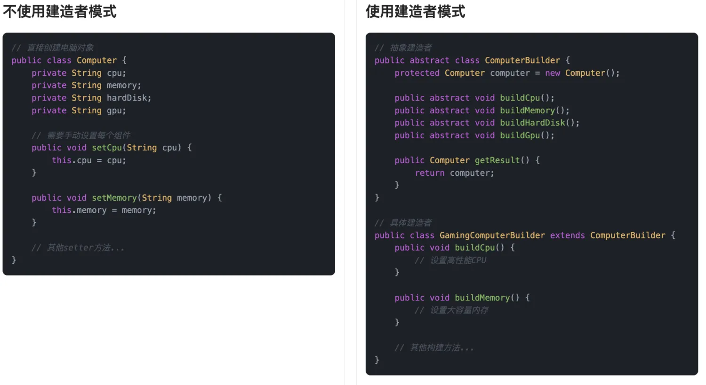
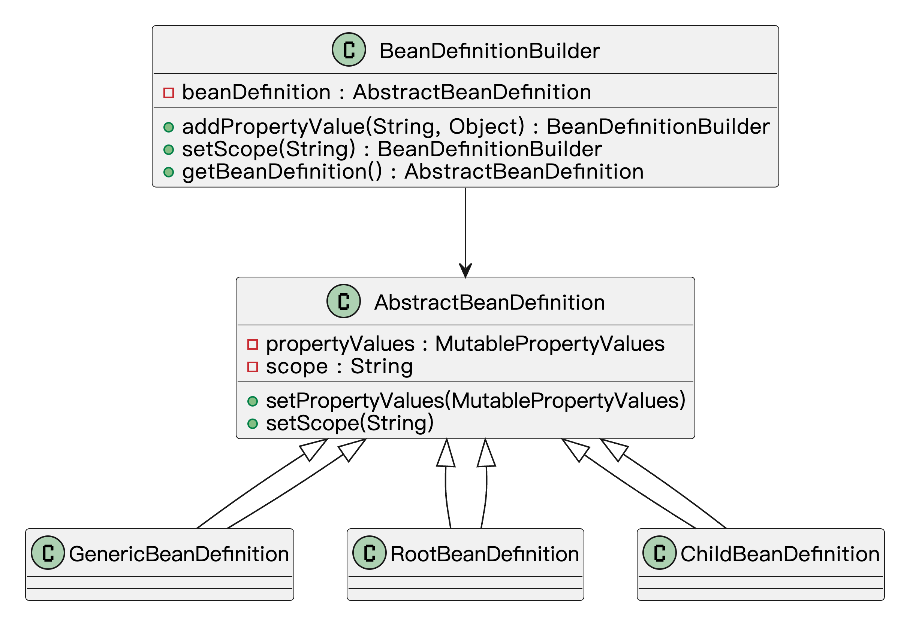

## 什么是建造者模式
**建造者模式**（Builder Pattern）是一种创建型设计模式，它的核心思想是：把一个复杂对象的创建过程拆解成多个小步骤，然后一步步构建出来。这个过程中，客户端只需要告诉系统“我想要什么”，而不用关心“怎么一步步造出来的”。

比如鱼皮去餐厅点餐，直接选了一个“豪华套餐”——里面包含了主菜、配菜、饮料，甚至还有甜点。鱼皮不需要跑到后厨说“先炒哪个菜，先上主食还是先上汤”，这些细节都交给餐厅的“构建流程”去搞定，鱼皮只管坐等上菜。建造者模式就像是这个套餐系统，负责把一个“复杂的成品”按照预设的步骤、有条不紊地建出来。


用更通俗点的话说，这模式就像组装一台电脑：你告诉装机师傅“我要高性能的游戏主机”，然后他一步步帮你装好电源、主板、显卡……最后你只管坐下来打游戏，不用操心每个零件怎么配、线怎么插。

## 为什么要使用建造者模式？
它有下列优点：

1. 对象构建过程复杂：如果需要创建的对象有很多步骤或者很多参数，直接在构造函数或者其他方法中传递这些信息会变得复杂难懂。而建造者模式能把这些步骤分开处理，使得对象的构建过程更加清晰。
2. 需要灵活的对象构建方式：当我们需要根据不同的需求构建相似的对象时，建造者模式允许我们通过改变建造过程中的某些步骤来创建不同的对象，而不需要重新编写整个对象的构造代码。
3. 构建过程和表示分离：建造者模式可以把构建过程和对象的表示（即结果）分离开来，使得同一个构建过程能够创建出不同表示的对象。

为了让大家更好地感受到建造者模式的作用，以电脑组装为例，我们需要创建不同配置的电脑（游戏电脑、办公电脑等）。让我们来看看使用和不使用建造者模式的区别：



通过对比可以看出，不使用建造者模式时，我们需要在创建 `Computer` 对象时需要手动一个一个`set`，这导致了代码可读性差、不够直观。当需要创建不同配置的电脑时，代码会变得冗长且难以维护。

而使用建造者模式后，我们可以通过链式调用逐步设置电脑的各个组件，使代码更加清晰易读。建造者模式将对象的构建过程与表示分离，使得创建过程更加灵活，也可以轻松处理可选参数，并且能够确保对象的完整性。这种实现方式不仅提高了代码的可维护性，还使得创建不同配置的电脑变得更加简单和直观。

## 建造者模式的应用场景
举一些开发中典型的应用场景：

+ 复杂表单或请求对象的构建：如创建一个包含多个可选字段的用户注册请求、订单提交请求、报表筛选条件等，可以用建造者模式灵活拼接参数，避免构造方法过长或参数顺序混乱。
+ 导出文件内容构建：例如生成复杂的 PDF 报告、Word 文件或 Excel 报表，往往需要一步步构建文档结构（页眉、表格、图片、段落等），使用建造者模式可以分步骤构造并保证内容完整性。
+ 业务流水记录对象创建：例如在支付系统或交易系统中，流水日志往往由多个字段拼成（请求来源、时间戳、交易码、响应内容、错误栈等），用建造者模式可以按需构造，避免创建臃肿的构造器或 set 方法杂乱调用。
+ 消息推送内容构建器：推送系统中，不同渠道（短信、微信、邮件）消息格式各异，有标题、正文、按钮、跳转链接等字段，通过建造者统一构造内容体，保持代码清晰灵活。

## 建造者模式的基本结构
建造者模式具有的角色和职责：

1）产品类（Product）：要构建的复杂对象，包含多个组成部分。

2）抽象建造者类（Builder）：定义构建产品各个部分的抽象方法，以及返回最终产品的方法。

3）具体建造者类（ConcreteBuilder）：实现Builder接口，具体负责各个部分的构建细节，并最终组装出完整产品。

4）指挥者类（Director）：统一指挥建造者按照一定步骤来构建产品，屏蔽了构建过程的细节。

5）客户端类（Client）：发起建造请求，选择具体的建造者并使用指挥者来完成产品的创建。

下面用一张类图帮大家更直观地理解建造者模式的结构：


## 建造者模式的实现
我们来用建造者模式模拟一下 “电脑组装” 的过程，来看下这个模式在实际场景中是怎么运作的。

1）定义产品类 `Computer`，表示最终要构建的复杂对象

```java
public class Computer {
    private String cpu;
    private String memory;
    private String hardDisk;
    private String gpu;

    public void setCpu(String cpu) {
        this.cpu = cpu;
    }

    public void setMemory(String memory) {
        this.memory = memory;
    }

    public void setHardDisk(String hardDisk) {
        this.hardDisk = hardDisk;
    }

    public void setGpu(String gpu) {
        this.gpu = gpu;
    }

    @Override
    public String toString() {
        return "Computer{" +
               "cpu='" + cpu + '\'' +
               ", memory='" + memory + '\'' +
               ", hardDisk='" + hardDisk + '\'' +
               ", gpu='" + gpu + '\'' +
               '}';
    }
}
```
这段代码定义了我们最终要构建的对象，也就是“电脑”。它包含 CPU、内存、硬盘、显卡几个配置项。

2）定义抽象建造者 `ComputerBuilder`，约定构建流程

```java
public abstract class ComputerBuilder {
    protected Computer computer = new Computer();

    public abstract void buildCpu();
    public abstract void buildMemory();
    public abstract void buildHardDisk();
    public abstract void buildGpu();

    public Computer getResult() {
        return computer;
    }
}
```
这段代码定义了“装机流程”的抽象说明。具体怎么装，由子类实现。

3）定义具体建造者 `GamingComputerBuilder`，实现具体组装逻辑

```java
public class GamingComputerBuilder extends ComputerBuilder {
    @Override
    public void buildCpu() {
        computer.setCpu("Intel i9");
    }

    @Override
    public void buildMemory() {
        computer.setMemory("32GB DDR5");
    }

    @Override
    public void buildHardDisk() {
        computer.setHardDisk("1TB NVMe SSD");
    }

    @Override
    public void buildGpu() {
        computer.setGpu("NVIDIA RTX 4090");
    }
}
```
这里我们实现了一个“高性能游戏电脑”的装机过程。每个组件都用了比较高端的配置。

4）定义指挥者 `Director`，组织组装顺序

```java
public class Director {
    private ComputerBuilder builder;

    public Director(ComputerBuilder builder) {
        this.builder = builder;
    }

    public Computer construct() {
        builder.buildCpu();
        builder.buildMemory();
        builder.buildHardDisk();
        builder.buildGpu();
        return builder.getResult();
    }
}
```
这个类负责控制装机顺序，不管你换哪个建造者，实现顺序都可以统一在这里安排。

5）客户端调用代码，组装电脑

```java
public class Main {
    public static void main(String[] args) {
        ComputerBuilder builder = new GamingComputerBuilder();
        Director director = new Director(builder);
        Computer gamingPc = director.construct();
        System.out.println(gamingPc);
    }
}
```
最终在主程序中，我们选用了一个具体的 Builder，把电脑一步步组装出来，最后构建了一台完整的高性能游戏电脑。

## 建造者模式的优缺点
### 优点
+ **结构清晰、过程可控**：建造者模式把复杂对象的构建过程拆成一个个明确的步骤，让整个构建流程变得清晰、稳定，而且每一步都可以单独控制，方便管理和调整。
+ **便于构建“不同版本”的对象**：通过不同的建造者，可以轻松地创建出结构类似但配置不同的对象，特别适合那种“定制化”很强的业务场景，比如生成不同类型的报表、构造不同风格的 UI 等。
+ **代码更易维护和扩展**：把构建逻辑从产品本身抽离出来，符合单一职责原则，既减少了耦合，也让代码更容易维护。如果后续要新增构建步骤或者替换某个细节，实现起来也很自然。

### 缺点
+ **增加了类的数量**：为了实现建造者模式，需要引入额外的建造者类和指挥者类，类的数量一下子就上来了。如果对象结构本身不复杂，这种拆分反而会让代码变得繁琐。
+ **不适合构建过程差异太大的对象**：建造者模式适合用在“有共同构建步骤”的对象上。如果对象之间的构建逻辑完全不一样，硬套建造者反而会让代码变得臃肿、不灵活。

## 扩展知识 - 源码分析
### 开源框架中的应用
#### 1、JDK
在 JDK 中，`StringBuilder` 是建造者模式的一个经典例子。我们可以通过连续调用 `append` 方法，逐步构建一个字符串对象，最后通过 `toString` 方法获取最终的字符串。这种方式避免了创建多个临时字符串对象，提高了性能。

```java
StringBuilder sb = new StringBuilder();
sb.append("我是");
sb.append("鱼皮");
String result = sb.toString();

```
在这个过程中，`StringBuilder` 充当了建造者的角色，`append` 方法是构建过程中的各个步骤，`toString` 方法则是获取最终产品的方式。

#### 2、Spring 框架
在 Spring 框架中，`BeanDefinitionBuilder` 是建造者模式的典型应用。它用于以编程方式构建 `BeanDefinition` 对象，允许我们逐步设置 Bean 的各种属性，如类名、作用域、构造函数参数等。通过这种方式，我们可以灵活地定义和注册 Bean，而无需直接操作底层的 `BeanDefinition` 接口。

以下是一个使用 `BeanDefinitionBuilder` 构建 Bean 的示例：

```java
// 创建 AnnotationConfigApplicationContext，这是一个可配置的应用上下文  
AnnotationConfigApplicationContext context = new AnnotationConfigApplicationContext();  
// 获取 BeanDefinitionRegistry，用于注册新的 Bean 定义  
BeanDefinitionRegistry registry = (BeanDefinitionRegistry) context.getBeanFactory();  
// 使用 BeanDefinitionBuilder 创建一个新的 Bean 定义  
BeanDefinitionBuilder builder = BeanDefinitionBuilder.genericBeanDefinition(UserService.class);
// 为新的 Bean 定义设置属性  
builder.addPropertyValue("property", "value");
// 为新的 Bean 设置作用域
builder.setScope(BeanDefinition.SCOPE_SINGLETON);
// 构建并获取 GenericBeanDefinition 对象 
BeanDefinition beanDefinition = builder.getBeanDefinition();
// 注册新的 Bean 定义到容器中，使用 "userService" 作为 Bean 的名称  
registry.registerBeanDefinition("userService", beanDefinition);  
// 刷新上下文，以便应用新的 Bean 定义  
context.refresh();  
```
这个示例中，我们通过 `BeanDefinitionBuilder` 构建了一个 `UserService` 的 BeanDefinition，并设置了属性和作用域，最后获取了构建好的 BeanDefinition 对象。

我们可以通过一张类图，来展示建造者模式的简单结构：



这个类图展示了 `BeanDefinitionBuilder` 如何构建不同类型的 `BeanDefinition`，以及它们之间的继承关系。

### 优势和作用
通过上述的源码分析，我们可以再次总结下建造者模式的作用。

#### 1、**提高了代码的可维护性**
建造者模式的核心在于“分离构建与表示”。像 `StringBuilder` 就是一个典型例子，我们一步步地 append 内容，而不是直接通过构造方法去拼字符串。这样写出来的代码结构更清晰，也更容易维护。Spring 里的 `BeanDefinitionBuilder` 也是类似的用法，通过链式 API 逐步设置属性，避免了混乱的构造逻辑，后期想改也很方便。

#### 2、增强了代码的扩展性
有时候业务需求经常变化，我们希望在不动原来逻辑的前提下加点功能。用建造者模式就很合适。比如 `BeanDefinitionBuilder` 允许我们按需添加属性值等配置，不需要修改 BeanDefinition 的核心结构。这种“开放扩展，封闭修改”的写法，让我们能更灵活地应对复杂场景。

#### 3、简化了复杂对象的创建
当一个对象涉及的参数很多，而且有些是可选项时，用传统构造方法会非常麻烦，代码也不好看。`StringBuilder` 的逐步构建方式就避免了这个问题，写起来更自然。Spring 里的 `BeanDefinitionBuilder` 也是一样，帮我们把复杂的 Bean 配置过程拆成了小步骤，整个创建过程变得清晰、灵活，也更容易调试。

## 相关面试题
可以在 [程序员面试刷题神器 - 面试鸭](https://www.mianshiya.com/) 上获取到企业常问的设计模式面试题。比如：

1）[什么是建造者模式？一般用在什么场景？ ](https://www.mianshiya.com/bank/1801559627969929217/question/1802171325634387970)


