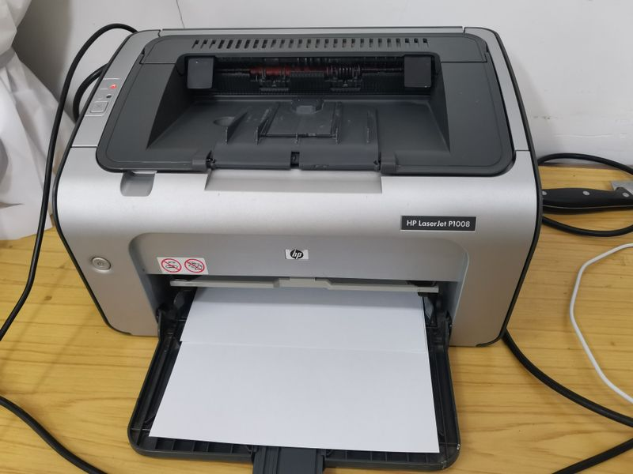

## 什么是原型模式？
**原型模式**（Prototype Pattern）是一种创建型设计模式，主要用于**通过复制现有的对象来创建新对象**，而不是通过“new”关键字来直接实例化。简而言之，原型模式让我们能够在已有对象的基础上创建新对象。它依赖于“克隆”已有对象的状态，从而减少了重复构建相同对象的成本。

举个例子，我们都打印过东西吧，我们把一份文件拿到打印店里，不需要再重新手写一遍，而是直接用复印机“咔咔咔”地复印出一堆一模一样的副本。在这个场景中，原件就像是原型（Prototype），复印机就相当于是调用了原型的克隆功能，快速拷贝出很多个一模一样的对象。

有时候我们可能还想在复印件上加点批注或者划重点，这就像是在克隆出来的对象上再做一点小修改，也正是原型模式的一个灵活用法。



所以说，原型模式就像是给你一台“对象复印机”，帮你高效地复制出需要的新对象，尤其适合那些构建过程复杂、创建成本高的场景。

## 为什么要使用原型模式？
它有下列优点：

1. 对象创建过程开销较大：当对象创建的过程比较复杂或者需要消耗较多资源时，直接复制现有的对象可能会比重新构建对象更高效。
2. 需要大量相似的对象：如果我们要创建大量结构相似、但又不完全相同的对象，那么通过克隆一个模板对象来创建新对象，会比每次都手动设置每个属性要简单许多。
3. 对象的状态是变化的：当对象的状态不止一次构建就能完成，并且在多次使用后可能会有不同的变化时，使用原型模式可以帮助我们根据现有对象状态来快速创建新对象。

为了让大家更好地感受到原型模式的作用，以文档编辑系统为例，我们需要创建文档的副本，并允许用户对副本进行修改而不影响原文档。让我们来看看使用和不使用原型模式的区别：


通过对比可以看出，不使用原型模式时，我们需要手动实现复制方法，为每个属性创建新的实例，这导致了代码冗长、容易出错、维护困难等问题。当类的属性发生变化时，需要同步修改复制方法，增加了开发成本。

而使用原型模式后，我们通过实现 `Cloneable` 接口和实现自定义的 `cloneDocument` 方法，可以轻松创建对象的副本。原型模式将对象的复制过程封装在类内部，使得复制操作更加简单和可靠。这种实现方式不仅减少了代码量，还提高了代码的可维护性，使得创建对象副本变得更加高效和优雅。

## 原型模式的应用场景
举一些开发中典型的应用场景：

+ 图形编辑软件中的形状复制：在图形编辑系统（如绘图软件、CAD 系统）中，用户常常需要复制图形（圆形、矩形、多边形等）。每种图形可能有许多相似的属性，使用原型模式可以通过克隆一个现有的对象来快速创建一个新的对象，而不是重新初始化对象。
+ 配置对象复制：例如系统的初始化配置、模板文件、配置信息等，这些通常是对象的集合（如数据库连接池配置、缓存配置等），如果某个配置在程序中有多个实例，原型模式可以通过克隆来快速生成新的配置对象，避免重复创建和设置。
+ 缓存对象克隆：在缓存系统中，尤其是当缓存对象需要被更新并生成新对象时，使用原型模式可以避免重复创建对象，直接从缓存中克隆出新对象并进行修改。
+ 文档复制功能：在内容管理系统、企业知识库、在线协作文档平台中，很多时候我们需要基于一份已有文档快速创建一个新文档。这个过程需要复制文档的标题、正文、作者信息、附件、目录结构、版本记录等内容。

## 原型模式的基本结构
原型模式具有的角色和职责：

1）原型接口（`Prototype`）：声明一个克隆自身的接口，所有具体原型类都需要实现这个接口。

2）具体原型类（ConcretePrototype）：实现原型接口，定义如何复制自身的对象。

3）客户端（`Client`）：通过调用原型对象的克隆方法，来获取新的对象实例。

下面用一张类图帮大家更直观地理解原型模式的结构：


## 原型模式代码实现
下面就以 “文档克隆” 为例，我们用原型模式实现文档复制功能。 

1）定义原型接口：声明克隆方法

```java
public interface DocumentPrototype extends Cloneable {
    DocumentPrototype cloneDocument();
}
```
这一步是原型模式的基础，定义一个统一的克隆方法 `cloneDocument()`，表示所有可复制的文档都应该实现这个接口，具备自我复制的能力。

2）实现具体原型类：定义文档结构并实现克隆逻辑

```java
public class WordDocument implements DocumentPrototype {
    private String title;
    private String content;
    private List<String> images;

    public WordDocument(String title, String content, List<String> images) {
        this.title = title;
        this.content = content;
        this.images = new ArrayList<>(images);
    }

    @Override
    public DocumentPrototype cloneDocument() {
        try {
            WordDocument copy = (WordDocument) super.clone();
            copy.images = new ArrayList<>(this.images); // 深拷贝，避免共享引用
            return copy;
        } catch (CloneNotSupportedException e) {
            throw new RuntimeException("Clone failed", e);
        }
    }

    public void show() {
        System.out.println("Title: " + title);
        System.out.println("Content: " + content);
        System.out.println("Images: " + images);
    }

    public void setTitle(String title) {
        this.title = title;
    }

    public void setContent(String content) {
        this.content = content;
    }

    public void addImage(String image) {
        this.images.add(image);
    }
}
```
这段代码是原型模式的核心实现。通过 `clone()` 方法创建副本，同时对 `images` 列表做深拷贝，防止多个副本之间互相影响。

3）客户端调用示例：从模板克隆出多个文档实例

```java
public class Client {
    public static void main(String[] args) {
        List<String> images = new ArrayList<>();
        images.add("cover.png");

        WordDocument template = new WordDocument("招聘简历模板", "请填写个人信息", images);
        System.out.println("== 原始模板 ==");
        template.show();

        WordDocument doc1 = (WordDocument) template.cloneDocument();
        doc1.setTitle("鱼皮的简历");
        doc1.setContent("鱼皮，5年的全栈开发经验");
        doc1.addImage("yupi_avatar.png");

        WordDocument doc2 = (WordDocument) template.cloneDocument();
        doc2.setTitle("yes的简历");
        doc2.setContent("yes，8年的Java开发经验");
        doc2.addImage("yes_avatar.png");

        System.out.println("\n== 克隆出的鱼皮的简历 ==");
        doc1.show();

        System.out.println("\n== 克隆出的yes的简历 ==");
        doc2.show();
    }
}
```
输出结果：

```plain
== 原始模板 ==
Title: 招聘简历模板
Content: 请填写个人信息
Images: [cover.png]

== 克隆出的鱼皮的简历 ==
Title: 鱼皮的简历
Content: 鱼皮，5年的全栈开发经验
Images: [cover.png, yupi_avatar.png]

== 克隆出的yes的简历 ==
Title: yes的简历
Content: yes，8年的Java开发经验
Images: [cover.png, yes_avatar.png]
```
客户端通过调用 `cloneDocument()` 方法，快速创建多个互不干扰的文档副本，避免重复构造和字段复制，提高开发效率，这也正是原型模式的精髓所在。

## 原型模式的优缺点
### 优点
+ **对象创建效率高**：原型模式通过克隆已有的对象来创建新对象，省去了重新 new 的过程，尤其适合那种初始化过程比较复杂或者耗资源的对象。复制一份现成的，比从头构建快得多。
+ **简化对象创建逻辑**：有时候一个对象的创建逻辑非常复杂，比如需要从数据库加载、远程拉数据、组合多个子对象等等，用原型模式就可以把这些一次性处理好，之后通过克隆就能直接复用。
+ **便于动态创建新对象**：如果系统需要在运行时灵活生成对象，而这些对象的结构和内容不确定，原型模式提供了很好的解决方案。通过复制已有对象，可以更方便地动态生成所需的新实例。

### 缺点
+ **深拷贝比较麻烦**：如果对象内部还有嵌套引用，比如有 List、Map 或其他复杂对象，浅拷贝就不够用了。这时候就得实现深拷贝，而深拷贝的代码写起来往往不太轻松，稍不注意就可能出问题。
+ **对克隆的依赖性强**：原型模式依赖对象实现 `clone()` 方法或者自定义的复制逻辑，如果原型类设计得不合理，比如克隆出来的对象状态不一致，就可能带来隐性 bug，尤其是在多人协作开发中更容易出问题。
+ **可能违反封装性**：为了实现克隆，有时候需要暴露一些本来不应该开放的字段或方法，这可能会破坏类本身的封装性，降低系统的健壮性

### 
## 扩展知识 - 源码分析
### 开源框架中的应用
#### 1、JDK
在 Java 中，原型模式主要通过 `Cloneable` 接口和 `Object` 类的 `clone()` 方法实现。我们可以通过实现 `Cloneable`接口并重写 `clone()` 方法，来创建对象的副本。这个机制在一些标准类中得到了应用，比如 `ArrayList`。

以 `ArrayList` 为例，它实现了 `Cloneable` 接口，并重写了 `clone()` 方法：

```java
public class ArrayList<E> extends AbstractList<E>
        implements List<E>, RandomAccess, Cloneable, java.io.Serializable {
    // ...

    // 克隆方法
    public Object clone() {
        try {
            ArrayList<?> v = (ArrayList<?>) super.clone();
            v.elementData = Arrays.copyOf(elementData, size);
            v.modCount = 0;
            return v;
        } catch (CloneNotSupportedException e) {
            // this shouldn't happen, since we are Cloneable
            throw new InternalError(e);
        }
    }
}

```
在`ArrayList`中，`clone()` 方法首先调用 `super.clone()` 创建一个浅拷贝，然后使用 `Arrays.copyOf` 方法复制内部数组 `elementData`，从而实现了深拷贝。这种方式避免了重新创建和初始化对象，提高了性能。

#### 2、Spring 框架
在 Spring 框架中，原型模式体现在 Bean 的作用域上。默认情况下，Spring 中的 Bean 是单例的，即容器中只存在一个实例。如果我们希望每次获取 Bean 时都创建一个新的实例，可以将 Bean 的作用域设置为 `prototype`，容器就会每次 `getBean` 的时候都会**克隆**一个新的实例。这个“克隆”的行为并不依赖 Java 的 `clone()` 方法，而是 Spring 自己通过反射机制，结合依赖注入，完成了类似原型模式的复制。

可以通过注解的方式定义一个原型作用域的 Bean：

```java
@Component
@Scope("prototype")
public class PrototypeBean {
    // Bean 的定义
}

```
这样每次通过 `ApplicationContext.getBean("prototypeBean")` 获取 Bean 时，Spring 都会创建一个新的实例。这种方法适用于需要频繁创建新对象的场景，比如处理用户请求的对象等。

来看下 `AbstractBeanFactory` 中核心的逻辑：

```java
// 根据bean名称获取bean
@Override
public Object getBean(String name) throws BeansException {
    return doGetBean(name, null, null, false);
}

```
进入 `doGetBean` 方法后，Spring 会根据 BeanDefinition 的 `scope` 字段判断是单例还是原型：

```java
if (mbd.isSingleton()) {
 // 单例
} else if (mbd.isPrototype()) {
    // 如果是原型，就创建一个新的实例
    Object prototypeInstance = null;
    try {
        beforePrototypeCreation(beanName);
        prototypeInstance = createBean(beanName, mbd, args);
    }
    finally {
        afterPrototypeCreation(beanName);
    }
    beanInstance = getObjectForBeanInstance(prototypeInstance, name, beanName, mbd);
}
```
而 `createBean` 会触发完整的 Bean 实例化流程，调用构造器、注入依赖、应用后置处理器，这一套操作每次调用都是“全新”的。Spring 中的 prototype bean 并不是字节级的 clone，而是行为级的 clone —— 每次都创建一个新的对象实例，保留原有定义和配置。

### 优势和作用
通过上述的源码分析，我们可以再次总结下原型模式的作用。

#### 1、提高系统灵活性，避免全局数据污染
在多线程或者请求隔离场景下，我们经常需要一份干净的对象副本，而不是去共享一个全局实例。像 `ArrayList`提供的 `clone()` 方法，就是为了复制一份当前实例的数据副本，互不影响。Spring 中的 `@Scope("prototype")` 也是这个思路，确保每次注入的 Bean 都是全新的，避免数据相互错乱。

#### 2、替代手动 new，提高一致性与可维护性
如果我们自己去写 `new`，对象的构造逻辑就散落在各个角落，不好统一管理。而通过 Spring 的原型作用域，我们可以把实例创建交给容器，集中配置。这不仅减少了重复代码，也方便做扩展，比如加依赖注入、初始化逻辑、统一拦截处理等，整个系统更有一致性。

#### 3、满足生命周期控制、插件解耦等复杂场景
有些组件每次都得重新创建，比如任务处理器、策略实现、临时缓存、动态表单对象等。用原型模式，我们每次都能拿到一个新对象，避免了线程安全问题，也不影响其他模块。无论是通过 `ArrayList.clone()` 这种集合克隆，还是 Spring 的原型 Bean，都体现了“按需独立”的设计理念，适合高变动、高隔离的业务场景。

## 相关面试题
可以在 [程序员面试刷题神器 - 面试鸭](https://www.mianshiya.com/) 上获取到企业常问的设计模式面试题。比如：

1）[什么是原型模式？一般用在什么场景？ ](https://www.mianshiya.com/bank/1801559627969929217/question/1802171457641717761)


