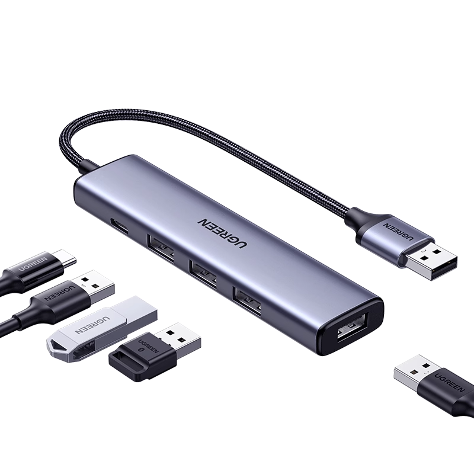
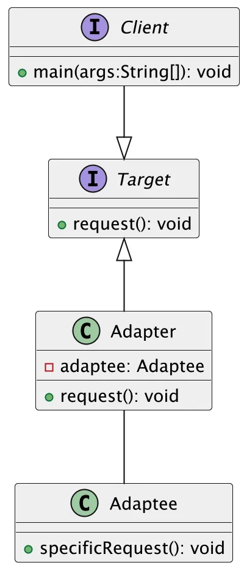
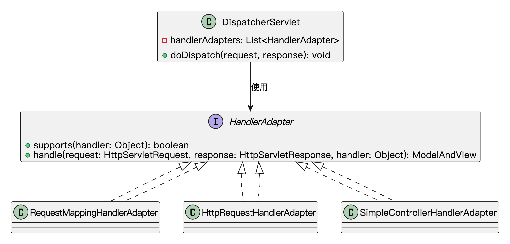
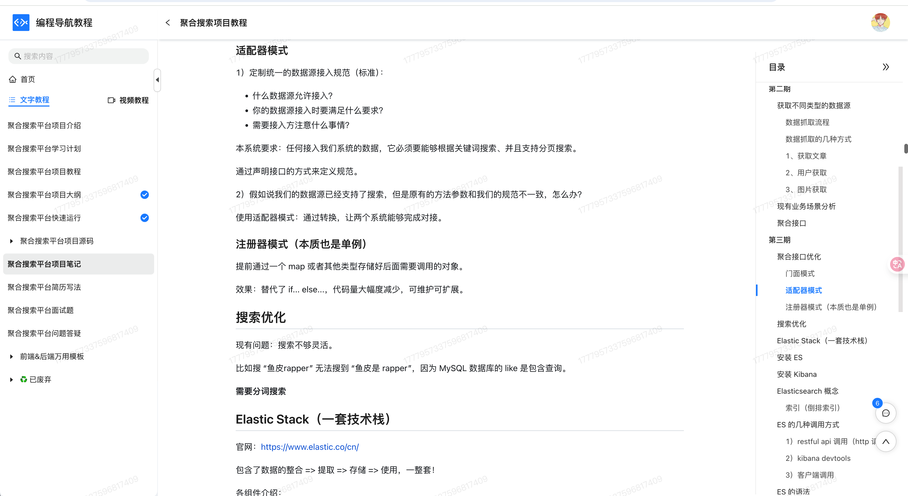

## 什么是适配器模式?
**适配器模式**（Adapter pattern）是一种结构型设计模式，通过创建一个适配器类，**将一个接口转换成客户端所期望的另一个接口**。 

换句话说，就是当两个东西原本接口不匹配，但我们又想让它们协作时，就可以用一个“适配器”做中间桥梁。

这就好比鱼皮出差带了个电子设备，接口是 Type-C 接口的，但酒店的充电器的头是 USB 接口。这时候咋办？鱼皮肯定不会改电线、换设备，而是拿出随身带的“接口转换器”，直接搞定。这转换器就是适配器，负责在“不兼容”之间搭建桥梁，让两个原本对不上号的东西顺利协作。



在代码里，我们也经常会遇到类似的问题：老接口和新系统不兼容，或者第三方库的接口和我们预期的不一样，这时候适配器就派上用场了。它就像是个“翻译器”或“转换器”，让两个本不兼容的对象可以正常沟通和工作。 

## 为什么要使用适配器模式？
适配器模式的目的是为了应对不同类或系统间接口不兼容的问题。在开发过程中，我们经常会遇到需要与已有系统或第三方库进行交互的情况。如果这些系统的接口和我们自己的系统不兼容，直接进行交互会很困难，这时就可以使用适配器模式。通过创建一个适配器，我们能够将第三方库或旧系统的接口转化为自己需要的接口，从而避免了大规模修改现有代码的复杂性和不必要的风险。适配器模式使得代码更加灵活，能够平滑过渡到不同的技术栈和系统，同时还可以在不改变客户端代码的前提下，扩展和引入新的功能。

为了让大家更好地感受到适配器模式的作用，以音频播放器为例，我们需要支持多种音频格式（MP3、VLC、MP4等）的播放。让我们来看看使用和不使用适配器模式的区别：


通过对比可以看出，不使用适配器模式时，我们需要在 `AudioPlayer` 类中通过条件判断来处理不同格式的音频播放，这导致了代码耦合度高、违反开闭原则、难以扩展等问题。每当需要支持新的音频格式时，都需要修改现有代码，增加了维护成本。

而使用适配器模式后，我们通过 `MediaAdapter` 类将不同格式的播放器适配到统一的 `AdvanceMediaPlayer` 接口，实现了接口的兼容性。适配器模式将不兼容的接口转换为可兼容的接口，使得代码更加灵活和可扩展。这种实现方式不仅降低了代码耦合度，还使得添加新的音频格式支持变得更加简单，提高了代码的可维护性。

## 适配器模式的应用场景
举一些开发中典型的应用场景：

+ 旧系统与新系统对接：在企业级应用中，许多老旧系统的接口不符合现代需求（例如，返回的数据格式不同、方法签名不匹配等），通过适配器模式可以将新系统所需的接口转换成老系统能提供的格式，使新旧系统能够无缝对接。
+ 不同数据库引擎访问：在一些跨平台或跨数据库的应用中，可能会同时使用 MySQL、PostgreSQL、Oracle 等不同数据库。通过适配器模式，可以将不同数据库的查询接口统一，使得开发人员可以通过统一的 API 访问不同的数据库。
+ 不同格式的文件读取与处理：例如系统需要处理不同格式的文件（如 CSV、Excel、JSON、XML 等）。在没有统一接口的情况下，可以使用适配器模式为每种文件格式提供适配器，使得客户端可以通过统一的接口进行文件读取和数据解析。
+ 音频播放器支持多种格式播放：不同音频格式的播放实现通常来源于不同的解码库，接口风格也各不相同。可以为每种格式封装一个适配器，统一实现一个播放器接口，让主播放器只关心“播放”这个动作，不关心具体格式和库。

## 适配器模式基本结构
适配器模式具有的角色和职责：

1）目标接口（Target）：客户端希望使用的接口。

2）适配器类（Adapter）：实现了目标接口，并且通过委托的方式将请求转换为适配的接口调用。

3）适配者类（Adaptee）：已有的、需要适配的类。

4）客户端（Client）：通过目标接口与系统交互的代码。

下面用一张类图帮大家更直观地理解适配器模式的结构：



## 适配器模式代码实现
下面就以 “多格式音频播放” 为例，我们用适配器模式实现一个简单的播放器系统。

1）定义目标接口：我们播放器原本支持的统一播放接口

```java
public interface AudioPlayer {
    void play(String audioType, String fileName);
}
```
这一步是适配器模式的目标接口，它规定了客户端希望使用的标准功能（比如只认 play 方法），这也是适配器的“插口”。

2）定义高级媒体接口：表示系统暂时不支持但需要适配的新格式

```java
public interface AdvancedMediaPlayer {
    void playVlc(String fileName);
    void playMp4(String fileName);
}
```
这一步是被适配的接口，定义了外部不兼容的格式支持方法，比如 `playVlc()` 和 `playMp4()`，这些接口不能直接被老播放器识别，需要一个适配器做中间转换。

3）实现高级播放器：实现各个具体格式的播放逻辑

```java
public class VlcPlayer implements AdvancedMediaPlayer {
    @Override
    public void playVlc(String fileName) {
        System.out.println("播放VLC格式的文件: " + fileName);
    }

    @Override
    public void playMp4(String fileName) {
        // 什么也不做
    }
}

public class Mp4Player implements AdvancedMediaPlayer {
    @Override
    public void playVlc(String fileName) {
        // 什么也不做
    }

    @Override
    public void playMp4(String fileName) {
        System.out.println("播放MP4格式的文件: " + fileName);
    }
}
```
这一步是具体的实现类，真正负责播放 `.mp4` 和 `.vlc` 文件，但它们的接口和我们播放器的 `AudioPlayer` 不兼容，不能直接使用。

4）创建适配器类：桥接高级播放器和目标接口

```java
public class MediaAdapter implements AudioPlayer {
    private AdvancedMediaPlayer advancedMediaPlayer;

    public MediaAdapter(String audioType) {
        if (audioType.equalsIgnoreCase("vlc")) {
            advancedMediaPlayer = new VlcPlayer();
        } else if (audioType.equalsIgnoreCase("mp4")) {
            advancedMediaPlayer = new Mp4Player();
        }
    }

    @Override
    public void play(String audioType, String fileName) {
        if (audioType.equalsIgnoreCase("vlc")) {
            advancedMediaPlayer.playVlc(fileName);
        } else if (audioType.equalsIgnoreCase("mp4")) {
            advancedMediaPlayer.playMp4(fileName);
        }
    }
}
```
这一步是适配器的核心，通过 `MediaAdapter` 将外部的高级播放器“包一层”，让它看起来像是 `AudioPlayer` 的实现，这样旧系统就可以无感接入新格式。

5）实现默认播放器：支持 MP3，其他格式交给适配器

```java
public class DefaultAudioPlayer implements AudioPlayer {
    private MediaAdapter mediaAdapter;

    @Override
    public void play(String audioType, String fileName) {
        if (audioType.equalsIgnoreCase("mp3")) {
            System.out.println("播放MP3格式的文件: " + fileName);
        } else if (audioType.equalsIgnoreCase("mp4") || audioType.equalsIgnoreCase("vlc")) {
            mediaAdapter = new MediaAdapter(audioType);
            mediaAdapter.play(audioType, fileName);
        } else {
            System.out.println("不支持的格式: " + audioType);
        }
    }
}
```
这一步是客户端真正使用的播放器类，对外提供统一的 `play()` 方法，内部智能判断是否需要适配器介入，扩展性和兼容性都非常好。

6）客户端调用示例

```java
public class Client {
    public static void main(String[] args) {
        AudioPlayer player = new DefaultAudioPlayer();
        player.play("mp3", "歌曲.mp3");
        player.play("mp4", "电影.mp4");
        player.play("vlc", "直播秀.vlc");
        player.play("avi", "老的媒体格式.avi");
    }
}
```
输出结果：

```plain
播放MP3格式的文件: 歌曲.mp3
播放MP4格式的文件: 电影.mp4
播放VLC格式的文件: 直播秀.vlc
不支持的格式: avi
```
客户端调用展示了适配器的使用场景，原本只支持 `.mp3` 的播放器，现在通过 `MediaAdapter` 轻松扩展到支持 `.mp4` 和 `.vlc`，而不需要修改原来的接口和逻辑，这就是适配器模式的优势。

## 适配器模式的优缺点
### 优点
+ **解耦系统**：适配器模式通过将不兼容的接口适配为客户端所需的接口，能够有效地解耦系统中的不同模块，使得模块之间的依赖关系更加松散，增强系统的灵活性。
+ **复用现有类**：通过适配器模式，可以复用已有的类或库，而无需修改原有代码。适配器将现有类的接口转换为需要的接口，从而使不兼容的类能够共同工作。
+ **增强可扩展性**：适配器模式提供了一种灵活的方式来扩展现有系统，允许不同的系统组件无缝集成。可以通过添加新的适配器来支持新的接口和功能，而不影响现有系统的正常运行。
+ **简化接口**：适配器模式可以将复杂的接口转换为简单的接口，简化客户端代码的使用，提升开发效率。

### 缺点
+ **增加系统复杂性**：适配器模式引入了额外的适配器类，尤其在适配多个接口时，可能导致系统中的类数量增加，从而增加了系统的复杂性和维护成本。
+ **性能开销**：每次调用适配器时，都需要通过适配器进行额外的转化处理，这可能会引入一定的性能开销，尤其在频繁调用的场景下，性能损失可能不可忽视。
+ **潜在的过度使用**：适配器模式的滥用可能导致设计过度复杂，特别是在接口之间差异较小时，可能不值得引入适配器，而直接通过调整接口即可解决问题。过多的适配器可能导致系统变得难以理解和维护。
+ **不适合所有场景**：适配器模式主要适用于接口不兼容的情况，对于接口设计不合理的情况，可能并不适用。过度依赖适配器可能掩盖了系统设计的问题，造成长期维护上的困难。

## 扩展知识 - 源码分析
### 开源框架中的应用
#### 1、JDK
我们在用 JDK 提供的一些工具类时，其实已经接触过适配器模式了。最常见的一个例子是 `java.util.Arrays#asList()` 这个方法。这个方法的作用，是把一个普通的数组“包装”成一个 List 接口的实现。它的底层实现就是一个典型的适配器类。

```java
public static <T> List<T> asList(T... a) {
    return new ArrayList<>(a);
}

// 这是 Arrays 的静态内部类，不是 java.util.ArrayList
private static class ArrayList<E> extends AbstractList<E>
implements RandomAccess, java.io.Serializable
{
    private static final long serialVersionUID = -2764017481108945198L;
    private final E[] a;

    ArrayList(E[] array) {
        a = Objects.requireNonNull(array);
    }
    // ...省略其他代码
}

```
这个 `ArrayList` 并没有重新设计数据结构，而是持有了原始数组的引用，底层依旧是数组。但是通过继承 `AbstractList`，它变成了 `List` 类型的实例，对外暴露的就是一个标准 List 接口。这就是一种对象适配器模式，通过组合已有对象（数组），将它包装成期望的接口（List）。

另一个常用的例子是 `InputStreamReader`，这个类的作用是把一个字节流（`InputStream`）适配成一个字符流（`Reader`）：

```java
public class InputStreamReader extends Reader {
    private final StreamDecoder sd;

      // 构造方法
      public InputStreamReader(InputStream in) {
        super(in);
        try {
            sd = StreamDecoder.forInputStreamReader(in, this, (String)null); // ## check lock object
        } catch (UnsupportedEncodingException e) {
            // The default encoding should always be available
            throw new Error(e);
        }
    }

    // 调用 StreamDecoder 的 read()，将字节转字符
    public int read(char cbuf[], int offset, int length) throws IOException {
        return sd.read(cbuf, offset, length);
    }
}

```
#### 2、Spring 框架
在 Spring MVC 中，`HandlerAdapter` 是一个非常典型的适配器模式的实现。我们知道，Spring MVC 中的处理器（Controller）有很多种形式，比如注解方式的 `@RequestMapping`，实现接口的 `HttpRequestHandler`。这些处理器的定义方式不同，调用方法也不一样，但 `DispatcherServlet` 是整个请求的统一入口。它不可能针对每种 Handler 都写死调用逻辑。这个时候，适配器模式就派上了用场。

我们来看下 `HandlerAdapter`的接口定义：

```java
public interface HandlerAdapter {
    // 判断当前适配器是否支持给定的 handler 类型（即 Controller 对象）
    boolean supports(Object handler);

    // 执行 handler 的逻辑处理，并返回 ModelAndView（用于渲染视图）
    @Nullable
    ModelAndView handle(HttpServletRequest request, HttpServletResponse response, Object handler) throws Exception;

}
```
Spring 提供了多个不同的适配器实现，比如：

+ `RequestMappingHandlerAdapter`：用来支持注解方式的 `@RequestMapping` 方法；
+ `HttpRequestHandlerAdapter`：用来支持实现了 `HttpRequestHandler` 接口的类；
+ `SimpleControllerHandlerAdapter`：用来支持实现了 `Controller` 接口的处理器。

来看下 `HttpRequestHandlerAdapter` 的结构：

```java
public class HttpRequestHandlerAdapter implements HandlerAdapter {

   	@Override
	public boolean supports(Object handler) {
		return (handler instanceof HttpRequestHandler);
	}

	@Override
	@Nullable
	public ModelAndView handle(HttpServletRequest request, HttpServletResponse response, Object handler)
			throws Exception {

		((HttpRequestHandler) handler).handleRequest(request, response);
		return null;
	}
    // 省略其他代码...
}

```
我们可以看到，核心逻辑在于判断是否支持某种类型的 Handler，然后进行适配调用。

而 DispatcherServlet 的处理流程中，也有这样一段逻辑：

```java
// 从已注册的 HandlerAdapter 列表中，选择一个支持指定 handler 的适配器。
protected HandlerAdapter getHandlerAdapter(Object handler) throws ServletException {
    if (this.handlerAdapters != null) {
        for (HandlerAdapter adapter : this.handlerAdapters) {
            if (adapter.supports(handler)) {
                return adapter;
            }
        }
    }
    throw new ServletException("No adapter for handler [" + handler +
                               "]: The DispatcherServlet configuration needs to include a HandlerAdapter that supports this handler");
}
```
这就是 Spring 中典型的**接口适配器**模式：通过不同的 HandlerAdapter 实现类，把各种处理器适配成统一的执行模型。

为了更清晰地理解这个结构，我们用一张类图表示出 Spring MVC 中适配器模式的关键类之间的关系：



在这个类图中，我们可以看到 `DispatcherServlet` 只依赖接口 `HandlerAdapter`，而不直接依赖任何具体实现类。新增新的处理器类型时，只需要实现一个新的 `HandlerAdapter`，完全符合开闭原则。

### 优势和作用
通过上述的源码分析，我们可以再次总结下适配器模式的作用。

#### 1、提升系统的兼容性和复用能力
适配器模式的最大作用就是可以把已有的功能和新的接口标准“对接”起来，避免重复开发，尤其在集成第三方接口或老系统时非常有用。比如我们想复用一个只支持 `InputStream` 的工具类，但我们的系统是基于字符流的，就可以用 `InputStreamReader` 做适配。

#### 2、解耦代码结构，方便扩展
在 Spring MVC 中，不同的 Controller 类型通过不同的 `HandlerAdapter` 进行适配，`DispatcherServlet` 完全不需要关心 Controller 的具体实现逻辑。这种结构的好处就是扩展性强，我们可以根据需求新增 handler 类型，而不会影响原有逻辑。

#### 3、遵循开闭原则，提高可维护性
所有的适配器都是通过实现同一个接口来对接系统核心逻辑，这种结构天然符合“对扩展开放，对修改封闭”的设计原则。系统维护起来更容易，新增功能也更稳定。

## 相关项目
#### 编程导航的聚合搜索项目
在 [编程导航的聚合搜索项目](https://www.codefather.cn/course/1790979621621641217) 中，使用了适配器模式来对接不同结构的数据源。系统内部定义了一套统一的数据源接入规范，要求所有数据源都支持根据关键词进行分页搜索。然而，部分第三方数据源的搜索方法参数格式与系统定义的接口不兼容，且无法直接修改双方的实现。

为解决这一接口不一致的问题，引入了适配器模式。通过为这些不兼容的数据源编写适配器类，将其原有接口转换成系统所期望的标准接口，从而实现无侵入的接入。适配器类在不改动原始代码的前提下，实现了接口兼容，降低了耦合度，并提升了对接数据源的灵活性和复用性。



## 相关面试题
可以在 [程序员面试刷题神器 - 面试鸭](https://www.mianshiya.com/) 上获取到企业常问的设计模式面试题。比如：

1）[什么是适配器模式？一般用在什么场景？ ](https://www.mianshiya.com/bank/1801559627969929217/question/1802171589225422850)


