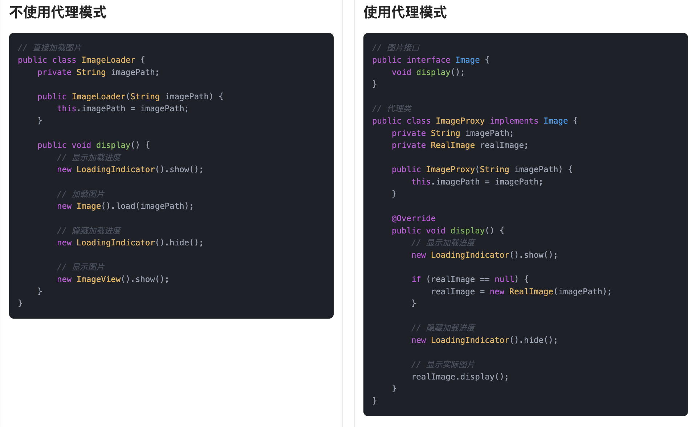
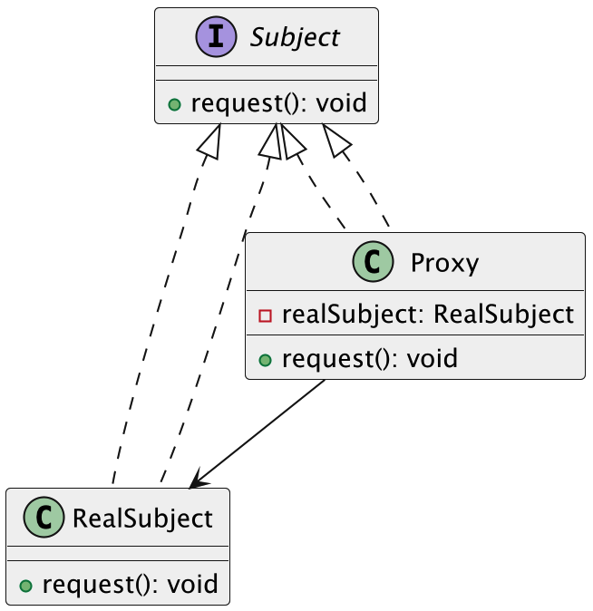
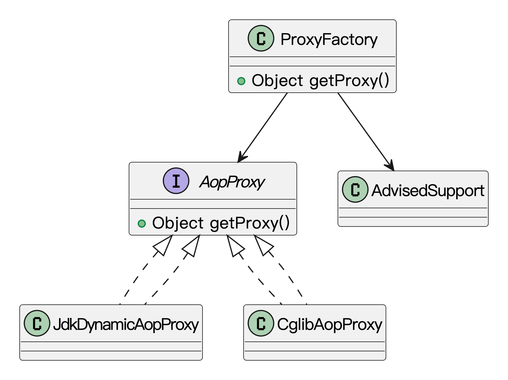
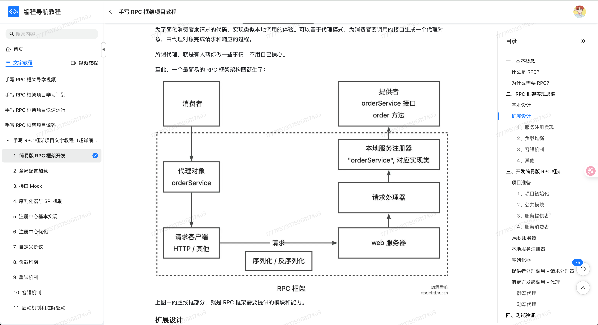

## 什么是代理模式？
**代理模式**（Proxy Pattern）是一种结构型设计模式，它的核心思想就是：**给某个对象提供一个代理对象，并由代理对象来控制对这个对象的访问**。听起来像是在加一道“门”，任何人想找目标对象打交道，都必须先经过这个“门”，而这个门就是我们说的代理。 

比如鱼皮的公司想去团建，要去订机票，但鱼皮不去航空公司官网折腾一堆操作，而是直接找了个靠谱的旅行社。“旅行社”就是代理，它在鱼皮和航空公司之间起到了中介作用，帮忙订票、选座、甚至提醒航班变动。


在程序里，代理模式的作用也是一样：当你不想或者不能直接访问某个对象时（比如资源太大、权限限制、需要做一些额外操作），可以用代理对象来“挡在前面”，由它统一处理所有访问。代理可以帮你做权限校验、延迟加载、日志记录，甚至缓存等等操作，但背后的真实逻辑其实还是那个“本体对象”在干，只不过被代理包了一层壳。

## 为什么要使用代理模式？
我相信很多初学者都会和我有一样的疑问，我们明明可以直接和目标对象打交道，为什么还要绕个弯子找代理呢？

核心原因是——控制复杂性，提升系统的灵活性和可维护性。有时候，我们不希望或不能直接访问某个对象，可能是因为这个对象太“贵”了，太复杂了，或者安全层面不允许别人直接访问。我们希望做一些“前置处理”或者“后置增强”，比如判断权限、打印日志、做缓存、懒加载这些行为。这个时候，如果把这些逻辑全塞进目标对象里，那目标对象的职责就变得很重，代码也不好维护。代理模式的好处就是：可以在不改变原始类代码的前提下，对原始对象进行功能增强或者访问控制。

为了让大家更好地感受到代理模式的作用，以图片加载为例，我们需要在加载大图片时显示加载进度，并在图片加载完成后显示。让我们来看看使用和不使用代理模式的区别：



通过对比可以看出，不使用代理模式时，图片加载的逻辑直接写在 `ImageLoader` 类中，这导致了职责混乱、代码耦合度高、难以扩展等问题。当需要添加新的图片处理功能时，需要修改现有代码，增加了维护成本。

而使用代理模式后，我们通过 `ImageProxy` 类将图片加载的控制逻辑与实际图片加载分离，实现了关注点分离。代理模式通过提供一个代理对象来控制对实际对象的访问，使得代码结构更加清晰，职责划分更加明确。这种实现方式不仅提高了代码的可维护性，还使得添加新的图片处理功能变得更加简单，同时保持了代码的灵活性和可扩展性。

## 代理模式的应用场景
举一些开发中典型的应用场景：

+ 权限代理：在系统中有权限控制时，代理模式可用于控制对某些功能或资源的访问。例如，某些用户或角色只能访问特定的资源或方法，通过代理来拦截调用，验证用户权限后再决定是否允许执行操作。
+ 日志记录代理：在业务系统中，操作日志的记录是非常常见的需求。代理模式可以用于方法调用的拦截，在方法执行前后自动记录日志信息，而不需要修改原始业务逻辑。例如，在一个订单系统中，所有订单的创建、修改操作都通过代理来记录日志，追踪操作过程。
+ 网络图片懒加载器：在开发一些图片浏览应用或文档查看工具时，我们不希望一开始就把所有图片都加载到内存中，尤其是当图片很多、尺寸又大时。这时我们可以使用代理模式，让“代理图片”控制真实图片的加载时机，只有真正需要显示时再去加载资源，从而节省内存和加快响应。

## 代理模式的基本结构
代理模式具有的角色和职责：

1）抽象主题接口（Subject）：定义了真实对象和代理对象都需要实现的方法。

2）真实主题（RealSubject）：也就是目标对象，真正去执行核心业务逻辑的类。

3）代理类（Proxy）：实现和目标对象相同的接口，在内部维护一个真实对象的引用。代理类会控制对真实对象的访问，可能会在调用前后加点特殊的处理逻辑。

下面用一张类图帮大家更直观地理解代理模式的结构：



## 代理模式的实现
下面就以 “网络图片懒加载” 为例，我们用代理模式实现一个简单的图片加载系统。

1）定义图片接口：声明所有图片对象都应该具备的 display() 方法

```java
public interface Image {
    void display();
}
```
这一步是代理模式中的统一接口，真实图片和代理图片都实现这个接口，使得客户端可以通过接口编程，而不关心底层是代理还是实际资源。

2）实现真实图片类：表示真正需要加载的图片资源

```java
public class RealImage implements Image {
    private String filename;

    public RealImage(String filename) {
        this.filename = filename;
        loadFromDisk();
    }

    private void loadFromDisk() {
        System.out.println("从磁盘加载图片：" + filename);
    }

    @Override
    public void display() {
        System.out.println("显示图片：" + filename);
    }
}
```
这一步是被代理的实际对象，负责加载和显示图片，但加载过程比较重，所以我们希望尽量延后执行它的创建逻辑。

3）实现代理图片类：控制 RealImage 的创建和访问时机

```java
public class ProxyImage implements Image {
    private RealImage realImage;
    private String filename;

    public ProxyImage(String filename) {
        this.filename = filename;
    }

    @Override
    public void display() {
        if (realImage == null) {
            realImage = new RealImage(filename);
        }
        realImage.display();
    }
}
```
这一步就是“代理类”的角色，它控制真实图片的访问逻辑：只有第一次调用 `display()` 时才真正创建 `RealImage` 并加载资源，起到了“懒加载”的作用，节省资源。

4）客户端调用示例：模拟用户浏览图片

```java
public class Client {
    public static void main(String[] args) {
        Image image = new ProxyImage("图片.png");

        System.out.println("== 第一次显示图片 ==");
        image.display(); // 会触发加载和显示

        System.out.println("\n== 第二次显示图片 ==");
        image.display(); // 直接显示，不再加载
    }
}
```
输出结果：

```plain
== 第一次显示图片 ==
从磁盘加载图片：图片.png
显示图片：图片.png

== 第二次显示图片 ==
显示图片：图片.png
```
客户端使用 `Image` 接口操作图片，底层是否加载了真实资源是由代理控制的。第一次显示会加载图片，第二次则直接复用。

## 代理模式的优缺点
### 优点
+ **控制对象访问**：通过代理类控制对目标对象的访问，有助于增强安全性、控制权限或延迟加载。
+ **增强目标对象功能**：无需修改目标类代码即可添加额外功能，如缓存、日志、远程访问等，符合开闭原则。
+ **隔离客户端与目标对象**：客户端通过代理与目标对象交互，有利于解耦，提高系统的可维护性。
+ **支持多种代理形式**：支持静态代理、动态代理、远程代理等多种实现方式，适应不同应用场景。

### 缺点
+ **增加系统复杂度**：引入代理类会增加类的数量和系统结构的复杂性，增加理解和维护成本。
+ **可能引入性能开销**：特别是在动态代理或远程代理中，可能带来反射、网络传输等额外开销。
+ **不适用于频繁变更的接口**：若目标接口频繁变更，代理类也需同步更新，降低了开发效率。

## 扩展知识 - 源码分析
### 开源框架中的应用
#### 1、JDK
我们知道，代理模式的主要作用是**控制访问**，也就是在不修改原始代码的前提下，增加一些额外逻辑。JDK 自带的 `java.lang.reflect.Proxy` 类就是一个典型的代理模式实现，它可以在运行时，帮我们创建一个实现了某些接口的“代理对象”，所有调用都会被转发到 `InvocationHandler`。这个设计对于很多基于接口的框架来说非常重要，比如 JDK 自带的动态代理就被广泛应用在 AOP、RPC、事务管理等场景中。

我们可以从 `Proxy` 类的源码看出它的核心逻辑：

```java

public class Proxy implements java.io.Serializable {
    // 代理类的处理器
    protected InvocationHandler h;

    protected Proxy(InvocationHandler h) {
        this.h = h;
    }

    public static Object newProxyInstance(ClassLoader loader,
                                          Class<?>[] interfaces,
                                          InvocationHandler h) {
        // 动态生成代理类并返回实例
        ...
    }
}

```
而我们自定义的代理逻辑，都会通过 `InvocationHandler` 接口来处理：

```java
//InvocationHandler 接口
// 代理对象会将方法调用委托给该方法，执行自定义的逻辑
public Object invoke(Object proxy, Method method, Object[] args)
        throws Throwable;
```
这个接口就是代理的核心，每次代理对象调用方法，都会触发 `invoke()` 方法，我们可以在里面统一添加增强逻辑，比如日志、权限检查等等。

#### 2、Spring 框架
Spring 在 AOP（面向切面编程）中大量使用了代理模式。默认情况下，如果目标类实现了接口，会使用 JDK 的动态代理。如果目标类没有实现接口，就会使用 CGLIB 来生成子类进行代理。

如果我们给某个 Bean 加了一个切面（比如加了 `@Around` 注解的方法），Spring 会在容器启动阶段，**用代理对象替换原始 Bean**，所有方法调用都会被这个代理对象拦截，然后交给切面逻辑处理。

我们来看 Spring AOP 中核心的代理工厂类 `ProxyFactory` 和 `AdvisedSupport`：

```java
public class ProxyFactory extends ProxyCreatorSupport {
    public Object getProxy() {
        return createAopProxy().getProxy();
    }
}
```
`ProxyFactory` 会根据配置决定是否使用 JDK 代理或 CGLIB 代理：

```java
// 根据 AOP 配置生成合适的 AopProxy 实现（JDK 动态代理或 CGLIB 代理）。
public AopProxy createAopProxy(AdvisedSupport config) throws AopConfigException {
		if (!NativeDetector.inNativeImage() &&
				(config.isOptimize() || config.isProxyTargetClass() || hasNoUserSuppliedProxyInterfaces(config))) {
			Class<?> targetClass = config.getTargetClass();
			if (targetClass == null) {
				throw new AopConfigException("TargetSource cannot determine target class: " +
						"Either an interface or a target is required for proxy creation.");
			}
			if (targetClass.isInterface() || Proxy.isProxyClass(targetClass) || ClassUtils.isLambdaClass(targetClass)) {
				return new JdkDynamicAopProxy(config);
			}
			return new ObjenesisCglibAopProxy(config);
		}
		else {
			return new JdkDynamicAopProxy(config);
		}
	}
```
我们来看下 Spring 中最关键的一个代理类 `JdkDynamicAopProxy`：

```java
class JdkDynamicAopProxy implements InvocationHandler {
 	private final AdvisedSupport advised;

    @Override
	@Nullable
	public Object invoke(Object proxy, Method method, Object[] args) throws Throwable {      // 省略部分代码
        // 省略代码...
    }
}

```
这个类其实就是 Spring 自己实现的 `InvocationHandler`，内部维护了一个叫 `AdvisedSupport` 的配置对象，里面包含了目标对象、切面列表、拦截器链等。

我们来看下类图结构：



这张类图中我们可以看到：

+ `AopProxy` 是代理的统一接口；
+ `JdkDynamicAopProxy` 和 `CglibAopProxy` 是两个具体的代理实现类；
+ `ProxyFactory` 是创建代理对象的工厂，它依赖 `AdvisedSupport` 来传入配置信息。

### 优势和作用
通过上述的源码分析，我们可以再次总结下代理模式的作用。

#### 1、代码增强不入侵业务逻辑
无论是 JDK 动态代理还是 Spring AOP，本质上都是在不改动原有类的前提下，实现了对方法的“增强”。这就符合代理模式的核心价值：**控制访问 + 结构解耦**。像日志、事务、权限校验这类功能，完全可以通过代理实现，业务代码保持干净简洁。

#### 2、高度解耦，易于扩展
通过接口 + 代理的方式，我们可以实现一个非常通用的调用流程。例如在 Spring AOP 中，一个切面可以作用于多个 Bean，不需要对每个 Bean 做定制化的改动。新增或修改切面，也不会影响原始服务类的实现。

#### 3、便于在运行时动态控制行为
使用代理之后，我们可以根据运行时的配置来动态决定是否执行某个拦截逻辑，或者动态调整调用流程。比如某些监控逻辑，我们可以通过配置动态启用或者禁用，而不是写死在方法里。

## 相关项目
#### 编程导航的手写 RPC 框架项目
在 [编程导航的手写 RPC 框架项目](https://www.codefather.cn/course/1768543954720022530) 中，远程调用模块通过 JDK 动态代理模式，实现了消费者对服务提供者的“无感知”调用。通过为服务接口生成代理对象，消费者在调用这些接口方法时，底层会通过代理逻辑将调用转换为远程请求发送至服务提供方，从而屏蔽了网络通信的细节。

这一做法实现了接口层与调用实现的解耦，简化了远程服务的使用方式。消费者只需调用本地代理对象的方法即可，无需感知实际调用的是本地方法还是远程方法，从而提升了系统的可用性和开发效率。



#### 编程导航的 OJ 判题项目
在 [编程导航的 OJ 判题项目 ](https://www.codefather.cn/course/1790980707917017089)中，代码沙箱模块采用了代理模式进行功能增强。在调用代码沙箱之前，系统会先记录请求参数；调用完成后，再将响应结果进行日志记录，便于管理员后续分析和排查问题。

通过引入代理模式，我们增加了一个代理类，专门负责统一处理日志打印相关的逻辑。这样，原有的代码沙箱实现类无需做任何改动，调用方式也基本保持不变，对外使用依旧一致。但在内部，功能却得到了悄然增强，比如自动记录日志、调用次数统计等。既不影响原有业务逻辑，又提升了系统的可维护性和可扩展性，使整体架构更加清晰，后期维护也更加轻松。


## 相关面试题
可以在 [程序员面试刷题神器 - 面试鸭](https://www.mianshiya.com/) 上获取到企业常问的设计模式面试题。比如：

1）[什么是代理模式？一般用在什么场景？ ](https://www.mianshiya.com/bank/1801559627969929217/question/1802557695141945346)


