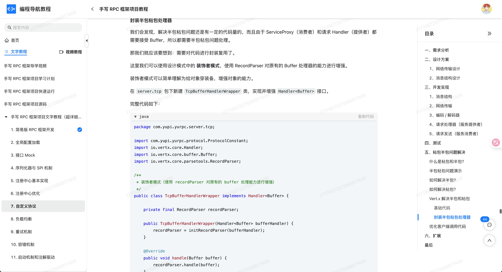

## 什么是**装饰模式？**
**装饰模式**（Decorator Pattern）是一种结构型设计模式，它的核心思想是：**动态地给对象添加额外的功能，而不会影响到其他对象**。

打个比方，鱼皮早上去咖啡店点了一杯美式。服务员问：要不要加点牛奶？要不要来点奶泡？糖浆需不需要？鱼皮说全都加上！于是原本一杯普通的美式咖啡，就被加出了拿铁的感觉。每加一样东西，其实就是“包了一层新功能”，但我们并没有动到咖啡豆的底层逻辑（原始类），只是一步步往上叠加。


这就是装饰模式的精髓：不改变原有对象的基础结构，通过外层的“装饰者”给它加新能力。在代码里，这种模式非常适合应对“对象功能扩展”的场景，比如日志增强、权限校验、性能监控等，既不污染原始逻辑，也很灵活组合。

## 为什么要使用装饰模式？
我们在实际开发中经常会遇到这样一种情况：某个类已经实现了基本功能，但过了一阵子，需求变了，需要在原有基础上加功能。比如要加日志、加缓存、加权限控制……这些都不是核心业务逻辑，但却是必需的。

这时候我们可能会想到继承。确实，继承是可以扩展功能。但一旦子类越来越多，继承层次就容易变得复杂，而且子类一旦继承了父类，就被绑死了，灵活性差。装饰模式正好解决了这个问题：它通过组合的方式，把附加功能封装成一个个装饰类，灵活地套在目标对象外面，不影响原始类结构，也不会破坏开放-封闭原则。

为了让大家更好地感受到装饰模式的作用，以文本渲染为例，我们需要为文本添加不同的样式（加粗、颜色等）。让我们来看看使用和不使用装饰模式的区别：


通过对比可以看出，不使用装饰模式时，我们需要为每种文本样式的组合创建单独的方法，这导致了方法的数量过多、代码重复、难以维护等问题。每当需要添加新的样式或组合时，都需要创建新的方法，增加了开发成本。

而使用装饰模式后，我们通过 `TextDecorator` 类将样式功能动态地添加到文本上，实现了功能的灵活组合。装饰模式通过组合的方式动态地给对象添加新的职责，使得代码结构更加清晰，扩展性更强。这种实现方式不仅减少了类的数量，还使得添加新的样式变得更加简单。

## 装饰模式的应用场景
举一些开发中典型的应用场景：

+ 动态增加功能或行为：例如，在电商系统中，用户可能选择多个优惠（如打折、优惠券、积分抵扣等）。这些优惠可以通过装饰模式动态地为订单增加不同的优惠功能，而不需要修改原始的订单类。每种优惠可以视为一个装饰类，独立实现不同的行为。
+ 输入输出流处理：在文件读取和写入操作中，经常使用装饰模式。例如，Java 的 I/O 流操作就使用了装饰模式。你可以使用 `BufferedReader` 装饰 `FileReader`，为其增加缓冲功能，而不需要改变 `FileReader` 的原始实现。
+ 日志系统功能增强：在日志记录系统中，通常有多种日志格式或输出方式。可以使用装饰模式为日志对象动态增加不同的功能，如输出到文件、控制台、远程服务器等。每种日志输出方式可以作为一个装饰器，透明地增加额外的功能。
+ 文本渲染增强系统：在开发富文本编辑器或日志输出组件时，经常会需要在文本基础上增加不同的功能，比如加粗、加下划线、加颜色等等。如果直接在原有类中添加这些功能，会导致类膨胀、职责混乱。用装饰模式可以在不改变原有类的基础上，为其动态添加功能，保持设计的灵活性和扩展性。

## 装饰模式的基本结构
装饰模式具有的角色和职责：

1）组件接口（Component）：定义对象的接口，所有的具体组件和装饰器都实现这个接口。

2）具体组件（ConcreteComponent）：就是原始对象，定义了核心的功能实现。

3）抽象装饰器（Decorator）：实现组件接口，内部持有一个组件对象（也就是被装饰的对象）。

4）具体装饰器（ConcreteDecorator）：继承抽象装饰器，负责给组件对象添加新的功能。

下面用一张类图帮大家更直观地理解装饰模式的结构：


## 装饰模式的实现
下面就以 “文本渲染增强” 为例，我们用装饰模式实现一个支持动态添加样式的文本组件系统。

1）定义文本组件接口：声明所有文本类必须实现的 render() 方法

```java
public interface TextComponent {
    String render();
}
```
这一步定义了所有文本相关组件的共同接口，保证后续的具体文本类和装饰器都遵循统一的调用规范。

2）实现基本文本类：作为被装饰的核心组件

```java
public class PlainText implements TextComponent {
    private String content;

    public PlainText(String content) {
        this.content = content;
    }

    @Override
    public String render() {
        return content;
    }
}
```
这一步提供了一个最基础的文本实现，它不包含任何格式，用来作为装饰链的起点。

3）定义装饰器抽象类：用于包裹基础组件并扩展功能

```java
public abstract class TextDecorator implements TextComponent {
    protected TextComponent component;

    public TextDecorator(TextComponent component) {
        this.component = component;
    }
}
```
这是装饰器的通用抽象父类，它持有一个 TextComponent 实例，允许我们在其基础上扩展功能，同时保持统一接口。

4）实现具体装饰器类（加粗、加颜色）

```java
public class BoldDecorator extends TextDecorator {
    public BoldDecorator(TextComponent component) {
        super(component);
    }

    @Override
    public String render() {
        return "<b>" + component.render() + "</b>";
    }
}

public class ColorDecorator extends TextDecorator {
    private String color;

    public ColorDecorator(TextComponent component, String color) {
        super(component);
        this.color = color;
    }

    @Override
    public String render() {
        return "<span style='color:" + color + "'>" + component.render() + "</span>";
    }
}
```
这些是具体的功能增强类，用来给文本添加 HTML 样式，比如加粗和着色。每个装饰器都只负责一件事，职责单一，组合灵活。

5）客户端调用示例：按需组合装饰器，动态增强文本

```java
public class Client {
    public static void main(String[] args) {
        TextComponent text = new PlainText("Hello, Decorator!");

        // 添加加粗
        text = new BoldDecorator(text);

        // 添加红色字体
        text = new ColorDecorator(text, "red");

        System.out.println("最终渲染结果：");
        System.out.println(text.render());
    }
}
```
输出结果：

```plain
最终渲染结果：
<span style='color:red'><b>Hello, Decorator!</b></span>

```
这端代码示例通过组合多个装饰器实现了“加粗+红色”两个功能的叠加。原始组件未被修改，所有增强功能都是通过包裹实现的，体现了装饰模式的核心思想：包装而非继承，扩展而非修改。

## 装饰模式的优缺点
### 优点
+ **扩展功能更灵活**：装饰模式允许你在不修改原始类代码的前提下，动态地给对象增加额外的功能。比起继承，它更灵活，也更符合开闭原则，特别适合功能经常变动的场景。
+ **避免类过多**：如果用继承来应对各种功能组合，很容易导致子类数量成倍增加，维护压力大。装饰模式通过“包装”的方式，把功能拆成一个个装饰类，组合使用，结构更清晰。
+ **可以组合使用**：多个装饰类可以灵活叠加，按需组合功能，像搭积木一样，自由度高，不用预先规划好所有情况，尤其适合处理功能可选、可叠加的业务逻辑。

### 缺点
+ **调试比较麻烦**：因为装饰模式是通过一层一层地包装对象的，有时候为了看清楚一个操作是在哪个环节做的，你可能得顺着一长串“包装链”去追踪，调试起来不太友好。
+ **增加了系统复杂度**：虽然类过多的问题解决了，但类之间的关系变得更抽象了，理解和使用都需要一定的学习成本。特别是对于刚接触装饰模式的人来说，不太容易一下子理清谁在装饰谁。
+ **可能影响性能**：如果装饰链太长，每次调用方法都要经过多层对象转发，虽然每层逻辑可能都很轻，但叠加起来也可能对性能有些影响，尤其是在高频调用场景下。

## 扩展知识 - 源码分析
### 开源框架中的应用
#### 1、JDK
我们先看 JDK 里面最典型的装饰模式实现，就是在 IO 流这一块，比如我们经常用到的 `BufferedReader`、`BufferedInputStream`。

它们并不是直接读取数据，而是包装了底层的原始输入流，通过加一层缓冲机制来提升读取效率。我们看下实际的类结构：

```java

public class BufferedReader extends Reader {
    private Reader in; // 被包装的 Reader

    public BufferedReader(Reader in) {
        this(in, defaultCharBufferSize);
    }

    public String readLine() throws IOException {
        // 加缓冲逻辑读取一整行
    }
}

```
```java
// 使用方式
Reader reader = new FileReader("test.txt");
BufferedReader bufferedReader = new BufferedReader(reader);
String line = bufferedReader.readLine(); 

```
可以看到，我们通过 `BufferedReader` 对 `FileReader` 做了包装，但并没有去动原始的 `FileReader` 类逻辑，这就符合了装饰模式的基本结构。

我们看下类图：


从类图能看出来，`BufferedReader` 和 `FileReader` 都继承自同一个抽象类 `Reader`，然后通过组合的方式包装了一个 `Reader` 类型的对象，实现了增强功能但不破坏结构的目的。

#### 2、Spring 框架
我们在开发 Web 应用时经常接触到 `HttpServletRequest` 和 `HttpServletResponse`，它们代表了请求和响应对象。而 `HttpServletRequestWrapper` 和 `HttpServletResponseWrapper` 正是 Spring Web 模块中对这两个对象的装饰器实现。这两个类的作用是作为一个“中间壳”，把原始的 `HttpServletRequest` 包装起来，默认是把所有方法都“原样转发”给原始的 request 对象。

比如`ContentCachingRequestWrapper`，这个类用来增强原始的 `HttpServletRequest`，让我们可以重复读取请求体。我们来看下源码：

```java
public class ContentCachingRequestWrapper extends HttpServletRequestWrapper {
    private final ByteArrayOutputStream cachedContent;

    public ContentCachingRequestWrapper(HttpServletRequest request) {
        super(request);
    }

    @Override
    public ServletInputStream getInputStream() throws IOException {
        if (this.inputStream == null) {
            // 缓存请求体，方便后面重复读取
            this.inputStream = new ContentCachingInputStream(this.getRequest().getInputStream());
        }

        return this.inputStream;
    }

    public byte[] getContentAsByteArray() {
        return this.cachedContent.toByteArray();
    }
}

```
它继承自 `HttpServletRequestWrapper`，后者本身就已经是对 `HttpServletRequest` 的包装。Spring 的 `ContentCachingRequestWrapper` 再次装饰这个对象，增强了“请求体可重复读取”的能力，常用于日志记录、过滤器链等场景。

除了使用 Spring 已有的，我们还可以自定义请求包装器。举个场景，比如我们想在读取参数之前先统一打印日志，或者对请求中的某个参数做一下格式处理。如果我们直接在业务代码里每次处理请求都手动加判断，那既重复又容易出错。这时候我们可以自己继承`HttpServletRequestWrapper`类，实现一个自定义请求增强器：

```java
public class LogRequestWrapper extends HttpServletRequestWrapper {
    public LogRequestWrapper(HttpServletRequest request) {
        super(request);
    }

    @Override
    public String getParameter(String name) {
        String value = super.getParameter(name);
        System.out.println("参数名：" + name + "，值：" + value);
        return value;
    }
}
```
然后在过滤器或拦截器中替换原始请求：

```java
chain.doFilter(new LogRequestWrapper(request), response);

```
这种“增强不侵入”的方式，就是典型的装饰模式应用。Spring 本身很多地方都是通过这种“包装器 + 委托”结构来实现灵活扩展的。

### 优势和作用
通过上述的源码分析，我们可以再次总结下装饰模式的作用。

#### 1、**增强功能不影响原有结构**
`BufferedReader` 和 `BufferedInputStream` 并不是通过继承原始类来加功能，而是通过包装已有对象来增强行为，这种方式不会影响原始类结构；Servlet 中我们也能通过包装 `HttpServletRequest` 或 `HttpServletResponse` 来扩展功能，而无需修改原有请求响应逻辑。

#### 2、支持链式组合，增强更灵活
装饰器可以一层层套，比如 `BufferedInputStream` 可以再包一层 `DataInputStream`；同样，在 Servlet 中也可以对请求对象连续包装多个增强，比如日志、加解密、参数过滤等，组合方式灵活，使用更自由。

#### 3、逻辑清晰、职责解耦
像日志、转换、校验这类与业务无关的增强逻辑，都可以通过装饰器独立出来，既避免了业务类臃肿，也方便维护和替换，IO 和 Servlet 场景都很适合这样做。

## 相关项目
#### 编程导航的手写 RPC 框架项目
在 [编程导航的手写 RPC 框架项目](https://www.codefather.cn/course/1768543954720022530) 中，处理 Vert.x TCP 通信中粘包和半包的问题时，使用了装饰者模式对原有处理器进行了增强。由于消息体长度不固定，采用了 Vert.x 内置的 `RecordParser` 并通过拆分读取的方式：先读取请求体长度，再按该长度完整读取消息体，从而解决变长消息的拆包问题。

为实现这一逻辑，定义了一个 Wrapper 类对原有的 TCP 处理器进行封装，借助装饰者模式，在不修改原有处理器代码的前提下，扩展了解析能力。使用时只需用该 Wrapper 包装原处理器即可，使系统在处理粘包半包问题时更具灵活性，也提升了整体的可维护性。



## 相关面试题
可以在 [程序员面试刷题神器 - 面试鸭](https://www.mianshiya.com/) 上获取到企业常问的设计模式面试题。比如：

1）[什么是装饰器模式？一般用在什么场景？ ](https://www.mianshiya.com/bank/1801559627969929217/question/1803766849256890369)


