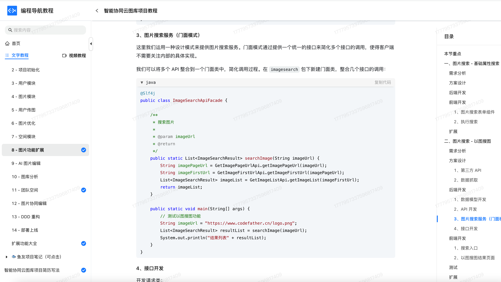
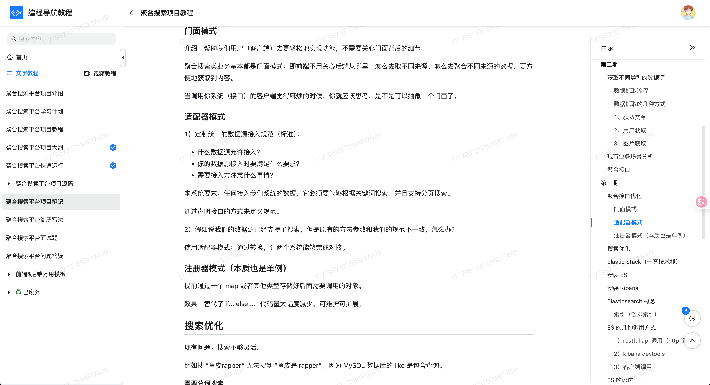

## 什么是外观模式？
**外观模式**（Facade pattern）是一种结构型设计模式，它的核心思想是：**为复杂的子系统提供一个统一的对外接口**，通过这个接口，我们就能更方便、更高效地访问这些子系统，而不需要关心它们内部的复杂逻辑。

比如有一次鱼皮去银行办业务，准备办理一笔贷款，结果银行里面有一堆系统：一个管审核资料，一个管征信查询，一个管资金调度……鱼皮一脸懵。好在银行前台小姐姐一句话：“您这边只需要把身份证交给我，剩下的我来处理～”突然就感觉轻松了有没有。


这就是外观模式的魅力。它**帮我们屏蔽了内部系统的复杂性**，只暴露一个“干净的、面向用户的接口”，让调用方用起来更省心。你不需要知道每个子系统是怎么工作的，只管跟“前台”打交道就好。

在开发中，我们也常常会封装一层“外观类”，比如整合多个工具类、SDK、业务模块，对外统一暴露一个 `xxxFacade`，简化调用流程。这样不仅降低了耦合度，还提升了代码的可读性和维护性。

## 为什么要使用外观模式？
开发中我们经常会遇到这样一种情况：系统内部有很多模块，比如数据库、缓存、第三方接口、日志系统等，而外部调用者（比如前端、接口调用者）根本没必要也不想知道这些模块是怎么运作的。我们如果直接暴露所有子系统接口，不仅使用麻烦，而且耦合度高，系统也不易维护。

这时候，我们通过引入外观模式，定义一个对外统一的访问入口，由这个入口来协调和管理各个子系统的调用流程。这样，外部调用者只需要跟这个“入口类”打交道，调用起来更方便，系统的结构也更加清晰、解耦。

为了让大家更好地感受到外观模式的作用，以用户注册为例，我们需要创建配置、数据库操作、发送欢迎邮件、日志记录等多个步骤。让我们来看看使用和不使用外观模式的区别：


通过对比可以看出，不使用外观模式时，客户端需要直接与多个子系统（数据访问、邮件服务、日志服务）交互，这导致了代码耦合度高、调用复杂、难以维护等问题。每当需要修改注册流程时，都需要修改多处代码，增加了开发成本。

而使用外观模式后，我们通过 `UserServiceFacade` 类将复杂的注册流程封装成一个简单的接口，实现了子系统与客户端的解耦。外观模式通过提供一个统一的接口来访问子系统，使得代码结构更加清晰，调用更加简单。这种实现方式不仅降低了代码耦合度，还使得修改注册流程变得更加容易，同时提高了代码的可维护性和可读性。

## 外观模式的应用场景
举一些开发中典型的应用场景：

+ 多模块复杂系统整合：在一些大型的业务系统中，往往会有多个子模块（如订单、支付、物流等）。通过外观模式，可以为外部系统提供一个简单的接口，让外部系统通过外观类与各个模块进行交互，避免直接调用复杂的子系统接口，简化了系统的操作。例如，在电商系统中，创建一个“订单管理”外观类，将订单、支付、库存、配送等模块整合为一个简单接口，提供给前端调用。
+ 数据库操作封装：对于一些复杂的数据库操作，可能需要多个步骤才能完成（如数据查询、转换、保存等）。使用外观模式可以为数据库操作提供一个简单的外观类接口，隐藏复杂的查询细节和操作步骤，减少开发人员的认知负担。例如，设计一个数据访问外观类，它封装了常见的增删改查（CRUD）操作，让其他业务层无需关心数据库的具体实现。
+ 复杂的第三方服务集成：在项目中，如果需要集成多个第三方服务（如支付服务、短信服务、邮件服务等），使用外观模式可以统一对外提供一个简洁的接口，避免各个业务层与第三方服务的直接交互。例如，在一个电商系统中，可以创建一个“支付外观类”，统一处理支付宝、微信支付等支付方式的调用，使支付逻辑更加简单易用。

## 外观模式的基本结构
外观模式具有的角色和职责：

1）外观类（Facade）：对外提供统一接口，封装子系统的调用。

2）子系统类（Subsystem）：负责自身的业务逻辑处理，通常不会对外暴露。

3）客户端（Client）：通过外观类来使用子系统的功能。

下面用一张类图帮大家更直观地理解外观模式的结构：


## 外观模式的实现
下面就以 “数据库操作封装” 为例，我们用外观模式实现一个简化的用户数据访问系统。

1）定义实体类：表示用户的数据结构

```java
public class User {
    private int id;
    private String name;

    public User(int id, String name) {
        this.id = id;
        this.name = name;
    }

    public int getId() {
        return id;
    }

    public String getName() {
        return name;
    }
}
```
这一步是定义数据库中实体的数据模型（User 类），实际开发中会映射到数据库表，用于存储和传输用户数据。

2）定义底层 DAO 接口和实现：封装原始数据库操作（模拟实现）

```java
public interface UserDAO {
    void insert(User user);
    User findById(int id);
    void update(User user);
    void delete(int id);
}
```
```java
import java.util.HashMap;
import java.util.Map;

public class UserDAOImpl implements UserDAO {
    private Map<Integer, User> database = new HashMap<>();

    public void insert(User user) {
        database.put(user.getId(), user);
        System.out.println("插入用户：" + user.getName());
    }

    public User findById(int id) {
        System.out.println("根据 ID 查询用户：" + id);
        return database.get(id);
    }

    public void update(User user) {
        database.put(user.getId(), user);
        System.out.println("更新用户：" + user.getName());
    }

    public void delete(int id) {
        User removed = database.remove(id);
        System.out.println("删除用户：" + (removed != null ? removed.getName() : "未知"));
    }
}
```
这一步实现了基本的数据库操作（CRUD），但接口比较底层，业务层如果直接调用，还是比较繁琐，不利于复用和维护。

3）定义外观类：封装 CRUD 操作，简化调用方式

```java
public class UserServiceFacade {
    private UserDAO userDAO;

    public UserServiceFacade() {
        this.userDAO = new UserDAOImpl(); // 实际开发中可注入
    }

    public void createUser(int id, String name) {
        User user = new User(id, name);
        userDAO.insert(user);
    }

    public void viewUser(int id) {
        User user = userDAO.findById(id);
        if (user != null) {
            System.out.println("用户信息：ID=" + user.getId() + "，姓名=" + user.getName());
        } else {
            System.out.println("未找到对应的用户");
        }
    }

    public void renameUser(int id, String newName) {
        User user = userDAO.findById(id);
        if (user != null) {
            User updatedUser = new User(id, newName);
            userDAO.update(updatedUser);
        } else {
            System.out.println("无法重命名，用户不存在");
        }
    }

    public void removeUser(int id) {
        userDAO.delete(id);
    }
}
```
这一步封装了对 `UserDAO` 的所有操作，把复杂的数据库调用包装成对业务开发更友好的接口，降低调用门槛。

4）客户端调用示例：通过外观类完成数据库操作

```java
public class Client {
    public static void main(String[] args) {
        UserServiceFacade userService = new UserServiceFacade();

        userService.createUser(1, "鱼皮");
        userService.viewUser(1);
        userService.renameUser(1, "Yes");
        userService.viewUser(1);
        userService.removeUser(1);
        userService.viewUser(1);
    }
}
```
输出结果：

```plain
插入用户：鱼皮
根据 ID 查询用户：1
用户信息：ID=1，姓名=鱼皮
根据 ID 查询用户：1
更新用户：Yes
根据 ID 查询用户：1
用户信息：ID=1，姓名=Yes
删除用户：Yes
根据 ID 查询用户：1
未找到对应的用户
```
通过 `UserServiceFacade`，我们把增删改查封装成简单的函数调用，业务层不需要再和底层 DAO 打交道，开发效率和代码可维护性都大大提升了。

## 外观模式的优缺点
### 优点
+ **简化调用逻辑**：外观模式最大的作用就是把系统的复杂度“挡在门外”。对于使用方来说，只需要跟一个外观类打交道，不用去理会底层有多少子系统、具体是怎么实现的，调用起来简单又清爽。
+ **降低耦合度**：外观类起到了一个中间人的作用，让调用者和内部子系统之间的联系变得松散。换句话说，你要是将来改了底层实现，只要外观接口不动，上层代码基本不用动，维护成本低。
+ **有利于分层架构设计**：在一些分层结构的系统里，比如三层架构，外观类可以作为“门卫”，帮你管理每一层之间的依赖关系，让层与层之间解耦得更干净，结构也更清晰。

### 缺点
+ **功能扩展时不够灵活**：一旦客户端习惯了只跟外观类打交道，那要想用到子系统里一些比较细的功能，就得回头改外观类，或者绕过它。这时候，外观反而成了一种限制。
+ **可能会变成“万能类”**：如果设计得不太合理，外观类很容易膨胀，什么事都往它身上堆，最后变成一个大杂烩，职责太多，反而不利于维护。
+ **隐藏了部分系统细节**：虽然这本身是优点，但有时候也是把“双刃剑”。尤其是在调试或者排查问题时，如果所有东西都被外观包装了起来，开发者可能会对系统内部的真实结构缺乏了解，排错效率也可能受影响。

## 扩展知识 - 源码分析
### 开源框架中的应用
#### 1、SLF4J
我们在使用日志的时候，大多数项目都会引入 SLF4J，而不是直接使用 Log4j2 或 Logback 的 API。这背后的设计思路，其实就是外观模式。

开发者在代码中只和 SLF4J 提供的接口（比如 `Logger`）打交道，不需要关注它到底底层用的是哪个日志实现。这样一来，日志实现就能随时替换，不会影响业务逻辑。

我们先来看一段日志记录的用法：

```java
import org.slf4j.Logger;
import org.slf4j.LoggerFactory;

public class UserService {
    private static final Logger logger = LoggerFactory.getLogger(UserService.class);

    public void createUser(String name) {
        logger.info("开始创建用户：{}", name);
        // ...
    }
}

```
这一段代码只依赖 SLF4J 的接口。底层到底是用的 Logback 还是 Log4j2，其实是在运行时动态绑定的，开发者不需要去关心。这就是典型的外观模式做的事：统一接口、隐藏实现细节。

我们来看下日志结构的类图：


通过这个类图，我们可以看到：

+ Logger 接口是对外暴露的统一入口；
+ LoggerFactory 是负责选择和初始化实际日志实现的门面；
+ LogbackLogger、Log4jLogger 等 是真正的日志输出者；
+ 程序员只需要关注 Logger，不用管底层到底是谁在写日志。

#### 2、Spring 框架
在 Spring 里，`DispatcherServlet` 是个很典型的外观角色。我们用 Spring MVC 开发 Web 应用时，所有的请求都会先经过它处理，然后它会负责把请求分发到对应的 Controller、处理结果、渲染视图，甚至异常处理，最后把响应返回。

也就是说，`DispatcherServlet` 把原本需要我们自己来写的一大堆控制逻辑，都整合封装到一个入口中。我们只需要定义 Controller 方法，剩下的工作 Spring MVC 替我们做好了。

我们来看一下 `DispatcherServlet` 的核心处理逻辑：

```java
protected void doDispatch(HttpServletRequest request, HttpServletResponse response) throws Exception {
   HttpServletRequest processedRequest = request;
    // 1. 获取处理器（Controller）
    HandlerExecutionChain mappedHandler = getHandler(request);

    // 2. 找到适配器（HandlerAdapter）来调用 Controller
    HandlerAdapter ha = getHandlerAdapter(mappedHandler.getHandler());

    // 3. 真正执行 Controller 方法
    ModelAndView mv = ha.handle(request, response, mappedHandler.getHandler());

    // 4. 处理结果，包括渲染视图等
    processDispatchResult(processedRequest, response, mappedHandler, mv, dispatchException);

}

```
从上面的步骤可以看出，`DispatcherServlet` 把 Controller 调用、参数绑定、异常处理、视图解析这些事情都统一封装进来了，这就是典型的外观模式结构。我们来看下基本的结构的类图：


我们只看到一个 `DispatcherServlet`，背后其实牵涉到非常多的模块。Spring 帮我们把整个流程对外统一包装，开发者只关注业务逻辑，这正是外观模式最典型的应用场景。

### 优势和作用
通过上述的源码分析，我们可以再次总结下外观模式的作用。

#### 1、降低系统复杂度
无论是 SLF4J 的日志模块，还是 Spring 的 MVC 模块，外观模式都通过一个“门面类”对外提供统一接口，把内部一堆子系统隐藏起来，让我们开发的时候不用关注太多细节。我们写业务的时候，就能更专注在核心逻辑上。

#### 2、增强扩展性和可维护性
因为内部逻辑都封装在外观类之后，如果未来底层实现改动，比如日志从输出到文件变成输出到远程服务器，我们也不需要改业务代码，只需要改配置就行了。类似地，Spring MVC 的内部流程如果变动，只要 `DispatcherServlet` 保持接口不变，对外也不会产生影响。

## 相关项目
#### 编程导航的智能云图库项目
在 [编程导航的智能云图库项目](https://www.codefather.cn/course/1864210260732116994) 中，以图搜图功能采用了外观模式。多个独立的类分别负责执行具体任务，如获取搜图页面、解析 HTML 脚本、调用 API 获取结果等。通过引入 `ImageSearchApiFacade` 门面类，将这些分散的调用流程统一封装为一个 `searchImage` 方法。外部调用时只需传入图片地址，即可获得相似图片列表，简化了使用方式，屏蔽了内部的实现细节和调用顺序。



#### 编程导航的聚合搜索项目
在 [编程导航的聚合搜索项目](https://www.codefather.cn/course/1790979621621641217) 的搜索聚合模块中，使用了门面模式对多个数据源的搜索结果进行了统一封装。该模式的主要目的是为调用方提供一个简化且一致的接口，屏蔽底层子系统的复杂调用逻辑，从而降低前端调用的理解和使用成本。

具体做法是：定义了一个门面类，作为前端与各类搜索服务之间的中介，内部持有多个数据源搜索服务的引用。根据前端传入的参数，门面类会选择性地调用对应的数据源服务，并对返回结果进行统一处理和聚合。前端只需通过该门面类提供的统一接口进行调用，无需关注各个数据源的具体实现细节，从而降低了系统的耦合度，提高了扩展性和可维护性。



## 相关面试题
可以在 [程序员面试刷题神器 - 面试鸭](https://www.mianshiya.com/) 上获取到企业常问的设计模式面试题。比如：

1）[什么是外观模式？一般用在什么场景？ ](https://www.mianshiya.com/bank/1801559627969929217/question/1802557443223658498)


