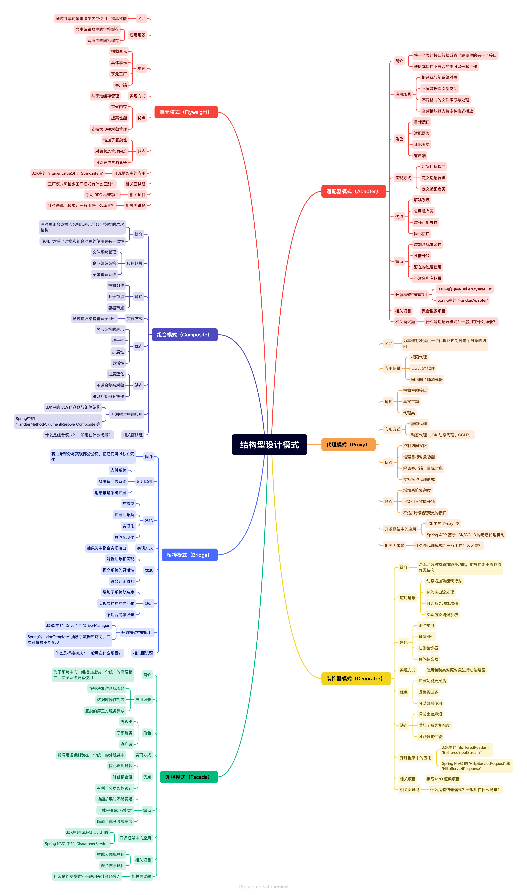

## 介绍
结构型模式是一类关注**“类和对象的组合方式”**的设计模式。它的目标不是去解决某个具体的业务问题，而是解决**类之间、对象之间怎么搭配、怎么协作更合理**的问题。  
在我们日常开发中，单个类往往不能独立完成所有任务，不同的类之间需要互相配合。这个时候，怎么组合它们就变得非常重要。如果组织得不好，类之间的依赖关系会混乱不堪，代码也会变得难以理解和维护。  
结构型模式就是用来规范这些组合方式的。它通过继承和组合的手段，把已有的类进行合理的拼装，让系统的结构更加清晰、松散耦合，而且更容易扩展和复用。

我们按照实用性从高到低的顺序，可以有下面这些结构型设计模式：
+ [代理模式](7-代理模式.md)
+ [装饰模式](8-装饰模式.md)
+ [适配器模式](6-适配器模式.md)
+ [外观模式](9-外观模式.md)
+ [组合模式](11-组合模式.md)
+ [观察者模式](10-桥接模式.md)
+ [享元模式](12-享元模式.md)
## 思维导图

