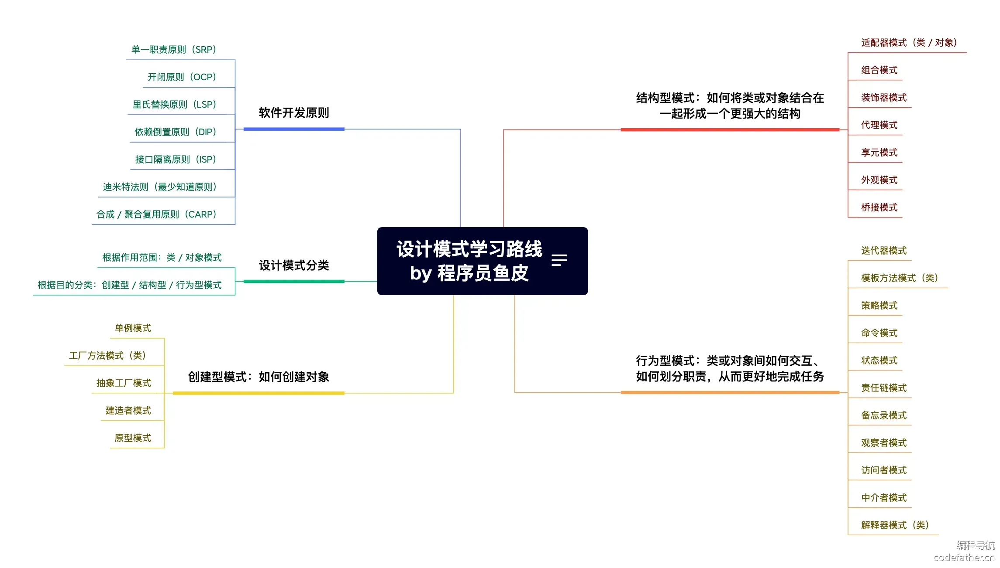

# 设计模式实战教程

大家好，我是程序员鱼皮。设计模式是我们开发软件时针对常见问题的 **通用** 解决方案，也是前辈们在写代码时不断摸索总结出来的好方法。可以理解为打游戏的攻略，就是我们遇到同一类的对手时，怎么走位、怎么放技能之类的。

设计模式最直接的作用就是 **减少烂代码、让项目代码更好维护**。举个栗子，如果没学过设计模式，可能随着产品不断加需求、改需求，你的代码会充满大量的 if else，新同事来了呢，也不敢动前人代码，只能再去补充 if else，于是屎山越堆越高。

而使用设计模式后，你可以把每段逻辑单独封装和维护，大家协作开发也会更高效。

即使到了 AI 时代，设计模式的含金量依然是极高的，如果你不懂设计模式，可能会出现 2 种情况：

1. AI 生成的代码太规范，用了设计模式，你却看不懂
2. AI 生成的代码太散乱，你不知道设计模式，所以也无法让 AI 帮你优化代码

此外，很多知名项目都用到了大量的设计模式，比如 Spring、MyBatis 等。如果不学习它，可能你天天写代码都是 CRUD、读别人的源码会非常吃力。

**因此，设计模式仍然是软件开发岗面试的重点，想进大厂的同学一定要学习它。**

为了帮助大家更好地学习设计模式，我带团队肝了一套 **完全免费且开源** 的设计模式教程！有帮助的话也欢迎点个 star 支持啦~

**前置知识**
--------

在正式进入设计模式之前，我们先花点时间把一些基础的面向对象概念捋一捋。虽然这些概念我们在学习 Java
的时候或多或少都接触过，但在设计模式的实际应用里，它们可不只是课本里的术语，而是很多模式背后的根基。

### 接口

接口是 Java 中非常核心的一个概念，它就像是“规范”或者“协议”，定义了一组方法的**名称和参数格式**
，但并不去实现这些方法的具体逻辑。我们可以把接口理解成是一种“承诺”——谁实现了这个接口，谁就必须按照接口定义的方法去完成逻辑。

在 Java 中，接口的作用主要有两个：

* **规范约束**：统一各个实现类的行为标准。
    
* **解耦合设计**：程序可以依赖接口而不是具体实现，这对于后期扩展和维护是非常重要的。

从 Java 8 开始，接口还可以带有默认方法（`default`）和静态方法，甚至可以有私有方法，但它们仍不能有实例变量，也不能有构造方法，接口本质上还是以“行为定义”为主。

### 抽象类

抽象类和接口有些相似，也是用来定义一个抽象的模板，让子类去继承并补全细节。但抽象类更像是“半成品”或者“骨架”，已经包含了一些默认的行为实现，还预留了部分抽象方法交给子类实现。

抽象类有几个特点：

* 可以有普通成员变量和方法。

* 可以有构造函数。

* 可以包含抽象方法（用 `abstract` 关键字标识）。

* 不能被直接实例化。

通常我们会在类之间存在**父子关系**，且想在父类中提供一些默认实现的时候，选用抽象类会更合适；而当我们只需要定义一套“规范”时，接口是更好的选择。

### 继承

继承是面向对象编程中的一个基本特性，它允许我们创建一个类，并“复用”另一个类的代码。简单说，就是**子类自动拥有父类的属性和方法
**，而不需要重新写一遍。

继承有两个主要用途：

* **代码复用**：父类写好了通用逻辑，子类可以直接使用。

* **构建层次结构**：通过继承构建出清晰的类型体系。

需要注意的是，Java 不支持多重继承（一个类不能继承多个类），是为了避免“菱形继承”这种带来歧义的场景。不过接口是可以多实现的，这在实际设计中提供了更灵活的扩展方式。

### 多态

多态是面向对象设计中最关键的一环。所谓多态，指的是**同一操作作用于不同对象时，可以表现出不同的行为**。这是我们实现“扩展性”和“可替换性”的基础。

多态有三种形式：

1. **方法重载（Overload）**：同一个类中方法名相同，参数不同。

2. **方法重写（Override）**：子类重新定义父类的方法。

3. **父类引用指向子类对象**：这是实际使用多态的常见场景。

理解多态最关键的一点是：**我们可以“面向父类编程”，而在运行时根据对象的实际类型调用具体实现**。这为设计模式中的很多“可扩展”“可替换”行为打下了基础。

* * *

梳理完了这些基础知识，目的是为了打牢理解设计模式的基本功。因为很多设计模式的核心思想，其实就是在这些语言特性之上构建出来的。如果对这些基础知识掌握得不牢，设计模式学起来就容易停留在表面，很难真正理解背后的设计意图。

接下来，我们就可以正式进入设计模式的学习了。

设计模式介绍
------

大家有没有思考过如下几个问题？

* 同样都是写代码，为什么有些同学的思路清晰、代码整洁；而我的代码却充满了重复和混乱，每次要修改时都无从下手、Bug 一堆？

* 如何写代码，才能使得项目易于扩展和维护？

* 我每天都在写重复的代码，如何提升水平？

* 为什么我读不懂大佬写的源码？是不是缺少了什么知识？

如果存在上述问题，那么我们一定要学习软件开发中的重要技能 —— 设计模式。

设计模式是软件开发人员在软件开发过程中面临的一般问题的 **通用** 解决方案。这些解决方案是众多软件开发人员经过相当长的一段时间的试验和错误总结出来的。

通俗地说就是前辈们在写代码时摸索出了一些不错的方法，可以用于解决一类问题、更好地开发和维护项目。于是其他软件开发者纷纷效仿，久而久之，就得出了一套优秀的软件开发方法总结。

目前最为经典的设计模式有 23
种，学习之后，不仅能帮助我们开拓思路、写出更优质的代码、提高项目的开发和维护效率；还能够帮助我们更好地阅读和理解源码，甚至可以根据文件名称直接推断出源码的架构设计（有点行话的感觉）！因此，在准备阅读框架源码前，强烈建议先学习设计模式。

此外，设计模式也是软件开发相关岗位面试的重点（尤其是大厂、后端开发岗位），建议大家有时间的话都要学习。

设计模式核心思想
--------

我们在学习设计模式时，不能只把它当成一些“用法模板”来背。设计模式真正的价值，其实是背后那一套“为什么要这么设计”的思路。它不是突然冒出来的，而是建立在一系列面向对象设计原则之上的。

这些设计原则，很多我们在项目中可能没系统学过，但如果认真看过一些优秀的源码，或者踩过不少坑，就会慢慢体会到它们的价值。下面我们来简单梳理几个最基础、也是最重要的设计原则，它们几乎贯穿了所有设计模式。

### 单一职责原则

> 一个类，只干一件事。

一个类只负责一个功能模块上的事情。如果一个类同时负责业务逻辑、数据库访问、日志处理等多种职责，那么一旦某个职责发生变化，就有可能影响到整个类的稳定性。

这个原则听上去简单，实际操作起来却常常被忽视。很多时候是图省事，结果一个类越写越大，维护起来就越来越难。

设计模式里，比如装饰器模式、职责链模式，其实都是在帮我们把复杂职责拆分开，控制类的粒度。

### 开闭原则

> 对扩展开放，对修改关闭。

当我们新增功能时，应该通过“新增代码”的方式来实现，而不是去修改已有的类或方法。这样做的好处是，原来的功能不会被影响，风险小；新功能也能保持独立，维护方便。

这个原则能帮助我们实现“加功能不动老代码”。比如策略模式、工厂模式、本质上都是在帮助我们在已有体系上“平滑加功能”。

### 里氏替换原则

> 子类对象必须能够替换掉父类对象，并保持原有功能不变。

通俗点说，继承关系不能乱用。继承不是为了代码复用，而是为了“保持通用的行为”。如果子类违背了父类的行为约定，那就会出现一些难以察觉的
bug。

这个原则是判断继承设计是否合理的一个标准。像模板方法模式、桥接模式这些，都很强调父子类之间的替换关系。

### 依赖倒置原则

> 高层模块不应该依赖低层模块，两者都应该依赖抽象。

我们应该“面向接口编程”，而不是直接依赖某个具体的类。

比方说，一个支付系统，业务逻辑层不要直接依赖“微信支付”或“支付宝支付”的实现类，而应该依赖一个 `Payment`
接口。这样我们就可以灵活地切换实现方式，而不会动到业务逻辑的代码。

像工厂模式、策略模式、依赖注入的思想，基本都是围绕这个原则展开的。

### 接口隔离原则

> 接口要小而精，不要大而全。

接口一旦设计成“全能型”，实现起来就容易出现“我不需要这个方法但也要实现它”的情况。这样不仅多余，还容易让接口的维护变得困难。

比如我们在系统中定义了 `UserService` 接口，如果这个接口又要注册用户、又要导出报表、还要批量删除，很多实现类就会出现强行实现的尴尬场面。

像组合模式、适配器模式这些，往往就是在帮助我们更好地隔离接口、解耦功能。

### 迪米特法则

> 只和直接相关的类交流，尽量减少对外部对象内部细节的依赖。

也叫“最少知道原则”，就是说一个类应该尽量只关注自己的直接朋友，不要对别人家的细节过于熟悉。这样可以减少耦合，提高模块的独立性。

典型的例子就是外观模式，它通过提供统一入口，让调用者不需要接触系统内部的各种细节类。

这些设计原则看似是理论，其实非常实用。它们决定了我们写的代码是否易读、是否好维护、业务功能是否能快速扩展。

而设计模式，就是这些原则的“落地方案”。也就是说，**设计模式本质上是在帮我们实践这些设计原则，让系统更健壮、更灵活、更可扩展。**

掌握了这些原则，理解设计模式就不是死记硬背，而是顺理成章的推导过程。我们后面讲的每一个设计模式，其实都可以回头映射到这些原则上。

设计模式的分类
-------

从设计模式的大类上来看，设计模式共分成三种类型：

1. [创建型模式](DesignPattern/创建型模式.md)（Creational Patterns）：主要关注“对象怎么创建”，比如单例、工厂、建造者。

2. [结构型模式](DesignPattern/结构型模式.md)（（Structural Patterns）：主要处理“类与类、对象与对象之间如何组合”，比如适配器、桥接、装饰器。

3. [行为型模式](DesignPattern/行为型模式.md)（Behavioral Patterns）：关注“对象之间如何协作和通信”，比如观察者、状态、策略

直接看下面的思维导图，分类很清晰：

学习建议
----

1. 对设计模式的学习和其他知识一样，先了解每种设计模式是什么？作用是什么？能够解决什么问题？适用于什么场景？有什么特点？类和对象的关系是什么（建议结合
   UML 类图来理解）？再去考虑编码实现和进一步在项目中应用。

2. 一定要多写代码实践，最好每个设计模式都实现一遍，不要去背代码，用的多了自然就能写出代码了。

3. 每个设计模式都可以 **独立学习** ，互相之间联系不大，因此可以根据自己的时间来选择性学习（比如先学重点的单例模式）。

4. 在学会基础的设计模式后，可以分析之前学过的框架源码（比如 Spring、MyBatis 等），参考别人是如何应用设计模式的。

5. **不要过度依赖设计模式！！！！！！** 它并不是银弹，过分使用设计模式可能只会增加系统的复杂度。

设计模式学习路线
--------

主流的设计模式共有 23 种，建议大家按照以下四个阶段来学习：

1. 基础学习

2. 编码实现

3. 项目实战

4. 备战面试

其中第一个阶段和第二个阶段 **可以同时进行** ，即对于每个设计模式的学习都是：先了解、再编码实现。

### 一、基础学习

依次了解每一种设计模式的应用场景、特点、UML 类图，能够对设计模式有个基础的印象。

#### 学习顺序

根据使用频率、难易度、面试考察率等综合排序，仅供参考，并不绝对！

优先：

1. [单例模式](DesignPattern/2-单例模式.md)

2. [工厂方法模式](DesignPattern/1-工厂方法模式.md)

3. [迭代器模式](DesignPattern/19-迭代器模式.md)

4. [策略模式](DesignPattern/14-策略模式.md)

5. [建造者模式](DesignPattern/4-建造者模式.md)

6. [模板方法模式](DesignPattern/18-模板方法模式.md)

7. [代理模式](DesignPattern/7-代理模式.md)

8. [责任链模式](DesignPattern/21-责任链模式.md)

9. [抽象工厂模式](DesignPattern/3-抽象工厂模式.md)

10. [适配器模式](DesignPattern/6-适配器模式.md)

11. [观察者模式](DesignPattern/13-观察者模式.md)

12. [外观模式](DesignPattern/9-外观模式.md)

一般：

1. [桥接模式](DesignPattern/10-桥接模式.md)

2. [组合模式](DesignPattern/11-组合模式.md)

3. [装饰器模式](DesignPattern/8-装饰模式.md)

4. [状态模式](DesignPattern/20-状态模式.md)

5. [访问者模式](DesignPattern/23-访问者模式.md)

6. [中介者模式](DesignPattern/16-中介者模式.md)

7. [命令模式](DesignPattern/15-命令模式.md)

8. [备忘录模式](DesignPattern/17-备忘录模式.md)

低优先：

1. [原型模式](DesignPattern/5-原型模式.md)

2. [享元模式](DesignPattern/12-享元模式.md)

3. [解释器模式](DesignPattern/22-解释器模式.md)

### 二、编码实现

本阶段的目标：依次编码实现每个设计模式，用任何支持面向对象的编程语言都可以，最好能够独立（不借助任何资料）从 0 写出每个设计模式的代码。

### 三、项目实战

本阶段的目标：通过做项目或阅读项目源码来进一步强化每个设计模式的实际应用。做到能根据某个场景主动选出合适的设计模式来优化代码、灵活运用，并且能够通过文件命名、项目目录结构等途径来快速判断出某个框架是否使用了设计模式。

### 四、备战面试

面试时对设计模式的考察主要有 4 种形式：

1. 直接问你某个设计模式的作用和大致的原理，考察你对设计模式的了解程度

2. 让你手写某个设计模式的代码，考察你对设计模式的熟悉程度和编码能力

3. 给你一个实际的业务场景，让你去设计系统，考察你对设计模式的理解应用能力和逻辑思维

4. 问你某个框架（轮子）的核心设计和源码细节，考察你对设计模式的理解应用能力

#### 经典面试题

1. [什么是设计模式？请简述其作用。](https://www.mianshiya.com/bank/1801559627969929217/question/1801818229490130946)

2. [23 种设计模式分为哪三大类？](https://www.mianshiya.com/bank/1801559627969929217/question/1801818359295451137)

3. [谈谈你了解的最常见的几种设计模式，说说他们的应用场景](https://www.mianshiya.com/bank/1801559627969929217/question/1804014835632644098) 。

4. [请解释什么是单例模式，并给出一个使用场景](https://www.mianshiya.com/bank/1801559627969929217/question/1801818689919852545)

5. [工厂模式和抽象工厂模式有什么区别？](https://www.mianshiya.com/bank/1801559627969929217/question/1801818998708707329)

6. [请描述简单工厂模式的工作原理。](https://www.mianshiya.com/bank/1801559627969929217/question/1802171196621791233)

7. [装饰器、适配器、代理、桥接这四种设计模式有什么区别？](https://www.mianshiya.com/bank/1801559627969929217/question/1802557281373855745)

更多面试题可以在面试鸭[《设计模式面试题题库》](https://www.mianshiya.com/bank/1801559627969929217)中查看。
